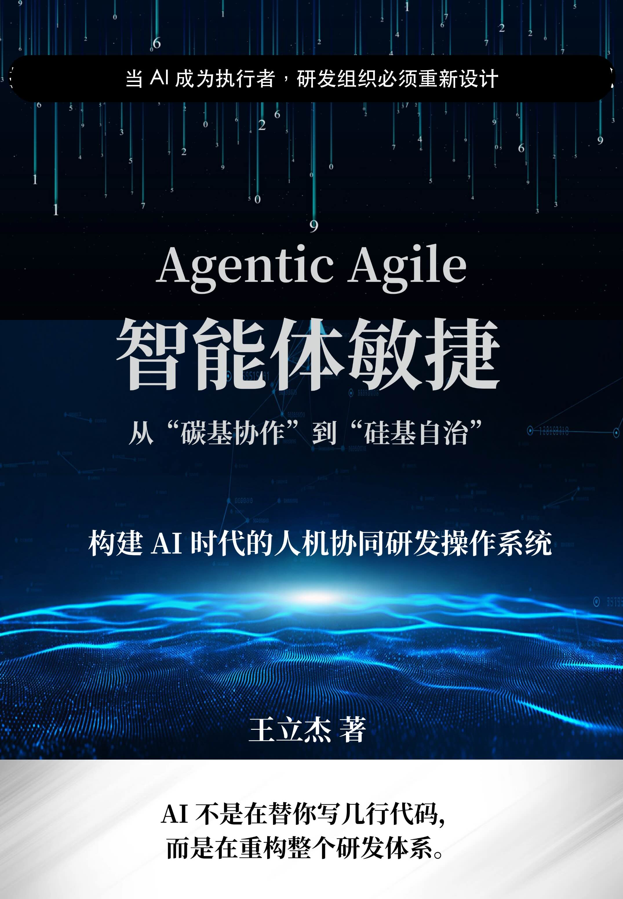

# 《Agentic Agile 智能体敏捷：从碳基协作到硅基自治》

> AI 已经会执行，研发组织准备好重新设计了吗？

[在线阅读全书](book/README.md)　[进入 Agentic Agile 官网](http://agentic.iloveagile.me/)　[下载 PDF / EPUB](#下载)

## 这不是给敏捷加一个 AI 插件

代码生成更多了，需求为什么还在排队？

Agent 跑得更快了，为什么测试、审核和返工反而成了新的瓶颈？

工具越来越多，目标、权限、责任和证据为什么仍然散落在聊天记录、文档和个人经验里？

因为 AI 改变的不只是工具，而是研发系统中的执行主体。把 Agent 接到旧岗位、旧流程和旧审批链上，就像给蒸汽工厂换上电动机，却不重新设计厂房、物料流和责任关系：局部会更快，系统未必更有效。

《Agentic Agile智能体敏捷：从碳基协作到硅基自治》讨论的，正是这次系统重构：如何重新设计人员、组织、流程与工具，让人类负责价值、意图和不可逆决策，让 Agent 在明确的约束与责任边界内执行、验证、恢复和进化。

## 你可以从两个入口开始

### 如果你负责组织转型

你将看到：

- 为什么 AI Enabled 不等于 AI First，更不等于 AI Native；
- 人员、组织、流程与工具如何协同重构；
- 如何从岗位接力转向人机责任网络；
- 如何把一次任务闭环扩展到团队、价值网络和组织慢外环；
- 如何判断 AI 调用量增加，究竟是不是组织价值真正增加。

### 如果你负责 Agent 交付

你将看到：

- 如何从模糊意图进入可签署的任务契约；
- 如何用约束、编排和 Harness 给高速执行装上护栏；
- 如何通过 SCOPE-V 连接 Specify、Constrain、Orchestrate、Prove、Evolve 与 Verify；
- 如何让 Evidence Bundle 支撑完成裁决，而不是用“全绿”代替证明；
- 如何把失败、恢复、遥测和经验沉淀为下一次执行的系统能力。

## 一套从意图到进化的运行闭环

```text
业务意图与人类责任
        ↓
可签署的契约与可执行的约束
        ↓
人和 Agent 的受控编排与执行
        ↓
证明、修复、独立验证与责任裁决
        ↓
Evidence 与价值/效能 Telemetry
        ↓
人员、组织、流程与工具的下一轮进化
```

书中的 3-4-3、SCOPE-V、Harness、验证工程和 Evidence Bundle 不是并列的术语清单，而是共同构成这套人机协同研发操作系统的不同控制部件。



## 全书结构

全书按章节展开，欢迎从前言开始，也可以按主题跳读、搜索和讨论。

- [前言：当 AI 成为执行者，研发组织必须重新设计](book/01-前言-当AI成为执行者研发组织必须重新设计.md)
- [第一部分：为什么 AI 时代需要新的研发操作系统](book/01-一-为什么AI时代需要新的研发操作系统/README.md)
- [第二部分：Agentic Agile 人机协同研发操作系统架构](book/02-二-AgenticAgile-人机协同研发操作系统架构/README.md)
- [第三部分：验证工程与 3-4-3 落地](book/03-三-验证工程与3-4-3落地-让操作系统真正运行/README.md)
- [第四部分：四维组织转型](book/04-四-四维组织转型-把工程能力变成企业运行方式/README.md)
- [第五部分：附录与行动入口](book/05-五-附录与行动入口/README.md)
- [完整在线阅读目录](book/README.md)

## 下载

你可以直接在线阅读，也可以下载整本 PDF 或 EPUB。

- [PDF 文件目录](downloads/pdf/)
- [EPUB 文件目录](downloads/epub/)
- [版本下载与发布说明](downloads/versions/)
- [GitHub Releases](https://github.com/elegant1998/Agentic-Agile/releases)

如果你只想先快速判断这套方法是否适合自己的组织，可以先访问 [Agentic Agile 官网](http://agentic.iloveagile.me/)，继续阅读宣言、进行成熟度自测，或使用 90 天首轮转型验证清单。

## 为什么公开

AI 正在进入研发执行系统，但组织重构、责任边界和验证机制还没有形成共同语言。公开这本书，是希望让更多团队少走“工具先行、组织滞后、最后无法证明价值”的弯路。

知识需要流动，方法也需要在真实任务中被检验。欢迎通过 Issue 指出错误、补充实践，或把这本书分享给正在面对同样问题的人。

## 关于作者

王立杰（无敌哥），AI 治理架构师、研发效能顾问，长期关注敏捷、研发治理、AI 原生组织与人机协同。作者希望把 AI 时代正在发生的生产方式变化，整理成可以理解、讨论、验证和逐步落地的共同语言。

## 版本

最新 PDF、EPUB 和历史版本请以 [GitHub Releases](https://github.com/elegant1998/Agentic-Agile/releases) 页面为准。

## License

© 2026 王立杰（Wang Lijie）

本作品采用 **[CC BY‑NC‑SA 4.0](https://creativecommons.org/licenses/by-nc-sa/4.0/)** 许可。

- Attribution：使用时请注明作者及作品来源。
- NonCommercial：不得将本作品用于商业目的。
- ShareAlike：改编作品须以相同许可协议发布。
