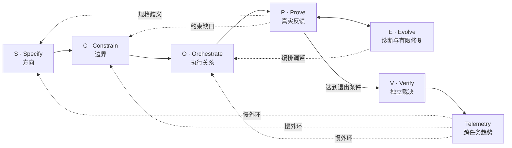

# 第九章｜SCOPE-V：人机协同研发的持续控制回路

三大理论解释了 3-4-3 为什么需要外部化认知、建立反馈并治理复杂协作；三大自治机制说明系统怎样获得意图、纠正偏差，并把机器不该决定的事情交还人类。要让这些原则进入日常研发，还需要一套持续运行的控制架构。SCOPE-V 就是这套架构。

## 9.1 它不是六步瀑布，而是六个持续运行的控制面

第一次看到 SCOPE-V，人们很容易把它读成另一套六阶段流程：先 Specify，再 Constrain，然后 Orchestrate、Prove、Evolve、Verify，仿佛把需求、设计、开发、测试换了一组英文名称。

这种理解会错过它最重要的设计。SCOPE-V 不是六个只能依次走完一次的箱子，而是六个在任务生命周期中持续发挥作用的控制面：

- **Specify** 持续回答目标是否仍然明确、规格是否发生漂移；
- **Constrain** 持续检查权限、数据、质量和过程边界；
- **Orchestrate** 根据依赖、失败和资源状态动态调整执行关系；
- **Prove** 不断用测试与可执行证据挑战候选结果；
- **Evolve** 对失败进行诊断、修复、重构与知识回写；
- **Verify** 保持独立视角，决定现有证据支持哪一种行动。

Telemetry 汇聚任务执行中产生并经 Verify 确认的信号，在跨任务尺度形成慢速外环，把趋势反馈到下一轮 S、C、O。于是 SCOPE-V 的真实结构不是：

```text
第一步 → 第二步 → 第三步 → 第四步 → 第五步 → 第六步 → 结束
```

而更接近：



在整个过程中，S、C、O 的结果仍然约束 P 与 E；P 暴露的失败可能要求回到 S 重新澄清、回到 C 增加边界，或回到 O 调整 Work Graph。它是一个可回流、可停止、可重新签署的控制系统，而不是把所有变化都塞进当前步骤继续向前。

## 9.2 SCOPE-V 与传统 SDLC 到底有什么不同

SDLC（Software Development Life Cycle，软件开发生命周期）回答的是软件从构想到运行通常经历哪些生命周期活动。不同组织可以采用瀑布、迭代、敏捷、DevOps 或持续交付，但仍然需要需求、设计、实现、测试、部署和运维。

SCOPE-V 不否定这些活动，也不试图再发明一套项目管理生命周期。它解决的是另一个问题：**当执行主体中出现能够高速生成、调用工具、并行协作和自主修复的 Agent 时，怎样在运行时持续控制它的方向、权限、反馈和责任。**

| 比较视角 | 传统 SDLC 主要关注 | SCOPE-V 额外关注 |
|---|---|---|
| 核心对象 | 软件产品的生命周期活动 | Agent 行为及其治理状态 |
| 执行主体 | 以人类团队和确定性工具为主 | 人类责任主体 + 概率性 Agent |
| 需求入口 | 文档、Backlog、评审和沟通 | 可签署意图契约与规格漂移控制 |
| 流程推进 | 阶段、迭代或流水线状态 | 证据、门禁、停止和回流条件 |
| 质量反馈 | 测试、评审、CI/CD、运行监控 | P⇄E 快内环、独立 V、证据映射 |
| 权限治理 | 角色权限和流程审批 | 任务级工具能力、最小权限、越权阻断 |
| 完成判断 | 阶段完成、故事完成、发布成功 | 契约、约束与 Evidence 支持单任务裁决；Telemetry 支持跨任务调整 |
| 学习方式 | 复盘、事故分析、流程改进 | Telemetry 外环回写图谱、约束与编排 |

二者可以叠加。一个采用 Scrum 的团队，可以在每条高风险用户故事内部运行 SCOPE-V；一个 DevOps 团队，可以把五道门嵌入现有 CI/CD；一个传统阶段式项目，也可以用意图契约、约束矩阵和 Evidence Bundle 治理 Agent 执行。

因此更准确的说法是：**SDLC 描述软件怎样走过生命周期，SCOPE-V 描述智能体在每次行动中怎样被持续控制。** 前者更像路线，后者更像车辆上的方向、刹车、仪表、驾驶辅助和事故恢复系统。

## 9.3 为什么人机协作时代需要这样的控制回路

人类开发者与 Agent 的差异，不只是速度。Agent 还具有四个会改变治理设计的特征。

第一，**执行速度快于人类审查速度**。一个人在准备评审时，Agent 可能已经修改几十个文件。如果反馈仍然只发生在阶段末尾，方向性错误会快速扩散。

第二，**输出具有概率性**。同一个 Prompt 在不同上下文、模型或时间可能产生不同结果。仅靠“流程执行过”不能证明行为正确，必须要求真实测试、约束结果和可复查证据。

第三，**Agent 能够行动，而不只是建议**。当它能读写仓库、调用数据库、访问网络和执行发布命令时，错误不再停留在文本层面。Constrain 与 Tools Manifest 必须成为运行时边界。

第四，**多 Agent 会放大协调复杂度**。每个 Agent 都可能局部合理，但 Handoff、共享文件、上下文版本和目标理解可能互相冲突。Orchestrate 必须把协作关系变成可执行 Graph。

于是传统“人先理解—人再编码—人最后评审”的隐性控制，必须转变为显式的机器可执行控制：目标写进契约，风险写进约束，协作写进图，成功写进测试，判断依据写进证据，系统表现写进遥测。

## 9.4 六个控制面分别控制什么

### 9.4.1 S：Specification——控制方向

S 不只是“写需求”。它把模糊意图转成 Goal、Non-goals、Rules 和可执行 AC，并由 IO 显式签署。它控制的是系统朝哪个目标前进，以及什么变化已经构成规格漂移。

S 的典型工件是 Intent Contract、Example Mapping 和签署记录。没有这些工件，Agent 很容易把讨论、建议或历史规则误当成当前授权。

### 9.4.2 C：Constraints——控制可行动空间

C 把法律、安全、数据、架构、质量、工具和过程边界转成可执行规则。它不告诉 Agent 如何实现，而是限制哪些实现路径不可接受。

风险只有转换为规则、测试、权限或恢复动作，才真正进入控制系统。“注意隐私”不是控制；“Agent 不得读取生产报销明细，触发即阻断并升级”才是控制。

### 9.4.3 O：Orchestration——控制执行关系

O 用 Work Graph 定义节点、依赖、并行、超时、重试、Handoff 和停止条件。它控制的不只是先后顺序，还包括失败后返回哪里、哪个结果可以被下游信任、什么时候需要人类。

传统任务列表告诉团队“要做什么”；Orchestration 还要让运行时知道“当前谁能做、拿什么输入做、做到什么程度算完成”。

### 9.4.4 P：Proof——控制反馈真实性

P 的目标不是生成“看起来正确”的实现，而是让候选结果接受挑战。AC、TDD Red、运行时断言、边界测试、安全检查和性能基准都属于证明机制。

证据先于结论。单一 LLM-as-Judge 或 Agent 自述不能作为成功证明，因为同一个误解可能同时影响实现和评价。关键结论需要可复现运行证据，必要时还需要独立来源。

### 9.4.5 E：Evolution——控制修复与学习

E 接收 P 暴露的失败，判断它属于实现错误、规格冲突、约束缺失、编排问题还是证据不足。只有在授权边界内，系统才允许进行有限修复；超出范围则回流到 S、C、O 或触发 HITL。

E 不只是把测试改绿，还要保留失败、修复和重验记录。尚未裁决的发现先进入 Evidence Bundle 与 Loop Memory，经过 V 确认且具有复用价值后，才能晋升为图谱、约束或测试资产，避免把一次猜测写成组织事实。

### 9.4.6 V：Verification——控制最终裁决

V 站在执行与自愈内环之外，独立检查契约、约束、实现、证据和时效是否一致。它不生产用于证明自己的证据，而是审查证据并决定：批准、条件批准、补证、缩小范围、拒绝或升级。

V 的独立性非常重要。如果负责修改结果的同一 Agent 同时决定证据是否充分，就可能出现自我证明。Verify 可以使用自动化工具，但价值取舍、不可逆操作和残余风险仍由人类责任主体裁决。

## 9.5 为什么 E 必须在 V 之前

“为什么不先 Verify，再 Evolve？”这是 SCOPE-V 架构中很有价值的问题。

因为 P 已经承担了执行内环中的失败发现。P 暴露测试失败、约束拦截或证据缺口后，E 负责在当前授权范围内诊断和修复，再回到 P 重新取证。这个 P⇄E 回路可以快速运行多次：

```text
P：边界测试失败
→ E：判断为实现错误，完成最小修复
→ P：重跑同一测试并取得新证据
→ E：检查是否需要反思与知识回写
→ 满足退出条件后提交 V
```

V 的职责不是参与每一次试错，而是在内环达到退出条件后进行独立审查。如果把 V 放在 E 前面并让其参与修复，裁判就进入了比赛：验证者既发现问题、又修改结果、再宣布通过，独立性会被削弱。

E 在 V 之前还带来三个好处：

1. **减少人类审查噪声**：可在边界内自动修复的普通错误先被收敛；
2. **保留失败历史**：V 看到的不只是最终绿灯，还包括系统怎样从红到绿；
3. **明确退出条件**：只有测试、约束、证据和修复记录达到要求，才进入裁决。

但 E 不能无限运行。超过重试、Token 或时间预算，必须修改契约、降低约束，或出现证据矛盾和不可逆风险时，内环立即停止并交给人类。

## 9.6 快内环：P ⇄ E 的诊断与自愈

快内环针对当前契约、当前上下文和当前执行结果运行。它的时间尺度可以是秒到分钟，目标是让局部偏差尽早收敛。

快内环必须具备：

- 明确失败信号，而不是模型觉得“不太好”；
- 失败分类与路由；
- 最小修复范围；
- 原检查重跑；
- 最大轮次与资源预算；
- 失败和修复证据；
- 超界后的 HITL 条件。

费用报销任务中，5000.00 元边界测试失败。E 判断为比较符号错误，修改一行实现，再由 P 重跑相同边界测试。如果 E 发现财务制度与签署契约冲突，它不能选择一边修复，而应停止内环，返回 S 请求 IO 重新决策。

## 9.7 独立裁决：V 的审计与放行

当快内环达到退出条件，V 执行三角验证：

```text
Intent Contract：做的是不是被批准的事？
Constraint Matrix：执行是否守住边界？
Evidence Bundle：结论是否由真实、当前、足够独立的证据支持？
```

V 还检查工件版本、代码提交、UNKNOWN 项、回退准备和人工批准。它可以得出“测试通过但暂不发布”，也可以给出带灰度、时间和监控条件的批准。

## 9.8 慢外环：Telemetry → S/C/O 的组织学习

V 之后的 Telemetry 形成慢速外环。它不是修复当前一行代码，而是观察多个契约后的累积趋势：Token 是否持续上升、首次成功率是否下降、HITL 是否集中在某类问题、约束自愈是否改善、知识沉淀是否减少重复失败。

这些趋势反过来改变下一轮控制面：

- 目标准确率下降，回到 S 检查意图和契约质量；
- MUST 失败增加，回到 C 检查约束表达与工具权限；
- Token、轮次和 Handoff 摩擦上升，回到 O 调整上下文和编排；
- 重复出现同类失败，回到 E 改进诊断与修复策略，并把经验证的模式更新到图谱和组织知识。

快内环保证当前任务收敛，慢外环保证整个系统不会在长期中退化。前者像即时纠偏，后者像根据连续航行数据改进航线、规则与训练。

## 9.9 每个控制面都必须产生可检查工件

控制面不能只停留在概念层。每一面至少要有可读取、可版本化、可审计的产物：

| 控制面 | 关键工件或证据 |
|---|---|
| S | Intent Contract、Example Mapping、IO 签署 |
| C | Constraint Matrix、constraints.yaml、Tools Manifest |
| O | Work Graph、节点契约、Handoff 记录 |
| P | TDD Red/Green、AC 运行结果、NFR 检查、Evidence Bundle 原始证据 |
| E | 失败分类、修复与重验记录、Loop Memory、Evidence Bundle 更新 |
| V | 三方一致性审计、Evidence Bundle 裁决状态、发布或退回决定 |
| Telemetry | 单任务事件与度量、聚合 Dashboard、跨任务趋势 |

这就是“每节必产工件”的含义：没有工件，控制状态无法被机器检查；没有原始证据，人类只能相信 Agent 的叙述。

## 9.10 五道机械门把控制状态变成不可跳过的事实

五道机械门进一步防止系统跳过关键状态。它们是状态转换的机械裁决点，不是把 SCOPE-V 重新切成五个线性阶段：

```text
前置门：契约、IO 签署、约束和 AC 是否存在？
编码门：测试是否先写并产生可信 Red？
验证门：测试、AC、构建和证据是否通过？
收尾门：Evidence Bundle 是否可裁决，本次真实信号是否已进入单任务遥测与 Dashboard，合格知识是否回写？
Bug 回溯门：完成后发现问题，是否如实修正证据和组织记忆？
```

Agent 不能仅凭自然语言声明“我已经完成前置检查”。门禁需要读取真实工件、时间、版本和运行结果。

收尾门检查遥测入口是否完整，不负责用一次任务解释长期趋势。组织层结论必须等待多个可比任务按 Measurement Contract 聚合后，才能进入 Telemetry 慢外环。

## 9.11 一个完整控制回路示例

仍以“超过 5000 元的报销增加总监审批”为例：

1. S 把“超过”、金额口径、适用范围和异常路径写成签署契约；
2. C 禁止访问生产明细、禁止修改历史已审批单，并规定回退开关；
3. O 安排边界测试先于实现，组织关系检查与回退准备可并行；
4. P 先证明 5000.00 与 5000.01 的测试在旧实现上失败；
5. E 完成最小实现，处理代理总监冲突，并把候选规则及来源写入 Evidence Bundle；
6. P 重跑原测试和约束，生成当前提交的证据；
7. V 独立检查契约、约束、证据、UNKNOWN 与回退，批准两个部门灰度，并将已确认规则晋升为组织知识；
8. Telemetry 记录首次成功、修复轮次、HITL、Token 和知识沉淀；
9. 多个契约后发现代理关系类 HITL 持续偏高，外环驱动 S 增加前置问题、C 增加组织关系约束、O 提前安排领域检查。

这个例子说明 SCOPE-V 的完成点不是“代码写完”，而是当前任务已经由证据支持裁决，并且执行经验已经进入下一轮控制。

## 9.12 SCOPE-V 设计的四条底线

最后可以用四条原则概括其控制论立场：

1. **证据先于结论**：不能以“看起来正确”或单一 LLM Judge 作为成功证明；
2. **风险转化为控制**：热点名词必须落为规则、测试、权限、门禁或恢复动作；
3. **价值判断不可让渡**：AI 可以有限自治，但目标、公平、伤害取舍和不可逆操作由人负责；
4. **每个控制面必须可检查**：不堆砌概念，每一面都要产生工件、矩阵、模型、策略或证据。

因此，SCOPE-V 的价值不在于记住六个英文单词，而在于为概率性、高速度、可行动的 Agent 建立一套能够持续校准、受控修复、独立裁决并长期学习的工业级自循环模型。

## 9.13 与三大自治机制的关系

三大自治机制不是另一套流程，而是贯穿 SCOPE-V 的三条运行原则：意图注入主要落在 S、C、O，使任务在签署契约与可治理上下文中开始；高频对抗与自净化主要运行在 P⇄E，用原判据重验并在超出预算、范围或授权时停止；人类异常裁决贯穿全程，并在 V 集中处理价值取舍、约束例外、不可逆操作和残余风险。

分工保持简单：**3-4-3 规定责任和工件，三大机制规定自治原则，SCOPE-V 组织一次任务的控制回路，Harness 把这些控制执行出来。** Telemetry 是跨任务的慢外环，流水线则承载制品、门禁和发布，不再另设一套概念映射。

## 9.14 本章小结

SCOPE-V 不是一套替代 Scrum、DevOps 或 SDLC 的六阶段流程，而是面向概率性 Agent 的运行时控制架构。S、C、O 建立方向、边界和执行关系，P⇄E 用真实反馈形成快速纠偏内环，V 保持独立裁决，Telemetry 再把多次任务的运行信号反馈给下一轮治理。三大自治机制由此不再停留在原则层，而是进入可执行、可停止、可审计和可进化的控制系统。

**本章最小实践**：选择一项真实 AI Coding 任务，画出它的 SCOPE-V 控制回路，并标出三大自治机制、P⇄E 快内环、HITL 异常出口、五道门和 Telemetry 慢外环。  
**完成证据**：一张带工件、门禁、回流与责任人的 SCOPE-V 运行图。  
**延伸实践**：推荐学习《Agentic Agile 3-4-3 基础课：跑通第一次受控自治》，完整跑一遍 SCOPE-V，并观察每个状态如何产生下一步证据。

---
