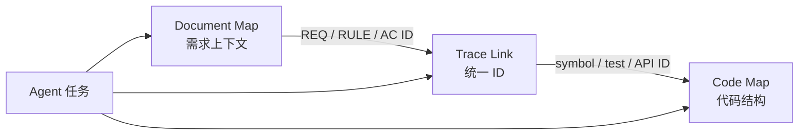

# 第十九章｜Knowledge & Memory Engineering：让上下文和经验成为组织资产

## 19.1 Agentic Knowledge Engineering：用双地图连接需求与代码

既有大型系统的增量治理还有一个基础问题：Agent 怎样找到当前任务所需的代码、规则、历史、接口和运行证据？当知识来自代码、Wiki、工单、聊天、日志和人员记忆时，哪些内容可以相信，哪些已经过期，哪些只能作为线索，哪些又不能被当前 Agent 访问？

企业常把答案归结为“建设一个 AI 知识库”：收集文档、切片、Embedding、写入向量数据库，再让大模型检索。这样的系统可以提高文本可发现性，却无法自动保证知识正确、新鲜、适用、授权和可验证。对 AI Coding 而言，一段被高相似度召回的过期架构说明，可能比完全没有知识更危险。

因此，Agentic Agile 3-4-3 需要的不是单一文档库或 RAG 平台，而是一套 **Knowledge & Memory Engineering（知识与记忆工程）**：让知识能够被结构化发现、按任务裁剪、带来源使用、经过证据晋升、在失效时撤回，并通过交付结果持续校验。它是 3-4-3 的知识与状态基础设施，不是第五个动态工件，也不能绕过契约、约束和 Verify 直接获得组织事实地位。

从工程落地看，这套体系首先要把两个经常混在一起的知识世界分开：

- **Document Map 管需求上下文**：需求、业务规则、验收标准、领域术语、约束、决策与历史原因；
- **Code Map 管代码结构**：仓库、模块、文件、符号、调用关系、接口、数据流与测试；
- **Trace Link 用统一 ID 串联两张地图**：回答一项需求由哪里实现、由什么测试证明、发生变更时影响什么。

两张地图不是两座信息孤岛，而是面向同一任务的两种视角。Document Map 回答“为什么这样做”，Code Map 回答“在哪里实现”，Trace Link 回答“需求—代码—测试是否闭环”。



| 知识面 | 核心对象 | 主要问题 | 推荐开源工具 |
|---|---|---|---|
| Document Map | PRD、需求、规则、AC、术语、ADR、约束 | 为什么做、什么才算完成、哪些决定仍有效 | **IWE** |
| Code Map | 模块、文件、符号、调用、接口、测试 | 在哪里实现、谁依赖它、改动影响哪里 | **codebase-memory-mcp** |
| Trace Link | Requirement ID、Rule ID、AC ID、Symbol ID、Test ID | 需求是否落实到实现并得到验证 | 项目内可版本化的关系清单或图索引 |

> **AI Coding 时代真正稀缺的不是知识存量，而是能够被正确检索、经过验证、带有责任边界并持续演进的可信知识。**

### 19.1.1 双地图的工具落地：IWE 与 codebase-memory-mcp

Document Map 与 Code Map 的共同理念是：**原始资产留在本地并保持可检查，机器生成的索引可以重建，通过 MCP 为分布在不同工具和任务中的 Agent 提供统一查询能力。** 两者都可以采用 local-first 架构，但处理的对象和判断逻辑不同。

**Document Map 推荐使用 IWE。** IWE 以本地普通 Markdown 文件为事实源，通过文档层级、交叉引用和反向链接形成知识图谱，并同时提供 CLI、MCP 和编辑器 LSP。它不要求把需求迁入专用数据库；需求、业务规则、验收标准、术语、ADR 和会议结论仍然是人可以直接审阅、Git 可以版本化的文件。项目可以用 YAML Front Matter 固定 `req_id`、状态、责任人、适用范围和版本，用显式链接表达 `depends_on`、`supersedes`、`constrained_by` 与 `verified_by`。

IWE 的优势不只在于安装轻量。它能够对 Front Matter 和文档结构执行 Schema 校验，为 Agent 写入声明影响范围，并在重命名或重构文档时维护链接关系。这与需求治理的核心要求一致：知识必须可检查、可追踪、可验证、可回退，而不只是“语义相似”。IWE 使用 Rust 实现，可通过 Homebrew、npm 或 Cargo 安装；采用 Apache-2.0 许可证。项目说明：<https://github.com/iwe-org/iwe>。

IWE 是 Document Map 的推荐结构底座，不是需求治理本身。它能够建立、查询和维护关系，却不能替代需求签署、责任人裁决、有效期管理和 Evidence。AI 写入的新结论仍应先是候选知识，不能因为已经进入图谱就自动成为正式业务规则。

如果组织还需要大规模语义召回，可以把 QMD 作为 IWE 之上的可选检索增强；如果更关注跨会话对话记忆，也可以接入 Basic Memory 等可选 Provider。但语义索引和 Agent Memory 不应取代 IWE 中可审阅、可版本化的需求图。QMD 项目说明：<https://github.com/tobi/qmd>。

**Code Map 推荐使用 codebase-memory-mcp。** 它通过 Tree-sitter AST 与语义解析，为函数、类、调用链、HTTP 路由和跨服务关系建立持久化代码知识图谱，并通过 MCP 支持结构查询、调用链追踪和影响分析。它直接把代码结构图的持续构建、跨会话保存和查询作为产品能力，更适合作为企业 Code Map 的工程底座。项目说明：<https://github.com/DeusData/codebase-memory-mcp>。

Code Map 至少应遵守四条原则：

1. 代码知识按符号、定义、引用、调用和依赖建模，不能只按固定字符数切片；
2. 地图用于导航和影响分析，不需要把全部源代码放入模型上下文；
3. 上下文应随任务动态选择，而不是所有 Agent 共用同一份静态摘要；
4. 代码变化后，结构地图应自动增量刷新，并绑定仓库、分支或 Commit 版本。

两种工具之间不能只靠模糊文本相似度连接。建议把统一 ID 写入双方都能查询的关系中，例如：

```yaml
requirement_id: REQ-PAY-017
acceptance_criteria: [AC-PAY-017-01, AC-PAY-017-02]
implemented_by:
  - symbol: payments.refund_service.create_refund
    repository: payment-platform
verified_by:
  - test: tests/refund/test_refund_policy.py::test_refund_window
evidence: governance/evidence/EB-T-137.md
```

Document Map 不应复制整份代码结构，Code Map 也不应猜测业务意图。Trace Link 保存稳定标识和关系，查询时再分别下钻到原始需求、源代码、测试与证据。

### 19.1.2 知识库不等于 RAG，也不等于向量数据库

典型 RAG 流程是：

```text
文档收集
→ 文本切片
→ Embedding
→ 向量检索
→ 将相似内容注入 Prompt
```

它解决的是语义相似内容的发现，不天然解决知识治理。向量距离不能证明某段内容是最新版本，也不能证明它来自权威来源、适用于当前模块、未被后续决策废弃，或者当前 Agent 有权读取。

对 AI Coding 而言，知识至少同时具有六个维度：

- **内容**：这条知识说了什么；
- **来源**：来自代码、运行数据、制度、专家还是模型推断；
- **范围**：适用于哪个领域、模块、版本和环境；
- **状态**：候选、已验证、已批准、冲突、过期或撤回；
- **权限**：谁可以检索、引用和修改；
- **证据**：什么事实支持它，什么条件会推翻它。

没有这些维度，知识库只是可搜索的材料集合。它可能帮助 Agent 更快回答，却不能保证 Agent 更可靠地行动。

### 19.1.3 五层知识体系

建议把企业知识分为五层，而不是全部塞进同一个向量索引。

#### L0：事实源层

这一层保存真正的 Source of Truth：

- Git 中的代码、配置和 Commit；
- API、数据库 Schema 和消息定义；
- CI/CD 原始运行结果；
- 生产日志、Trace、指标和事件；
- 已签署 Intent Contract；
- 已批准 Constraint Matrix 与例外；
- Artifact Digest、发布裁决和审计记录；
- 正式制度、法规和责任人决定。

模型摘要不能替代原始事实。摘要可以帮助导航，但高风险结论必须能够下钻到 L0。

#### L1：结构索引层

这一层对应 Code Map，主要由机器自动生成：

- 文件、目录、类、函数、接口和类型；
- 定义、引用、调用和依赖；
- API 提供方与消费方；
- 数据表与读写关系；
- 测试与被测代码映射；
- 代码所有者、变更热点和历史 Commit；
- 部署单元与运行时调用链。

L1 的使命是帮助 Agent 找路，不负责解释全部业务意义。

#### L2：语义知识层

这一层解释系统为什么这样工作：

- 业务能力地图和领域术语；
- 业务规则与 Intent Graph；
- 架构决策记录 ADR；
- 跨模块契约和兼容策略；
- Preserve List、已知例外和历史原因；
- 运维手册、故障模式和恢复策略。

AI 可以从代码和资料中生成草稿，但需要 OA、IO、领域专家或正式证据确认。

#### L3：任务上下文层

它不是永久知识库，而是针对当前任务动态组装的 Context Slice：

```text
当前目标与 Non-goals
＋适用约束
＋相关代码符号与完整文件
＋上下游接口
＋历史缺陷与决策
＋现状测试与运行证据
－无关模块
－过期版本
－未授权数据
```

L3 决定当前 Agent 实际看到什么。信息进入知识系统，不代表每次任务都应该注入。

#### L4：验证后的组织记忆层

这一层保存经过真实任务验证、未来能够复用的知识：

- 已确认的失败模式；
- 被证据支持的业务规则；
- 可复用测试和恢复模式；
- 工具风险与权限边界；
- 常见误解与反例；
- 已关闭或仍存在的 UNKNOWN；
- 对特定任务有效的上下文与编排策略。

模型反思不能自动进入 L4。只有经过 Evidence Bundle、独立验证、责任人裁决或生产遥测确认的内容，才有资格成为组织记忆。

### 19.1.4 每条知识都要有“身份证”

一段没有来源和范围的文字不应被称为正式知识。最小知识对象可以表示为：

```yaml
id: K-EXPENSE-017
title: 历史草稿不重新计算审批链
type: business_rule
scope:
  domain: expense
  modules: [expense-service, approval-engine]
  environments: [test, production]
statement: 历史草稿再次打开时保留创建时的审批路径
source:
  type: production_trace
  reference: trace-set-2026-08-07
status: VERIFIED
confidence: high
owner: Expense-Domain-OA
version: 3
valid_from: 2026-08-07
valid_until: null
supersedes: K-EXPENSE-009
access:
  classification: internal
  contains_sensitive_data: false
evidence:
  - governance/evidence/EB-T-101.md
```

字段可以按组织裁剪，但至少要回答：它是什么类型、适用哪里、来自哪里、现在处于什么状态、谁负责、何时生效、替代了什么、谁能访问以及证据在哪里。

知识的引用也应携带 ID 和版本。只把一段文字复制进 Prompt，会丢失其身份；后续无法判断它是否被更新、撤回或误用。

### 19.1.5 知识状态机：存在不等于可信

知识至少可以有以下状态：

| 状态 | 含义 | Agent 使用规则 |
|---|---|---|
| CANDIDATE | AI 或人员提出，尚未验证 | 只能作为侦察线索 |
| HYPOTHESIS | 有部分依据，仍需验证 | 不得支撑高风险结论 |
| VERIFIED | 已被独立证据确认 | 可在声明范围内使用 |
| APPROVED | 已由有权责任人批准 | 可作为正式规则或边界 |
| CONFLICTED | 与其他来源产生冲突 | 停止并升级 OA/HITL |
| DEPRECATED | 被新知识替代 | 默认不再召回 |
| EXPIRED | 超过有效期或环境已变化 | 重新验证后使用 |
| REVOKED | 因错误或风险被撤回 | 禁止注入和引用 |

状态必须影响检索和行动。一个系统如果把 `DEPRECATED` 内容仍以高相似度排在第一位，即使页面上显示了灰色标签，治理仍然失败。

知识状态与遗留系统的四类行为可以衔接：Observed 和 Implemented 可以产生候选事实，Intended 提供价值方向，只有经过证据确认的 Verified Behavior 才能晋升为可信知识；需要组织承担责任的规则还要进入 APPROVED。

### 19.1.6 知识晋升不能由模型自我证明

知识生命周期应包含：

```text
发现
→ 标注来源、范围和敏感级别
→ CANDIDATE / HYPOTHESIS
→ 用代码、测试、运行数据或专家交叉验证
→ VERIFIED
→ 必要时由责任人 APPROVED
→ 进入可召回知识
→ 观察实际使用效果
→ 修正、合并、过期或撤回
```

例如 Agent 在一次失败中发现“审批服务要求金额保留两位小数”，不能直接写成全局规则。它需要确认：要求是否来自正式 Schema；只适用于人民币还是全部币种；生产是否存在三位小数历史数据；哪些消费方依赖当前行为；谁拥有解释权。

还需要一条防止知识污染的硬规则：

> **模型生成内容不能仅凭被模型重复引用而获得更高可信度。可信度必须来自独立事实、运行证据或有权责任人的裁决。**

否则会形成自我强化回路：模型生成错误总结，知识库收录，下一次模型召回并再次引用，重复次数被误当成共识。

### 19.1.7 五种检索必须协同

大型代码库不能只依赖向量相似度，至少需要五类检索。

**词法检索**用于精确定位错误码、方法名、配置键、表名、API 和 Contract ID。

**符号与代码图检索**用于回答定义在哪里、谁调用、实现了什么接口、有哪些测试和依赖。这是 Code Map 的优势区域。

**语义检索**用于寻找“历史报销兼容”“审批超时恢复”等概念相近内容。

**运行时关系检索**使用 Trace、日志、消息链路、数据库访问和生产指标，区分“代码可能调用”与“当前版本在这个场景确实调用”。

**治理关系检索**根据当前任务找到对应 Intent Graph 节点、有效契约、适用 MUST、历史 Evidence Bundle、UNKNOWN、发布和 Bug 回溯记录。

最终结果应进行混合排序：

```text
综合相关度 =
任务相关性
× 来源可信度
× 版本新鲜度
× 范围匹配度
× 权限允许度
× 风险权重
```

具体公式可以因平台而异，但语义相似度不能成为唯一排序依据。对于高风险任务，一条低相似但明确适用的 MUST 约束，应排在一段高相似的旧设计讨论之前。

### 19.1.8 从检索结果到任务 Context

检索只是发现候选内容，Context Engineering 还要完成选择、冲突处理、权限过滤、压缩和注入。可以采用：

```text
任务与契约解析
→ 多路召回
→ 版本、状态和 ACL 过滤
→ 冲突检测
→ 依据 Work Graph 节点重排
→ Token 预算内裁剪
→ 生成带引用的 Context Slice
→ 注入前隔离检查
```

同一个任务中，不同 Agent 获得的知识也不同。测试 Agent 需要业务规则、反例和历史缺陷；实现 Agent 需要可信 Red、相关代码、接口和变更围栏；安全 Agent 需要数据流、权限和威胁知识；V 需要原始证据、版本和裁决规则。

Context Slice 应保留知识 ID、版本、状态和来源，使 Agent 可以说明“我根据什么行动”。发生 CONFLICTED 或关键知识缺失时，系统应停止或请求补充，而不是自动选择篇幅最长的答案。

### 19.1.9 自动知识与治理知识的双通道

知识更新可以分成快通道和慢通道。

**快通道：机器可重建知识**

- Code Map 与符号索引；
- 静态依赖和 API 清单；
- Schema、测试映射和代码所有者；
- Git 热点和变更历史；
- 部署拓扑与运行时 Trace 摘要。

这些内容随代码和部署自动刷新，绑定版本即可，一般不需要逐条人工批准。

**慢通道：需要责任确认的知识**

- 业务目标、规则和领域术语；
- Preserve、例外和兼容责任；
- 架构决策与风险接受；
- 安全、合规和生产边界；
- 失败教训与组织策略。

AI 可以起草，OA 负责证据和范围审查，IO 或相应责任人批准。快通道不能自动覆盖慢通道：代码扫描发现某个阈值是 5000，不代表业务政策就是 5000；它只说明当前某个版本的实现包含这个数字。

### 19.1.10 权限隔离：可检索不等于可见

知识库可能包含生产日志、客户数据、安全漏洞、密钥痕迹、商业策略和跨租户信息。把文档切片以后写入统一向量库，并不会消除原始数据权限。

知识治理至少要落实：

- 源数据接入前分类与脱敏；
- 租户、项目、领域、角色和环境级 ACL；
- 向量、全文索引、缓存和摘要继承源权限；
- Agent 检索使用最小权限身份；
- Context Slice 再次做敏感信息隔离检查；
- 检索、引用、导出和拒绝都保留审计；
- 删除或撤权能够传播到派生索引与缓存。

工具权限与知识权限也要分开。Agent 可以知道生产表结构，不代表可以查询生产数据；可以读取脱敏事故报告，不代表可以获得其中的凭证或客户标识。

### 19.1.11 知识与四大动态工件的关系

知识系统不能取代四大动态工件：

| 工件 | 与知识系统的关系 |
|---|---|
| Intent Graph | 组织稳定的业务方向、能力和关系，不是全文仓库 |
| Intent Contract | 对当前任务需要的目标、规则和知识形成签署快照 |
| Constraint Matrix | 把重要知识升级为机器可执行边界 |
| Evidence Bundle | 证明本次知识和结论为什么值得相信 |

知识库可以保存候选和已验证知识；Intent Graph 提供宏观导航；Intent Contract 将当前适用知识冻结成执行基准；Constraint Matrix 规定 Agent 不能如何使用知识；Evidence Bundle 则为知识晋升、冲突解决和结果裁决提供证据。

不能因为知识库里存在一条规则就自动把它当成契约；不能因为检索到了某份旧 Evidence Bundle 就认为当前版本仍然通过；也不能把所有经验都升级成 MUST，制造约束疲劳。

### 19.1.12 知识如何进入 SCOPE-V

知识治理贯穿控制回路，而不是任务结束后的文档整理。

**Specify** 检索历史意图、术语、规则、缺陷和用户反馈，同时检查有效期和冲突。

**Constrain** 加载适用的权限、安全、合规和兼容知识；敏感内容在这里完成访问控制。

**Orchestrate** 按 Work Graph 为节点组装不同 Context，并安排需要补证的知识任务。

**Prove** 验证知识主张。例如“旧移动端不依赖该字段”必须通过 Contract Test、Trace 或消费方证据证明。

**Evolve** 将失败、反例和新发现形成 CANDIDATE，而不是直接写入正式记忆。

**Verify** 审查来源、范围、新鲜度、独立性和冲突，决定晋升、保持候选、标记过期或撤回。

**Telemetry** 观察哪些知识被召回、是否减少返工、是否造成误导、消耗多少 Token，以及有没有真正改善首次成功率。

因此知识回写属于 LOOP-3，不是“Agent 自动总结一下”。回写内容必须改变未来任务行为，并且能够被治理和撤销。

### 19.1.13 治理岛知识包

百万行项目不应先导入全部代码、Wiki、工单、聊天和日志再建设企业大知识库。知识建设应沿治理岛扩张：

```text
选择真实变更
→ 建立局部 Code Map
→ 找到相关业务知识和历史证据
→ 标记冲突、权限与 UNKNOWN
→ 组装任务 Context
→ 完成验证与裁决
→ 将确认知识沉淀为治理岛知识包
```

第一座费用治理岛的知识包可能是：

```text
knowledge/expense/
├─ capability-map.yaml
├─ document-map/
│  ├─ requirements/
│  ├─ business-rules.md
│  ├─ glossary.md
│  └─ decisions/
├─ code-map/
│  ├─ symbols.index
│  └─ interfaces.yaml
├─ trace-links.yaml
├─ known-unknowns.yaml
├─ owners.yaml
├─ access-policy.yaml
├─ characterization-tests/
└─ evidence-index.yaml
```

这些文件不一定采用相同格式。关键是自动地图、人工语义、未知项、所有权、访问策略、测试和证据索引彼此分开又能通过 ID 连接。T-101、T-117 等任务完成后，知识包逐步扩张，而不是一次生成一部“费用系统百科全书”。

### 19.1.14 Knowledge Release：知识变化也要携证发布

批量导入、规则晋升、权限变化、索引算法升级和知识撤回都会改变 Agent 行为，因此重要知识变化也需要版本与证据，可以形成 Knowledge Release。

一份知识发布应说明：

- 新增、修改、合并、废弃或撤回哪些知识；
- 来源、状态、范围、责任人和批准记录；
- 影响哪些 Agent、模块、检索策略和 Context；
- 使用哪些基准任务验证召回准确性；
- 是否发生敏感信息越界；
- 新旧版本对 Token、准确率和首次成功率的影响；
- 失败时如何回退知识版本和清理缓存。

高风险知识不能直接在生产检索链路上原地覆盖。可以采用 Champion-Challenger：旧版继续服务，候选知识或新排序策略先在回放任务、影子流量或有限团队中验证，证明效果后再晋升。

Knowledge Release 与软件 Release 类似：发布的不是代码制品，而是一套会影响 Agent 认知和行动的知识基线。

### 19.1.15 知识质量遥测

知识治理不能只统计文档数、切片数、向量数和访问量。更有价值的指标包括：

- 知识来源标注率；
- 有明确责任人的知识比例；
- VERIFIED/APPROVED 比例；
- 过期、撤回知识的误召回率；
- CONFLICTED 知识发现与解决时间；
- 敏感信息误召回和越权次数；
- 关键任务的有效召回率；
- 因知识缺失导致的返工；
- 因错误知识导致的失败；
- UNKNOWN 的新增、关闭和逾期趋势；
- 知识复用后首次成功率的变化；
- 每个成功任务的检索与上下文 Token 成本；
- 知识修正和撤回的平均时间。

知识指标必须与交付结果联动。如果文档和向量增长一倍，目标准确率、首次成功率和执行效率没有改善，知识系统可能只是更昂贵的文档仓库。如果 Token 降低但错误知识导致返工增加，也不能称为 Context 优化。

### 19.1.16 六类典型失败

**文档坟场**：大量材料被导入，却没有责任人、版本、有效期和使用反馈。

**知识污染**：Agent 的推测和通用反思被直接写入长期记忆，后续任务不断引用。

**过期知识高置信召回**：旧接口、旧制度和旧架构因语义相似度高而排在当前规则之前。

**权限泄露**：生产日志、客户数据或跨租户资料进入共享索引，派生摘要没有继承原权限。

**上下文污染**：系统召回大量相关但冲突的内容，却不展示来源、版本和状态，让 Agent 自行猜测。

**反馈回路自我强化**：模型生成错误总结，知识库收录；下一次模型引用它并生成更多相似内容，使错误看起来越来越像共识。

这些失败说明，知识工程的主要风险不是“搜不到”，还包括“搜到错误内容并让 Agent 相信”。高风险系统宁可明确返回 UNKNOWN，也不能用不可靠知识制造虚假确定性。

### 19.1.17 一个大型系统知识召回案例

继续使用八十万行费用平台的 T-101。用户要求把人民币审批阈值从 5000 调整为 8000。Document Map 先找到当前需求、阈值规则、验收标准和地区例外；Code Map 再用词法检索定位三个 `5000`，并显示它们分别属于 v1 接口、v2 规则和地区定制。符号图找到调用者和相关测试，运行时 Trace 证明当前新建人民币报销走 v2，同时 Document Map 还召回一份两年前的“统一金额规则”设计稿和最近一次地区例外裁决。

如果只用向量相似度，旧设计稿可能因为描述完整而排名最高。知识治理层发现它已经 `DEPRECATED`，适用版本止于 v1；地区例外是 `APPROVED`，但范围只覆盖特定租户；v2 Trace 和当前接口契约是 `VERIFIED`。系统因此为领域 Agent 组装：当前契约、v2 规则符号、Trace、现状测试和地区禁止修改约束，同时把外币批处理关系标记为 UNKNOWN。

实现和验证完成后，Evidence Bundle 证明新阈值、历史兼容和地区隔离。Evolve 提议“新建人民币报销走 v2”进入组织记忆；V 检查 Trace、版本和适用范围后将其晋升为 VERIFIED。旧设计稿仍可用于历史解释，但不会进入默认任务 Context。

这个案例体现了完整链路：Document Map 负责找到需求上下文，Code Map 负责找到代码结构，Trace Link 用统一 ID 连接需求、实现、测试与证据；混合检索汇聚多种来源，知识状态和范围决定能否使用，Context Engineering 完成裁剪，Evidence Bundle 支持晋升，Telemetry 检查知识是否真正帮助任务成功。

### 19.1.18 本专题的工程验收

团队可以选择一次真实变更，检查：

1. 是否区分事实源、结构索引、语义知识、任务 Context 和组织记忆？
2. Document Map 与 Code Map 是否职责分离，并能通过统一 ID 下钻到需求、完整文件、测试和证据？
3. 每条关键知识是否有来源、范围、状态、责任人、版本和证据？
4. CANDIDATE、CONFLICTED、DEPRECATED、EXPIRED 和 REVOKED 是否真正影响检索？
5. 是否同时使用词法、符号图、语义、运行时和治理关系检索？
6. Context Slice 是否经过权限、冲突、新鲜度和 Token 预算检查？
7. 自动结构知识与需要责任人批准的业务知识是否走不同更新通道？
8. 知识索引、缓存和摘要是否继承源数据 ACL 与删除要求？
9. 新知识是否通过 Evidence Bundle 或生产证据晋升，而非由模型自报？
10. Knowledge Release 是否可以验证、灰度和回退？
11. Dashboard 是否能看见错误召回、过期知识、权限事件、Token 与交付效果？
12. 下一次相关任务是否能够复用知识，又不会把过期或越权内容带入 Context？

如果这些问题能够由真实工件、审计记录和任务结果回答，企业建设的才是面向 Agent 的可信知识系统，而不只是一套向量检索服务。

## 19.2 Agent Memory Engineering：从任务状态到可治理组织记忆

Agent 可以在一次会话里表现得很聪明，却在下一次任务中重新犯下昨天的错误。它也可能记住了某次临时讨论，却把已经撤销的结论当成长期规则。前者是“没有记忆”，后者是“记忆失控”。

因此，记忆管理不是给模型接一块无限大的硬盘，更不是把所有聊天记录塞回上下文。**Agent Memory Engineering 是一套对经验进行捕获、筛选、验证、召回、衰减、晋升和遗忘的工程系统。** 它要解决的不是“模型能不能记住”，而是以下治理问题：

- 什么内容值得记住，什么内容必须忘记？
- 一条记忆适用于本次任务、当前模块，还是整个组织？
- 谁提供了这条记忆，它是否仍然有效？
- 记忆与新事实冲突时，Agent 应该相信哪一个？
- 哪些经验可以晋升为约束、测试、知识或 Skill？
- 一条被撤销的敏感信息，能否从索引、摘要和缓存中同步删除？

### 19.2.1 先区分 State、Context、Memory 与 Knowledge

这四个概念经常被混用，但它们在治理上承担不同责任。

| 对象 | 回答的问题 | 典型内容 | 生命周期 |
|---|---|---|---|
| State（状态） | 任务现在进行到哪里 | 当前节点、失败次数、待办项、锁定文件 | 秒到天 |
| Context（上下文） | Agent 此刻看见什么 | 当前契约、相关代码、约束、检索片段 | 一次推理或一次任务 |
| Memory（记忆） | 过去哪些状态与经验值得再次使用 | 上轮失败原因、有效修复策略、未决风险、交接信息 | 天到月，按价值衰减 |
| Knowledge（知识） | 哪些结论已经被验证，可以稳定复用 | 业务规则、架构事实、接口语义、组织标准 | 月到年，版本化治理 |

例如，“当前正在执行 SIT-03”是状态；SIT-03 的契约、接口定义和相关代码是上下文；“上次在预生产环境因时区配置导致该用例失败”是情景记忆；“所有结算时间统一采用 UTC 存储、业务时区展示”经过验证和批准后，才成为组织知识或工程约束。

**记忆记录经验，知识表达经过治理的结论。** 记忆可以是知识的候选来源，但不能因为被模型记住，就自动拥有规则效力。

### 19.2.2 为什么“保存全部聊天”不是记忆管理

聊天记录最多是一种原始材料或审计记录。直接将全部聊天作为长期记忆，会同时放大五类风险：

1. **噪声污染**：探索过程、重复提问和无效尝试挤占 Context Window。
2. **事实冲突**：早期假设与后续结论并存，Agent 不知道哪一个有效。
3. **敏感泄露**：密钥、客户数据和个人信息可能被长期保留并越权召回。
4. **版本漂移**：代码和规则已经变化，旧讨论仍被当成当前事实。
5. **成本失控**：每次任务重复注入大量历史文本，Token 成本上升，准确率反而下降。

尤其不能把模型的隐式推理过程当作组织资产保存。组织真正需要保留的是可审计的输入、关键决策、验证结果、失败模式、责任人和证据，而不是不可验证的思维草稿。

### 19.2.3 五类 Agent 记忆

为了避免“一种存储解决所有问题”，可以将 Agent 记忆分成五类：

| 记忆类型 | 作用 | 例子 | 主要治理要求 |
|---|---|---|---|
| 工作记忆 Working Memory | 支撑当前一步推理与执行 | 当前文件、最近一次命令结果 | 小容量、短寿命、及时清理 |
| 任务记忆 Task Memory | 维持一个契约内的连续性 | 当前节点、已完成 AC、未决问题 | 与任务 ID 绑定、可交接、任务结束后归档 |
| 情景记忆 Episodic Memory | 保存发生过的事件及其结果 | 某次发布失败、某种修复成功 | 必须带时间、环境、版本和证据 |
| 语义记忆 Semantic Memory | 保存被验证的事实和规则 | 业务术语、接口含义、架构事实 | 来源、版本、作用域、审批和冲突管理 |
| 程序记忆 Procedural Memory | 保存“如何做”的可复用方法 | 排障步骤、测试策略、回滚剧本 | 可执行、可验证、可版本化，适合晋升为 Skill |

五类记忆不是五套孤立数据库，而是五种不同治理语义。一次失败首先进入任务记忆；经过复盘形成情景记忆；多次复现并被证据支持后，可能沉淀为语义规则或程序化 Skill。

### 19.2.4 六级记忆作用域

记忆必须回答“对谁有效”。同一句话在不同作用域下，治理风险完全不同。

1. **节点级**：仅服务于当前 SCOPE-V 节点，例如本轮 Prove 的失败现场。
2. **任务级**：服务于一个 Intent Contract，例如 T-101 的未决问题和验证进度。
3. **模块级**：适用于支付、订单或结算等特定模块。
4. **领域级**：适用于某一业务领域，例如财务合规或客户身份治理。
5. **项目级**：适用于整个代码库和交付体系，例如分支、发布和环境规则。
6. **组织级**：可跨项目使用的标准、模式、Skill 和治理政策。

作用域越大，写入门槛越高。任务中的一次偶然经验可以自动进入候选记忆，但不能由 Agent 自行升级为组织规则。跨级晋升必须经过证据、责任人和治理流程。

### 19.2.5 哪些内容值得记，哪些内容必须忘

值得保存的通常是能够降低未来风险或重复劳动的信息：

- 已作出的关键决策、理由、责任人和适用版本；
- 已验证的成功策略与失败模式；
- 可复现的异常、环境差异和恢复动作；
- 未关闭风险、未决问题和 Handoff 状态；
- 对验收标准、约束或接口语义的澄清；
- 多次任务中稳定出现、可能晋升为知识或 Skill 的模式。

不应进入长期记忆的包括：

- 完整聊天记录和模型的隐式推理过程；
- 未经验证的猜测、临时脑暴和一次性措辞；
- 已撤销或被新版本取代的规则；
- 密钥、访问令牌、无必要的个人信息和客户敏感数据；
- 对未来任务没有解释力的实现碎片；
- 无法追溯来源、适用范围和时间的信息。

一个简单判断是：**如果未来的 Agent 无法知道这条信息为何可信、何时适用、由谁负责，它就不应被当作治理记忆召回。**

### 19.2.6 Memory Write Gate：记忆不能由 Agent 随意写入

记忆写入应经过一道类似代码合并的门禁：

```text
执行事件
  ↓
提取候选记忆
  ↓
噪声与隐私过滤
  ↓
标注来源、类型、作用域与版本
  ↓
去重与冲突检测
  ↓
CANDIDATE
  ↓
证据验证与责任人裁决
  ↓
晋升 / 合并 / 保留候选 / 丢弃
```

自动化可以完成提取、分类、去重和风险提示，但不能代替规则所有者完成价值与责任判断。特别是会影响业务行为、安全边界和上线条件的记忆，必须由 IO、OA 或领域责任人批准。

### 19.2.7 结构化记忆对象

一条可治理记忆不能只有一句自然语言。它至少需要身份、来源、范围、状态、证据和生命周期信息。

```yaml
memory_id: M-T101-004
type: episodic
scope:
  level: module
  project: settlement-platform
  module: refund
statement: "预生产环境未配置 UTC 时，跨日退款校验会出现假失败"
source:
  task_id: T-101
  event_id: EVT-20260807-17
  evidence_refs:
    - evidence/T-101/sit-03-result.json
status: VERIFIED
confidence: 0.96
owner: settlement-tech-lead
created_at: 2026-08-07T16:20:00+08:00
last_used_at: 2026-08-07T16:20:00+08:00
validity:
  environment: pre-production
  code_version: v4.8.x
  valid_until: 2026-11-07
access:
  classification: internal
  allowed_roles: [developer, tester, tech-lead]
promotion:
  candidate_for: constraint
  status: pending
supersedes: null
```

这不是为了把 YAML 写得复杂，而是为了让检索、冲突处理、过期判断、权限控制和审计能够自动化。

### 19.2.8 记忆状态机

记忆状态必须真正改变系统行为，而不是只作为标签展示。

| 状态 | 含义 | 默认行为 |
|---|---|---|
| CANDIDATE | 新提取、尚未验证 | 可供复盘，不得驱动关键决策 |
| VERIFIED | 已有证据支持 | 可在对应作用域内召回 |
| CONFLICTED | 与其他记忆或当前事实冲突 | 退出默认 Context，等待裁决 |
| EXPIRED | 超出有效期或版本范围 | 不再自动召回，可保留审计 |
| REVOKED | 被责任人明确撤销 | 禁止使用，并传播撤销状态 |
| ARCHIVED | 已归档，仅用于历史分析 | 不进入执行上下文 |
| PROMOTED | 已沉淀为知识、约束、测试或 Skill | 召回正式工件，而非旧记忆文本 |

当一条记忆被晋升后，系统应优先引用正式工件。例如“退款阈值必须校验审批”晋升为 Constraint 与自动化测试后，Agent 应加载约束和测试，而不是继续依赖最初那段复盘文字。

### 19.2.9 完整记忆生命周期

Agent Memory Engineering 的闭环可以概括为九个动作：

1. **Capture**：从执行、验证、遥测和人工裁决中捕获事件。
2. **Filter**：去除噪声、重复信息、敏感数据和无长期价值内容。
3. **Verify**：用测试、日志、代码、契约和人工裁决确认真实性。
4. **Consolidate**：合并同类经验，识别稳定模式与反例。
5. **Retrieve**：根据任务、范围、版本、权限和预算检索。
6. **Apply**：将少量高相关记忆注入 Context，并记录使用情况。
7. **Evaluate**：判断记忆是否帮助了任务，是否造成误导。
8. **Decay**：降低过期、低复用或被新事实削弱的记忆权重。
9. **Archive or Forget**：归档审计记录，或按政策彻底删除。

```text
执行事件 → 工作/任务状态 → 情景记忆候选 → 证据验证
                                      ↓
知识 / 约束 / 测试 / Skill ← 语义与程序记忆 ← 复用与晋升
```

这个闭环的价值不在于记得更多，而在于每一次召回都能够提高下一次执行的确定性。

### 19.2.10 衰减不能只依靠“保存 90 天”

当前 Agentic Agile 3-4-3 的 Loop Memory 已提供跨周期进度、经验、风险、模式、开放问题和决策记录，并以 `max_age_days: 90` 作为轻量衰减配置。这对单项目起步很实用，但企业级系统不能只按时间决定记忆是否有效。

一条记忆的有效性至少受以下信号影响：

- 来源证据是否可靠；
- 当前任务与原作用域是否匹配；
- 代码、接口、模型、环境和业务规则是否已经换版；
- 最近是否成功复用；
- 是否出现新的反例或冲突证据；
- 责任人、政策或安全等级是否变化。

可以用一个概念模型理解：

```text
记忆有效度
= 来源可信度 × 作用域匹配度 × 新鲜度 × 版本一致性 × 成功复用度
- 冲突证据 - 反例惩罚
```

MUST 级约束不能因为 90 天没有使用就自动失效；业务规则应通过版本和责任人撤销；敏感信息则必须服从更严格的保留与删除政策。时间只是衰减信号之一，不是最终裁决者。

### 19.2.11 召回、注入与 Context 污染

“存得好”不等于“用得好”。记忆检索至少应结合：

- Intent Contract 与 AC；
- 项目、模块、文件和符号；
- 失败类型、环境和版本；
- 记忆类型、状态、作用域和新鲜度；
- 当前操作者权限；
- Context Window 与 Token 预算。

系统不应把所有相关记忆一次性塞给 Agent，而应形成一个最小 Context Slice：先召回少量 VERIFIED 记忆，在需要时再沿来源和证据展开。召回之后还要记录“是否被采用、是否提高一次通过率、是否造成误导”，否则系统无法判断一条记忆究竟是资产还是噪声。

### 19.2.12 记忆冲突如何处理

假设旧记忆写着“退款金额超过 5000 元必须人工审核”，而新契约经业务负责人批准后将阈值调整为 8000 元。系统不能让两条记忆随机竞争注意力。

建议采用以下冲突流程：

1. 检索或写入时识别范围重叠和数值冲突；
2. 将相关记忆标记为 CONFLICTED，移出默认执行上下文；
3. OA 比较契约、代码、测试、上线记录和来源时间；
4. IO 或领域责任人对业务含义作出裁决；
5. 新版本记忆通过 `supersedes` 指向旧版本；
6. 旧记忆进入 REVOKED 或 ARCHIVED，并将撤销传播到索引和缓存。

“最新”并不天然等于“正确”，“出现次数多”也不等于“权威”。冲突裁决依据应是来源等级、证据质量、责任归属和适用范围。

### 19.2.13 三层 LOOP 如何管理不同记忆

三层 LOOP 与五类记忆天然对应：

| LOOP | 主要记忆 | 典型动作 | 人类责任 |
|---|---|---|---|
| LOOP-1 自洽环 | 工作记忆 | 在一次执行中检查输入、输出和局部一致性 | 预设规则与工具边界 |
| LOOP-2 自愈环 | 任务记忆、情景记忆 | 根据失败诊断、修复、重试并保留现场 | 规定重试上限和退出条件 |
| LOOP-3 自进化环 | 语义记忆、程序记忆 | 跨任务识别模式，提出约束、测试、知识或 Skill 候选 | 审批晋升，承担组织级后果 |

LOOP-2 可以自主记录“本次如何恢复”，但 LOOP-3 不应自主宣布“以后所有项目都这样做”。从经验到制度的跃迁，就是记忆治理最重要的人类控制点。

### 19.2.14 记忆如何贯穿 SCOPE-V

SCOPE-V 不是六步瀑布流程，记忆也不是在最后统一归档。它参与每一个持续运行的控制面：

- **S—Specification**：召回历史歧义、类似契约和已确认术语，帮助把意图写得可判定。
- **C—Constraints**：召回风险与反例；只有经过批准的内容才能转为 MUST/SHOULD/MAY。
- **O—Orchestration**：加载任务状态、文件锁、Handoff 和上轮开放问题，保持跨 Agent 连续性。
- **P—Proof**：利用既往失败模式设计反例、边界和测试，但必须匹配当前版本。
- **E—Evolution**：从失败与修复中提取候选记忆，在快内环中诊断和自愈。
- **V—Verification**：独立核验证据，裁决哪些记忆可信、哪些经验可以晋升。
- **Telemetry**：观察记忆的命中、误导、成本和复用效果，反向调整下一轮 S/C/O。

这使 SCOPE-V 不只是完成一次交付，还能在不牺牲治理边界的前提下形成组织学习。

### 19.2.15 Evidence Bundle 支撑记忆晋升

记忆晋升必须由证据支撑。例如三个退款任务都出现阈值误判，团队想把“阈值规则必须进入自动化验证”晋升为项目级程序记忆。Evidence Bundle 至少应包含：

- 三次事件的任务 ID、环境、版本和日志；
- 对应 Intent Contract 与业务规则来源；
- 失败可复现结果和修复后的自动化测试；
- 是否存在反例、适用范围和非适用范围；
- IO、OA 或领域责任人的审批记录；
- 晋升目标：Constraint、测试、知识条目、Playbook 或 Skill；
- 上线后遥测与回退方式。

Evidence Bundle 证明的不是“Agent 说它学会了”，而是“这条经验已经具备成为组织能力的条件”。

### 19.2.16 隐私、权限与删除传播

记忆存储往往比代码库更容易聚合敏感信息，因此必须独立治理：

- 每条记忆继承源数据的分类、ACL 和保留期限；
- 检索先做权限过滤，再做相关性排序；
- 敏感字段在写入前脱敏，密钥和令牌禁止进入长期记忆；
- 用户或源数据被删除时，派生摘要、向量索引、缓存和备份按政策同步处理；
- 被 REVOKED 的记忆不再出现在新的 Context Slice 中；
- 所有读取、修改、晋升和删除动作留下审计记录。

模型内部不可见、不可审计的“记住了”不能作为企业治理基础。真正可治理的组织记忆应位于外部、显式、版本化、可授权和可删除的存储中。

### 19.2.17 记忆遥测与 Loop Memory 的增强方向

Memory Dashboard 不应只显示“保存了多少条”，还要回答记忆是否真正改善交付：

| 指标 | 治理含义 |
|---|---|
| 候选记忆数与验证率 | 是否产生大量未经治理的经验碎片 |
| 召回命中率与有效复用率 | 记忆是否与真实任务相关并被采用 |
| 错误召回与过期召回率 | 是否把错误或旧事实注入 Context |
| 冲突发现与裁决时长 | 组织能否及时处理规则分歧 |
| 晋升率 | 经验是否转化为约束、测试、知识和 Skill |
| 长期未使用率 | 存储中是否积累大量无价值记忆 |
| 记忆 Token 成本 | 召回成本是否换来了质量收益 |
| 一次通过率变化 | 记忆是否减少返工和重试 |
| 撤销与删除完成时间 | 敏感或错误信息能否及时退出系统 |

Agentic Agile 3-4-3 的 Loop Memory 提供了一个轻量起点：它记录跨周期进度、经验、风险、模式、开放问题与决策，并支持时间衰减。面向企业级应用，可在此基础上逐步增强：

1. 为每条记忆增加唯一 ID、类型、作用域、来源和适用版本；
2. 引入 CANDIDATE、VERIFIED、CONFLICTED、REVOKED 等状态；
3. 绑定 Evidence Bundle、责任人和访问控制；
4. 用多信号衰减替代单一时间过期；
5. 增加去重、冲突检测、晋升路由与删除传播；
6. 将召回效果、Token 成本和交付结果纳入全局 Dashboard。

这不是推翻现有 Loop Memory，而是把它从“任务跨周期状态文件”演进为“可治理的组织记忆控制面”。

### 19.2.18 大型既有系统中的记忆闭环案例

以拥有百万行代码的结算平台为例。团队执行 T-101：将退款人工审核阈值从 5000 元调整为 8000 元。

1. **任务开始**：O 从现状基线、Code Map 和 Task Memory 中加载相关模块、上次变更记录与开放风险。
2. **执行失败**：接口测试通过，但 UAT 发现一个历史批处理仍按 5000 元拦截。LOOP-2 保存失败现场、版本、调用链和修复结果。
3. **形成候选**：E 提取情景记忆——“退款阈值同时存在于在线服务与历史批处理配置中”。状态为 CANDIDATE。
4. **独立验证**：V 通过代码检索、配置比对、SIT/UAT 结果和 Evidence Bundle 确认该事实，将其标记为 VERIFIED。
5. **跨任务复现**：后续两次金额规则变更出现相同风险，LOOP-3 提出晋升建议。
6. **组织裁决**：领域责任人批准建立统一阈值配置、架构约束和契约测试；程序记忆进一步沉淀为变更 Playbook。
7. **遥测反馈**：Dashboard 跟踪相似变更的一次通过率、遗漏率、召回 Token 和人工审核时间。

这个过程中，原始失败没有被粗暴保存为“永远正确的答案”，而是经过任务记忆、情景记忆、证据验证、跨任务复现和正式工件晋升，最终成为可治理的组织能力。

### 19.2.19 Agent Memory Engineering 验收清单

建设或评审一套 Agent 记忆系统时，可以追问：

1. State、Context、Memory 与 Knowledge 是否被明确区分？
2. 是否定义工作、任务、情景、语义和程序五类记忆？
3. 每条记忆是否具有来源、类型、作用域、版本、状态和责任人？
4. 写入前是否经过隐私过滤、去重、冲突检测和 Memory Write Gate？
5. CANDIDATE 是否被禁止直接驱动高风险行为？
6. 召回是否同时考虑契约、版本、权限、新鲜度和 Token 预算？
7. CONFLICTED、EXPIRED 与 REVOKED 是否真正退出默认 Context？
8. 衰减是否结合时间、版本、复用、反例和责任人裁决？
9. 经验晋升为约束、测试、知识或 Skill 时，是否有 Evidence Bundle？
10. 是否禁止保存模型隐式推理、密钥和无必要的个人数据？
11. 源数据删除后，摘要、索引、缓存和派生记忆能否同步处理？
12. Dashboard 是否能够证明记忆降低了返工、风险或 Token 成本？

如果这些问题只能由“我们用了向量数据库”来回答，组织拥有的仍然只是存储能力；只有当记忆的产生、使用、晋升和遗忘都可被控制、证明和追责时，才真正具备 Agent Memory Engineering。


## 19.3 本章小结

Knowledge Engineering 解决 Agent 如何找到、判断和复用可信组织知识；Memory Engineering 解决任务状态、失败经验和跨周期决策如何被捕获、验证、召回、衰减、晋升与遗忘。Document Map、Code Map、混合检索和 Context Slice 帮助 Agent 找到信息，Trace Link、来源、状态、权限、Evidence Bundle 与 Memory Write Gate 决定信息能否被相信并影响行动。知识与记忆只有进入可审计生命周期，才能从个人经验升级为组织能力。

**本章最小实践**：为一个真实模块建立 Document Map、Code Map 与最小 Trace Link，并将一次已验证失败沉淀为结构化候选记忆。  
**完成证据**：可追溯知识条目、Context Slice、记忆状态与一次证据支持的晋升或撤销记录。  
**延伸实践**：推荐学习《Agentic Agile 组织转型进阶：构建人机协同研发操作系统》，把上下文、知识和失败经验沉淀为可复用的组织资产。

---
