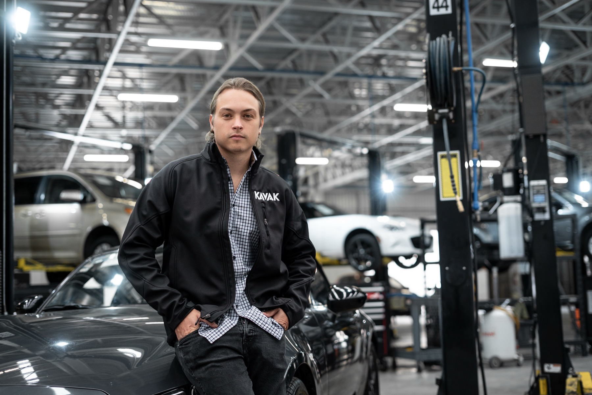

# 第二十八章｜Kavak：从二手车平台到 Agent 原生组织

2022 年末，拉美二手车平台 Kavak 正处在高增长之后的转折点。一边是跨国扩张、数十亿美元估值和数千名员工，另一边是成本削减、裁员、客户投诉与盈利压力。创始人兼 CEO Carlos García Ottati 在内部信中承认，公司必须“**focus on doing fewer better things**”，即聚焦更少、但做得更好的事情。[Reuters, 2022](https://www.investing.com/news/economy/softbankbacked-kavak-laid-off-staff-plans-significant-cutsinternal-email-2952055)

三年多以后，Kavak 对外描述的已经不是一家给员工配置 AI 助手的公司，而是一套由 Agent 承担大部分客户交互和交易、由人处理实体工作和异常情况的组织。它为活跃客户实例化长期 Agent，让 Agent 记住客户历史、调用企业 API、协调销售与金融能力，并在无法继续时向人类请求帮助。公司还宣称，96% 的客户交互和约 95% 的交易已经由 Agent 完整处理。[a16z, 2026](https://a16z.simplecast.com/episodes/how-kavak-rebuilt-itself-around-ai-agents-alejandro-maza-ayala-lp7LuwGh)

这组数字很醒目，但它不是本案例最重要的部分。真正值得研究的问题是：**一家原本依靠专业分工、跨团队交接和大规模人工运营的企业，怎样把组织的基本协调单元从“岗位处理任务”改成“长期 Agent 服务客户”？**

本章基于截至 2026 年 8 月的公开资料。Kavak 是非上市公司，没有公开完整的组织图、分阶段投资、样本口径和审计后的 Agent 经营数据。文中凡涉及 96%、2.1 倍、NPS 提升三倍、AI CEO 增利 50% 等结果，均明确标为**公司自报**，不能视为独立因果证明。

## 28.1 Kavak 是谁：它从来不只是一家二手车网站

Kavak 于 2016 年 10 月在墨西哥成立，创始人为 Carlos García Ottati、Loreanne García 和 Roger Laughlin，最初团队约 15 人。创立动因来自 Carlos 本人的二手车交易经历：卖车耗时很长，买到的车又存在机械问题。他由此看到拉美二手车市场中信息不透明、欺诈风险高、质量没有保障和融资不足等问题。[Forbes, 2022](https://www.forbes.com/sites/forbesinternational/2022/07/23/how-this-mexico-based-used-car-seller-became-the-most-valuable-startup-in-latin-america/)

Kavak 采用的不是轻资产信息撮合模式，而是高度垂直一体化的 C2B2C 模式：从个人手中收购车辆，完成定价、检测和整备，再销售给另一位消费者，同时提供融资、质保和售后服务。



*Kavak 创始人 Carlos García Ottati 置身车辆整备现场。这个场景直观揭示了 Kavak 与普通信息平台的区别：它不只处理线上交易，还要管理车辆检测、维修、库存和交付等实体作业。图片来源：[Bloomberg Línea, 2022](https://www.bloomberglinea.com/2022/12/16/ceo-de-kavak-regresa-a-dirigir-la-startup-en-mexico-tras-despido-de-country-manager/)。*

```text
个人卖车
  → 在线估价与收购
  → 车辆检测
  → 整备与维修
  → 库存和物流
  → 展示与销售
  → 金融、保险与置换
  → 交付、质保与售后
```

这条价值流决定了 Kavak 的组织复杂度。它不仅要像电商平台一样获客和交易，还要像汽车经销商一样管理库存，像维修企业一样检测与整备，像物流企业一样调度车辆，像金融科技公司一样评估风险和提供贷款。公司还需要建立拉美市场缺失的车辆数据与信用基础设施。

Kavak 从成立之初就使用数据和机器学习进行车辆定价、信用评估和物流优化，因此它不是在 2023 年才第一次接触 AI。2022 年时，公司已经拥有自己的估价算法、240 项车辆检查流程、金融产品和大规模整备中心。[Forbes, 2022](https://www.forbes.com/sites/forbesinternational/2022/07/23/how-this-mexico-based-used-car-seller-became-the-most-valuable-startup-in-latin-america/)

这里必须区分两种变化：

- **算法进入业务**：用机器学习改善定价、风控和调度；
- **Agent 重构组织**：让 AI 持有目标和上下文，跨越原有部门边界持续推进客户旅程。

前者优化了局部决策，后者才开始改变公司的运行方式。

## 28.2 转型前的组织与运营：垂直一体化，但客户仍在职能之间流动

### 28.2.1 高增长形成的专业化组织

Kavak 在墨西哥验证模式后快速扩张。2020 年，它成为墨西哥首家独角兽；2021 年私人估值达到 87 亿美元。到 2022 年，公开报道显示公司拥有超过 5000 名员工、40 个车辆整备中心，并进入墨西哥、阿根廷、巴西等多个市场。[Forbes, 2022](https://www.forbes.com/sites/forbesinternational/2022/07/23/how-this-mexico-based-used-car-seller-became-the-most-valuable-startup-in-latin-america/)

随着业务扩张，Kavak 形成了典型的专业职能结构：获客、销售顾问、车辆采购、定价、融资、保险、检测、整备、物流和售后分别积累专业能力，国家或地区团队负责落地运营。公开资料不足以还原一张正式组织图，但 Kavak 首席产品与 AI 官 Alejandro Maza Ayala 回顾 2020 至 2021 年的销售过程时称，一个客户完成买车可能需要跨越约 15 类专业能力，与融资、车型咨询、收车估价和保险等不同团队分别沟通。[a16z 访谈转录, 2026](https://bidclub.ai/e/kavak-s-playbook-rebuilding-company-around-ai)

因此，转型前的基本协调逻辑可以概括为：

```text
客户提出需求
  → 前台识别需求
  → 转交专业团队
  → 各团队完成局部任务
  → 再由下一团队接力
  → 人工汇总结果并推进交易
```

这种结构并非错误。面对车辆、金融和合规等复杂问题，专业分工可以提高局部质量。但当客户旅程持续三四个月、需要跨越多个专业团队时，组织会付出三种代价：

1. 客户需要重复说明需求，关系与上下文在交接中损耗；
2. 各团队优化自己的任务指标，却没有单一主体持续负责客户长期结果；
3. 业务量上升时，服务能力依赖招聘、培训和增加管理层级。

### 28.2.2 增长掩盖不了运营断点

2022 年，外部环境和内部运营问题同时出现。Kavak 在巴西裁减约 150 个岗位，随后又宣布显著削减支出和团队规模。公司将其归因于利率、通胀和经济放缓，并把盈利速度、库存控制、客户留存和车辆周转列为 2023 年重点。[Reuters, 2022](https://www.investing.com/news/economy/softbankbacked-kavak-laid-off-staff-plans-significant-cutsinternal-email-2952055)

客户体验问题更加直接地暴露了组织断点。Carlos 在内部信中承认，客户很难联系到公司，团队也不能在第一次交互中高效提供正确解决方案。Reuters 同年还报道了墨西哥市场中广受关注的客户服务投诉。Carlos 对此回应：“**We have a group of users that we definitely could serve better.**”[Reuters, 2022](https://www.euronews.com/next/2022/07/06/mexico-kavak-expansion)

来自外部的声音更尖锐。Bloomberg Línea 采访的多名前员工把问题归因于决策过度集中、管理低效和快速扩张后的运营失配；一名前售后负责人估计，投诉主要与车辆检查和交付后的问题有关。由于这些内容来自匿名或离职员工，具体比例无法独立核验，但它们至少说明：Kavak 当时面对的不只是宏观经济压力，也包括组织协同和客户服务能力不足。[Bloomberg Línea, 2022](https://www.bloomberglinea.com/2022/12/05/kavak-falla-en-atencion-al-cliente-por-nepotismo-y-mala-gestion-exempleados/)

这构成了 AI 转型前的真实基线：

| 维度 | 转型前主要特征 | 暴露的问题 |
| --- | --- | --- |
| 人员 | 大量专业人员按职能处理客户旅程 | 能力绑定岗位，扩容依赖招聘与培训 |
| 组织 | 多专业团队、国家运营和管理层级 | 决策集中，跨团队交接损耗上下文 |
| 流程 | 客户依次经过销售、金融、检测和售后 | 周期长，首次解决率不足，责任易漂移 |
| 工具 | 定价、风控、物流等局部算法系统 | 算法支持局部决策，却没有持续协调客户旅程 |

## 28.3 四阶段转型：从垂直平台到 Agent 原生组织

Kavak 没有公开一份正式的四阶段路线图。以下阶段是本书根据公司披露、外部报道和 2026 年高管访谈重建的分析框架，日期存在重叠，不应理解为严格串行的项目计划。

| 阶段 | 大致时期 | 核心变化 | 组织基本单元 |
| --- | --- | --- | --- |
| 第一阶段 | 2016—2022 | 用数据与算法建立垂直一体化平台 | 职能团队与交易 |
| 第二阶段 | 2022—2023 | 在经营压力下重置目标，开始围绕 Agent 改造系统 | Agent 化业务能力 |
| 第三阶段 | 2023—2025 | 以 Eval 驱动销售、金融和运营 Agent 进入核心价值流 | 工作流与专业 Agent |
| 第四阶段 | 2025 年末以来 | 放弃部分既有多 Agent 图，转向“一个客户一个长期 Agent” | 客户 × 长期 Agent |

### 28.3.1 第一阶段：算法增强垂直一体化业务

Kavak 的第一阶段不是生成式 AI，而是数字平台和机器学习。它用数据进行车辆估价、信用评分、库存与物流决策，同时把检测、整备、融资和售后纳入统一业务体系。

这一阶段建立了后来 Agent 化所需的三个前提：

1. **业务闭环**：公司能够从获客一直触达交易、融资、交付和售后结果；
2. **数据闭环**：交易、车辆、客户和履约过程持续产生数据；
3. **行动接口**：关键业务能力已经数字化，后来才可能被 Agent 调用。

但此时 AI 主要服务于职能，组织仍以岗位和流程为主。算法可以给出价格，却不能持续理解客户为什么犹豫；风控可以计算贷款条件，却不会主动协调车辆选择、置换和保险；每个系统都更聪明，客户仍然需要在组织中移动。

**阶段启示：** Agent 原生转型并非从模型开始。没有数字化业务能力、可靠数据和可调用接口，Agent 只能停留在聊天层，无法承担真实价值流。

### 28.3.2 第二阶段：从“采用 AI”转向“围绕 Agent 重建”

经营压力迫使 Kavak 重新审视增长模式。2022 年前后的成本削减与服务问题，提供了一个不能被忽略的背景：AI 转型不是发生在没有约束的创新实验室里，而是在公司必须改善盈利、客户留存和运营效率时展开。

根据 Alejandro 的回顾，Kavak 作出了三项战略选择：

1. 不保持原组织不变后给员工发放 ChatGPT，而是围绕 Agent 重建系统和 API；
2. 不只自动化简单任务，而是把 Agent 放进最难、最接近经营结果的问题中；
3. 不再只按买入、卖出多少辆车衡量公司，而是转向客户关系、满意度、转化率和终身价值。

他把第一项选择概括为：“**redesign your whole company around the agents**”。[a16z 访谈转录, 2026](https://bidclub.ai/e/kavak-s-playbook-rebuilding-company-around-ai)

这句话真正困难的部分不在愿景，而在基础设施。Agent 要推进交易，就必须读取客户和车辆状态，调用估价、预约、贷款、保险和履约能力，并受到身份、权限和规则约束。Kavak 因此需要重建大量 API 和系统，使原本只供内部应用使用的能力可以被 Agent 可靠调用。

**阶段启示：** 给员工配置 AI 只改变局部执行速度；当 Agent 要承担端到端结果时，企业必须把知识、规则和业务动作改造成可读取、可调用、可观测的运行能力。

### 28.3.3 第三阶段：让 Eval 成为速度、授权与管理系统

从 2023 年起，Kavak 已经使用 AI Agent 管理车辆发现、融资和检测预约等客户对话。[Meta, 2026](https://whatsappbusiness.com/resources/success-stories/kavak/) 但把 Agent 放到销售和贷款等高影响场景，不能只依赖演示效果。Kavak 的答案是把 Eval 放在系统中心。

Alejandro 披露，公司用于建设 Eval 的工程时间、Token 和资金，与建设 Agent 本身大体相当。它首先检查的不是 Agent 说得像不像人，而是业务结果：客户是否获得价值、是否完成交易、是否满意，以及之后是否愿意继续互动。

```text
Agent 候选能力
  → 离线场景与反例评估
  → 受控进入真实客户旅程
  → 观察转化、满意度、风险与成本
  → 人工处理异常
  → 将失败转成新场景、规则或能力
  → 再次评估与扩大
```

Kavak 没有把 Agent 定位成回答常见问题的客服，而是直接建设销售 Agent。公司称，传统买车过程需要融资、保险、置换估价和车型咨询等约 15 类专业能力；新的 Agent 则把这些能力组合成面向客户的“超级专家”。

公司自报的结果包括：

- 客户 NPS 和满意度提高到原来的约三倍；
- Agent 的销售转化率最初比人工团队高约 50%，后来达到约 2.1 倍；
- 车贷审批通常缩短到三分钟以内；
- 截至 2026 年，96% 的客户交互、约 95% 的交易由 Agent 完整处理。

这些数据没有披露样本量、时间窗口、客户分配方式和完整对照实验，因此只能说明公司报告了显著改善，不能证明所有改善都由 Agent 单独造成。尤其是车贷审批时间，还依赖 Kavak 的垂直业务数据、风险政策和车辆资产处置能力，不是换一个模型就能复制。

这一阶段还把 Agent 推进到实体运营。Kavak 为技师提供名为 El Mike 的辅助 Agent，用于车辆检查和维修指导；公司自报相关质保事件下降约 26%。这里的人机关系不是替代：Agent 提供知识和步骤，技师继续承担需要触觉、视觉和实体操作的工作。

**阶段启示：** Eval 不是上线前的一张测试报告，而是连接目标、授权、运行事实和改进动作的管理系统。真正决定 Agent 能走多远的，不只是模型能力，而是组织能否发现错误、限制影响并把异常转化为下一轮能力。

### 28.3.4 第四阶段：从工作流 Agent 到“一个客户一个长期 Agent”

Kavak 最初建设的仍是工作流和多 Agent 系统：不同 Agent 按图执行融资、推荐、购买等步骤。到 2025 年末，这套系统已经有数千乃至数万 Agent 运行，并被公司认为推动了增长与盈利。

但随着更强模型出现，Kavak 作出了一项高成本选择：放弃已经建设约两年的部分多 Agent 架构，转向更薄的 Harness。新的基本单元不是“一个任务一个 Agent”，而是“一个客户一个长期 Agent”。

每个活跃客户 Agent 拥有：

- 独立运行环境或虚拟机；
- 跨时间保存的客户历史与记忆；
- 面向客户满意和终身价值的长期目标；
- 调用公司工具、API 和 Skill 的能力；
- 持续运行、休眠、唤醒和安排下一步行动的机制；
- Eval、遥测和人工求助通道。

公司称，每天会实例化约 10 万至 20 万个此类 Agent。它们可能运行几分钟、数小时或数天，再根据下一任务自行唤醒。与传统工作流相比，关键变化是协调中心发生了转移：过去由客户穿过公司内部流程，现在由客户 Agent 调用公司能力。

```text
转型前：客户 → 多个职能团队 → 拼接一次交易

转型后：客户 → 长期 Agent → 调用专业 Agent、API 与人类能力
```

当 Agent 遇到无法处理的情况时，Kavak 没有只把客户转给二线团队后结束 Agent 任务，而是设计了“I need help”接口：Agent 请求人工能力，人工解决问题，处理过程再回到 Agent 的学习与评估闭环。

这就是“AI 调用人”最具体的含义。它不意味着 Agent 成为法律或伦理责任主体，也不意味着人类只是工具。它表示在运行结构上，Agent 持续保存客户目标和任务状态，人类以领域判断、实体操作或例外裁决的方式进入任务；责任仍必须由有权的人和组织承担。

**阶段启示：** 自治不是移除人，而是重新安排人出现的位置。Agent 负责连续执行，人负责目标、规则、例外和不可转移责任；一次人工介入只有被记录、验证并回写，才会成为组织学习，而不只是一次救火。

## 28.4 组织怎样改变：从岗位协作到人机能力网络

### 28.4.1 团队变平，但不是组织自动消失

Alejandro 描述的当前 Kavak，是由更扁平、更资深和更有授权的团队构成，团队内部同时包含工程、AI 和运营能力。员工的工作大致分为三类：建设 Agent、为 Agent 提供能力，以及在物理世界面对客户和车辆。

这种结构减少的是围绕信息传递和任务分配形成的中间层，不是所有管理工作。目标设定、风险偏好、预算、权限、例外和绩效判断仍然存在，只是其中一部分被编码进 Agent 的目标、Eval、API 和运行规则。

因此，“Agent 成为老板”更适合作为运行比喻，而不是治理结论。Agent 可以分配每日任务、请求人工帮助和跟踪进度，但它不能自行取得组织授权，也不能承担贷款、客户权益、劳动关系和事故后果。

### 28.4.2 Jedi Academy：转型不只培训 AI 工程师

Kavak 建立了内部 Jedi Academy，培训对象从 CEO、工程师和财务人员一直延伸到技师。Alejandro 称，课程持续更新，参与者经过六周训练后要把 Agent 推向生产。

这个做法背后的重点，不是要求每个人转岗为 AI 工程师，而是建立共同的 Agent 协作素养：

- 业务人员能够把专业知识转成目标、规则和评估场景；
- 工程人员能够把企业能力封装为 Agent 可调用的接口；
- 一线人员能够识别错误、请求接管并反馈真实运行情况；
- 管理者能够围绕业务结果和风险，而不是 AI 使用量作出投资判断。

Kavak 的内部表达也相当强硬：员工可以选择学习并适应新的现实，否则这家公司可能不再适合他。这种自上而下的方向感有助于打破观望，但也带来组织伦理问题：培训机会是否公平，员工能否真实表达反对意见，岗位变化和裁员之间如何区分，劳动责任是否被“技术必然性”掩盖？公开资料没有充分回答这些问题。

### 28.4.3 AI CEO：大胆实验不等于治理移交

2026 年，Kavak 在墨西哥 Cuernavaca 进行了一项为期约六周的“AI CEO”实验。Agent 分析当地经营指标，为销售、检测等一线人员安排每日任务，并通过语音反馈跟踪执行。公司自报，首月利润未达到翻倍目标，但提高了约 50%，客户满意度、库存周转和融资渗透率也有改善。

这个实验说明 Agent 可以承担高频经营分析和任务编排，却不能据此推出“CEO 已被替代”：

1. 实验发生在单一城市，不等于公司级治理；
2. 目标和指标由人设定，Agent 没有决定公司使命；
3. 人类仍完成车辆检查、交付等实体工作；
4. 公司没有公开基线、对照组、利润口径和风险事件；
5. “AI CEO”仍由 Kavak 管理层授权、监督并承担后果。

更准确的命名是**城市级经营 Agent**。它验证的是经营控制环中的分析、计划、调度和反馈能否被 Agent 承担，而不是公司治理责任能否交给机器。

## 28.5 结果：经营改善与证据边界必须同时看

2026 年 2 月，Kavak 宣布获得 3 亿美元新一轮融资，其中 a16z Growth 投资 2 亿美元。公司披露，2025 年完成近 12 万笔交易，同比增长约 40%，并在 2025 年 12 月首次实现单月全球合并盈利；公司还称，其金融科技业务成立以来累计提供超过 10 亿美元融资。[Kavak, 2026](https://news-room.kavak.com/kavak-announces-usd300-million-series-f-led-by-andreessen-horowitz-to-expand-access-trust-and-financing-across-latin-america)

这些经营结果与 AI 转型在时间上重叠，但不能简单写成“AI 导致盈利”。同期发生的库存收缩、市场聚焦、成本削减、融资结构和宏观环境变化，同样可能产生影响。较稳妥的判断是：Kavak 已经把 Agent 放进核心价值流，并报告了与转型方向一致的经营改善；AI 对总结果的独立贡献比例仍未知。

### 内部与外部声音对照

| 时间与声音 | 原话或公开立场 | 它揭示了什么 | 阅读时的限制 |
| --- | --- | --- | --- |
| 2022 年，创始人 Carlos | 聚焦“更少、但做得更好”，并承认部分客户本可得到更好的服务 | 转型前存在盈利与客户服务双重压力 | 内部信和采访反映管理层解释 |
| 2022 年，多名前员工 | 指向决策集中、管理低效和快速扩张后的运营失配 | 外部视角挑战了“问题只有宏观环境”这一解释 | 多为匿名或离职员工，细节无法全部核实 |
| 2026 年，首席产品与 AI 官Alejandro | 公司必须围绕 Agent 重建，而不是只提高 AI 采用率 | 管理层把转型定义为组织重构 | 属于转型负责人的事后总结 |
| 2026 年，Kavak 公司公告 | 强调客户长期价值、经营改善和 AI 投资 | AI 已成为公司增长叙事的一部分 | 融资公告具有企业传播目的 |
| 2026 年，a16z 访谈 | 把 Kavak 描述为“自我改进公司” | 投资方认可其 Agent 原生方向 | a16z 已投资 Kavak，不是独立评价机构 |

这些声音并不需要被压缩成一个“正确版本”。2022 年的运营危机解释了转型为什么具有紧迫性，2026 年的管理层叙事则解释了公司希望转向哪里。二者之间是否存在充分因果关系，仍需要更长时间和更多独立数据验证。

| 声明 | 来源性质 | 可以得出的结论 | 不能直接得出的结论 |
| --- | --- | --- | --- |
| 96% 交互、95% 交易由 Agent 处理 | 高管访谈，公司自报 | Agent 已进入大部分客户旅程 | 所有交易均无人监督且没有风险 |
| 销售转化率为人工 2.1 倍 | 高管访谈，公司自报 | 公司观察到 Agent 组表现更高 | 架构是唯一原因，其他企业可复制同等结果 |
| NPS 和满意度约为原来三倍 | 高管访谈，公司自报 | 客户体验指标被纳入 Eval | 指标口径、样本和持续时间已独立验证 |
| 城市利润提高 50% | 六周内部实验，公司自报 | 经营 Agent 值得继续实验 | AI 可以替代公司 CEO 或承担治理责任 |
| 2025 年交易增长约 40%，单月合并盈利 | 公司融资公告 | 公司经营状况明显改善 | 改善完全由 AI 转型造成 |

外部声音也提醒我们保持克制。2022 年，Reuters 和 Bloomberg Línea 记录了客户投诉、裁员和管理争议；2026 年的主要 AI 成效则来自 Kavak 高管以及已经投资 Kavak 的 a16z。a16z 的访谈提供了罕见的一线细节，却同时存在投资关系。这些说明不能因为后来的增长，就把早期代价和证据冲突从历史中删除。

## 28.6 Kavak 与 Agentic Agile：相通的是运行逻辑，不是名词

Kavak 没有宣称采用 Agentic Agile，也没有公开 3-4-3、SCOPE-V 或四大动态工件，这是两者机制层面的对照。

| Kavak 实践 | Agentic Agile 视角 | 相通之处 | 仍需追问的边界 |
| --- | --- | --- | --- |
| 从交易量转向客户终身价值 | 意图锚定 | Agent 围绕长期业务结果运行 | 客户权益、利润和风险冲突时谁裁决 |
| 一个客户一个长期 Agent | 动态责任单元与持续上下文 | 目标、记忆和执行不随交接丢失 | 记忆来源、权限、失效和隐私如何治理 |
| 重建 API 与 Skill | Harness 与可执行约束 | 企业能力成为可调用动作 | 动作权限、不可逆边界和审计证据是否完备 |
| Eval 投入接近 Agent 投入 | Prove、Verify 与 Evidence | 完成由结果和证据判断 | Eval 是否独立，是否覆盖合规与反例 |
| “I need help”人工接口 | 人类异常裁决 | 未知和越界触发人类介入 | Agent 是否能识别自己不知道，谁承担最终责任 |
| 人工处理回到学习闭环 | Evolve 与 Telemetry | 失败成为下一轮能力输入 | 单次经验如何验证后再晋升为全局规则 |
| 扁平跨职能团队 | 人机责任网络 | 能力动态组合，责任节点仍需稳定 | 扁平化是否造成责任模糊或劳动压力 |

这些对照归纳为六个核心论点。它们不是对 Kavak 做法的照搬，而是对其转型逻辑的提炼。

## 28.7 六个核心论点：Kavak 究竟改变了什么

Kavak 案例的核心不是“用 AI 卖车”，而是以下六项组织逻辑的变化。

### 1. 从“旧组织加 AI”转向“围绕 Agent 重构组织”

AI 转型最常见的误区，是组织结构、岗位、流程和 KPI 都保持不变，只给员工增加一个 AI 助手。这类做法可能提高局部速度，却不会自动减少部门交接、目标冲突和客户上下文丢失。它就像早期工厂只用电动机替换蒸汽机，却没有围绕电力重新设计生产线。

Kavak 选择的不是简单叠加工具，而是同时改造客户旅程、API、团队结构、评估体系和经营指标，重新安排客户、Agent、员工和业务系统之间的关系。转型对象因此不再是一个工具，而是整个生产系统。

### 2. 从“一个任务一个 Agent”转向“一个客户一个长期 Agent”

传统 Agent 往往围绕一次任务创建，任务完成后，上下文也随之结束。Kavak 则尝试为每位活跃客户实例化一个持续服务的 Agent，使其拥有长期记忆、客户上下文和调用企业系统的能力。

这使组织的基本服务单元开始从“岗位处理任务”转变为：

> **客户 × 长期 Agent × 企业能力网络**

Agent 的目标不只是完成一次咨询，而是在客户利益、合规、风险和满意度约束下，持续推进客户目标并提升长期价值。

### 3. 从复制普通劳动力转向复制经过验证的最佳实践

Agent 的价值不只是降低重复劳动成本，还在于把优秀员工的判断方法、业务知识和异常处理经验转化为可复制能力。Kavak 的关键不是复制顶尖销售的一段话术，而是识别他们在什么条件下如何判断、何时转向另一种策略，以及哪些情况必须停止或求助。

当一种方法经过验证后，可以快速应用到大量 Agent；当一次错误被发现，也可以通过更新规则、上下文和 Eval 减少同类错误。这种规模效应同时会放大风险：未经验证的经验如果被全局同步，错误也会被同样快速地复制。因此，经验必须经过“候选—验证—限定范围—责任确认—可回退发布”后，才能晋升为组织能力。

Kavak 自报的部分实验中，Agent 的销售转化表现达到人工团队的 2.1 倍。这一数字可以说明公司的转型方向，但它仍属于公司口径，不能直接推广到其他企业。

### 4. 从“人调用 AI”转向“Agent 编排人机能力”

在传统模式中，人掌握任务，并调用 AI 完成局部工作。在 Kavak 的模式中，Agent 可以持续保存目标、上下文和任务状态；当自身能力、权限或信息不足时，再通过“I need help”机制向人类请求帮助。

这并不意味着人变成了“工具”，更不意味着责任可以转移给机器。更准确的分工是：

> **Agent 负责持续执行、协调和反馈；人类负责价值判断、异常处理、实体操作与最终责任。**

人工介入之后，处理过程还可以被整理为新的评估案例、规则或训练样本。只有当这些经验经过验证并回写系统时，一次人工帮助才会变成组织能力的增量。

### 5. 从 Prompt 管理转向 Eval 驱动的管理系统

Agent 管理的重点不应是调用了多少次模型、打了多少电话或节省了多少分钟，而应是它是否产生了正确且可持续的业务结果：

- 客户问题是否真正解决；
- 车辆是否完成交易；
- 转化率和利润是否提高；
- 客户满意度是否改善；
- 合规、质量和风险是否保持在边界内；
- 失败后能否停止、升级或恢复。

因此，Eval 不只是模型上线前的测试工具，而是连接业务目标、Agent 行为、运行证据和管理决策的控制系统。它用来决定 Agent 能否上线、能获得多大权限，以及何时必须停止或回退。

### 6. 从固定流程自动化转向可治理的自我改进

传统自动化依赖预先设计好的固定 Workflow。随着模型能力增强，企业可以让一部分预设流程变薄，让 Agent 根据目标和环境选择行动，但流程变薄不等于治理消失。组织的管理重点反而要转向：

- 正确且可观察的目标；
- 真实、连续并经过治理的上下文；
- 清晰、最小且可撤回的权限；
- 独立的评估和验证机制；
- 人工介入、异常升级和停止条件；
- 持续反馈、经验沉淀和可回退发布机制。

系统的每次执行、失败和人工介入都可能产生新的改进信号，推动 Agent、规则和组织能力共同演化。但所谓“自我改进”必须是可验证、可限制、可追溯和可恢复的，不是让 Agent 自行改写全局规则。

六项变化共同指向一个结论：**AI 转型不是给旧公司加装工具，而是重新设计公司感知客户、调用能力、完成工作、处理异常和积累经验的方式。**

## 28.8 从案例到行动：企业短期可以做什么

Kavak 的“一个客户一个 Agent”并不适合所有企业。它成立于几个特殊条件：客户价值高、决策周期长、跨专业协调复杂、企业掌握端到端数据与服务能力，而且一次更好的转化可以覆盖较高的模型与工程成本。

其他企业值得迁移的不是 Kavak 的表面架构，而是一组可以从小范围开始的行动。

1. **盘点现有 AI 用例。** 判断它们是否只是“旧流程加 AI 工具”，还是已经改变了价值流、责任关系和反馈机制。
2. **选择一条高价值客户旅程。** 不要一开始就重构整家公司。选择上下文容易断裂、交接频繁、结果可度量且失败可控制的旅程，同时建立周期、质量、成本和客户体验基线。
3. **试验“一个客户一个长期 Agent”。** 为 Agent 提供持续身份、必要记忆和受控 API，但必须同步定义客户权益、数据边界、权限范围、停止条件和人工接管机制。
4. **建立业务结果导向的 Eval。** 除任务完成率外，同时衡量转化、利润、满意度、合规、返工、人工介入和失败成本。先建立停止、接管和恢复机制，再扩大 Agent 的自治范围。
5. **把人工介入变成学习入口。** 记录 Agent 为什么求助、人如何解决、问题是否重复，以及能否沉淀为规则、测试或新能力。只有经过验证的经验才能进入组织规则。
6. **寻找可复制的优秀实践。** 提炼顶尖员工的判断依据和异常处理方法，不只复制最终话术；同时保留适用条件、反例和风险边界。
7. **逐步调整组织分工。** 让 Agent 承接连续执行，让人从重复操作转向目标定义、能力建设、异常裁决和系统改进。扩大、保持、收缩或停止的依据，应是端到端业务结果，而不是 AI 使用量。

在每一步中，企业都应同时评估员工影响、劳动责任、客户知情、隐私和算法公平，而不是等到规模化之后再补治理。

企业还应主动避免四种误读：

- 不要把裁员自动解释为 AI 生产率；Kavak 2022 年的裁员早于公开的 Agent 成效，且公司当时主要归因于宏观环境和盈利压力。
- 不要把高转化率解释为 Agent 可以无限自主；金融和高客单价交易更需要权限、证据和责任边界。
- 不要把“AI CEO”解释为公司治理已经自动化；目前公开材料只支持一次城市经营实验。
- 不要把自我改进理解为未经验证的全局同步；复制经验之前必须先防止复制错误。

## 28.9 本章小结：公司开始像软件一样演化，但责任不能像代码一样自动部署

Kavak 从二手车平台成长为同时经营车辆、物流、金融与售后的垂直一体化公司，但增长也带来了跨团队交接、客户上下文丢失、服务难以扩容和管理复杂度。2022 年的经营与客户体验压力，使这些问题无法继续被增长掩盖。

此后的 AI 转型不是简单增加聊天工具。Kavak 重建 API，以 Eval 控制 Agent 进入销售、金融和实体运营，再从工作流 Agent 转向客户长期 Agent，并同步改变团队结构、人员能力和管理指标。它真正激进的地方，是把客户关系、任务协调和组织学习重新放到 Agent 周围设计。

但多数亮眼成效来自公司自报，投资方访谈也不是独立审计；客户记忆、贷款决策、劳动影响、错误同步和最终责任仍有未公开边界。Kavak 展示的是一种组织可能性，不是已经验证的通用答案。

真正可迁移的结论是：

> **未来公司可能像软件一样持续升级，但升级的不是一个模型，而是目标、能力、规则、证据和人机责任共同构成的运行系统。执行可以交给 Agent，责任不能随版本自动转移。**

**本章最小实践**：选择一条跨三个以上岗位的客户旅程，画出转型前的交接链；再设计一个能够持续持有客户目标和上下文的 Agent 责任单元，明确它可调用的 API、必须遵守的约束、Eval、人工求助接口和最终责任人。不要先讨论替代多少岗位，先回答客户是否更早获得可靠结果。

## 28.10 主要资料与证据说明

- [Kavak, “Who we are”](https://www.kavak.com/om-en/about-us)：公司成立背景、业务定位与客户价值主张。
- [Forbes, “How This Mexico-Based Used-Car Seller Became The Most Valuable Startup In Latin America”, 2022](https://www.forbes.com/sites/forbesinternational/2022/07/23/how-this-mexico-based-used-car-seller-became-the-most-valuable-startup-in-latin-america/)：创立过程、业务模式、人员规模、估值、垂直一体化能力与创始人观点。
- [Reuters, “SoftBank-backed Kavak lays off staff, makes significant cuts”, 2022](https://www.investing.com/news/economy/softbankbacked-kavak-laid-off-staff-plans-significant-cutsinternal-email-2952055)：成本削减、裁员、2023 年经营重点和内部信。
- [Reuters, “Mexican used-car startup Kavak expands outside Latin America”, 2022](https://www.euronews.com/next/2022/07/06/mexico-kavak-expansion)：国际扩张、巴西裁员与客户投诉回应。
- [Bloomberg Línea, “Kavak falla en atención al cliente...”, 2022](https://www.bloomberglinea.com/2022/12/05/kavak-falla-en-atencion-al-cliente-por-nepotismo-y-mala-gestion-exempleados/)：前员工对管理、组织和客户服务问题的外部视角；匿名来源内容仅作争议信号。
- [Bloomberg Línea, Kavak 墨西哥管理变动报道, 2022](https://www.bloomberglinea.com/2022/12/16/ceo-de-kavak-regresa-a-dirigir-la-startup-en-mexico-tras-despido-de-country-manager/)：章节配图的刊载来源；正式出版前应再核实图片授权范围。
- [Meta, Kavak success story](https://whatsappbusiness.com/resources/success-stories/kavak/)：自 2023 年起的客户旅程 Agent、WhatsApp 前置触达和试点数据；页面明确注明结果为企业自报。
- [The a16z Show, “The Self-Improving Company | Kavak's AI Playbook”, 2026](https://a16z.simplecast.com/episodes/how-kavak-rebuilt-itself-around-ai-agents-alejandro-maza-ayala-lp7LuwGh)：Kavak 首席产品与 AI 官对架构、Eval、组织与经营实验的系统说明。a16z 已投资 Kavak，存在利益相关。
- [访谈完整转录与摘要](https://bidclub.ai/e/kavak-s-playbook-rebuilding-company-around-ai)：用于核对访谈细节；属于第三方整理的 YouTube 字幕，不替代企业审计资料。
- [Kavak, Series F announcement, 2026](https://news-room.kavak.com/kavak-announces-usd300-million-series-f-led-by-andreessen-horowitz-to-expand-access-trust-and-financing-across-latin-america)：2025 年交易、盈利、融资与 AI 投资方向，均为公司披露。
