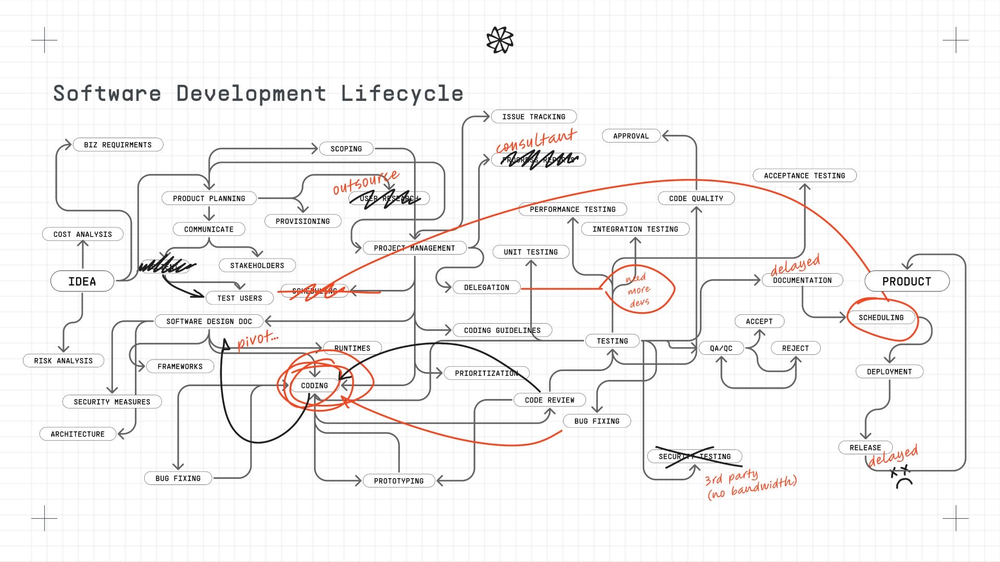
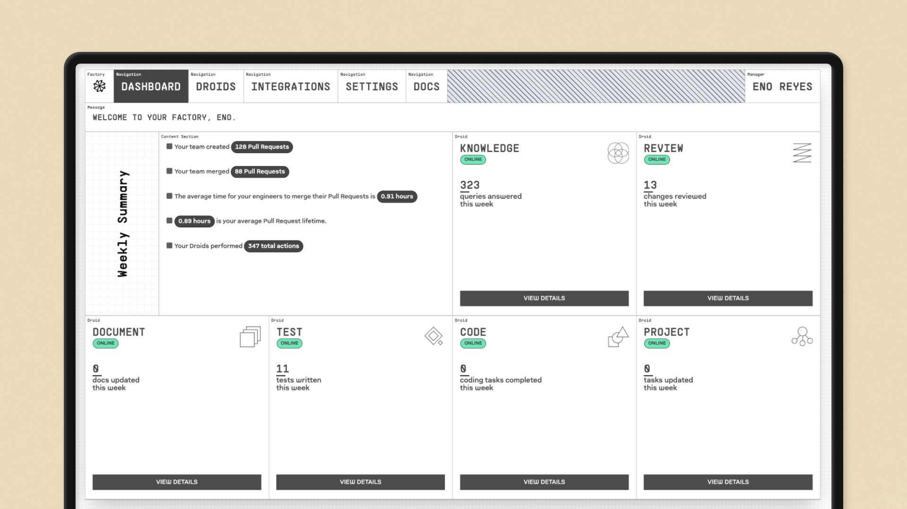

# 第二十九章｜EY（安永） 与 Factory Droids：从编码助手到 Agent 原生工程组织

2026 年 3 月，EY （安永）全球客户技术工程负责人 Stephen Newman 在接受 VentureBeat 采访时，提出了一个比“AI 能写多少代码”更尖锐的问题：即使 Agent 能在几分钟内生成数千行代码，如果这些代码无法集成、不符合内部标准，或者需要更多返工，那么前端的“快”并没有产生真实价值。

> “You can generate a ton of code, but it doesn't mean really anything ... It's got to be code that is integratable, that is compliant.”
>
> “你可以生成大量代码，但这本身并不意味着什么……代码必须能被集成，并且符合合规要求。”
>
> —— Stephen Newman，EY Global Client Technology Engineering Leader

这句话道出了大型企业引入编码 Agent 的核心矛盾：**模型可以加速代码生成，却不会自动获得组织的工程上下文、质量标准和行动权限。**

EY 后来试用了 Lovable、Replit 和 Factory 等多种 Agent 平台。开发者自发向 Factory 的 Droids 集中后，使用量迅速上升，EY 不得不限制流量和可连接的代码库，等待安全与合规审批。真正的转折不是选中了哪个工具，而是 EY 开始把 Agent 连接到代码库、工程标准、源代码目录和合规控制，并重新划分哪些工作可以高度自治，哪些必须由人掌握。

本章研究的不是“EY Droids”这个不准确的产品名称。**Droids 是 Factory 的软件工程 Agent 产品，EY 是企业用户之一。** 本章的对象，是 EY 的产品工程团队如何从辅助式 AI 走向半自主 Agent 执行，以及这种转变如何改写上下文、流程、权限和工程师角色。

本章基于截至 2026 年 8 月的公开资料。EY 没有公开 Droids 的团队数量、代码库范围、测量口径和细化质量数据。本章中 15%—60% 和最高 4—5 倍的数据来自 EY 负责人访谈，并非独立审计结果。

## 29.1 EY（安永） 是谁：一家以专业标准和人才组织交付的全球网络

EY 的历史可追溯至 19 世纪和 20 世纪初的多家会计事务所。1989 年，Ernst & Whinney 与 Arthur Young 合并为 Ernst & Young，后来统一使用 EY 品牌。

EY 不是一家由全球总部直接经营所有客户业务的单一公司，而是由 Ernst & Young Global Limited 成员所组成的全球网络。各成员所是独立法律实体，在共同品牌、战略、方法与专业标准下协作。这种结构既能贴近各国市场与监管，也使全球技术标准、数据边界和审批流程更加复杂。

2025 财年，EY 披露的全球合并收入为 532 亿美元，全球人员约 40.6 万，在 150 多个国家和地区提供服务。其业务横跨审计、咨询、税务、战略与交易。审计、税务和金融平台不只要“可用”，还要满足数据隔离、可追溯、稳定性、专业方法和监管要求。

*EY 全球创新市场激活负责人 Edwina Fitzmaurice。她在 EY 的 Agent 实践中强调“边做边学”，并亲自构建编辑、质疑者和倡导者等 Agent。这条更广的 EY Agent 转型线，为工程团队接受 Droids 提供了组织背景。图片来源：[Microsoft Customer Stories, 2025](https://www.microsoft.com/en/customers/story/25662-ey-microsoft-365-copilot)。*

## 29.2 转型之前：软件交付不是写代码，而是穿越整个工程系统

EY 的产品工程团队为审计、税务和金融等业务构建平台。在这类环境中，一个功能从需求到上线，需要穿越产品规划、架构、安全、开发、测试、代码审查、验收、发布和运维。工程标准分散在代码库、文档、流水线、审批规则和资深工程师的经验中。

*Factory 用这张图描绘大型组织软件开发生命周期中的依赖、延迟和反馈回路。它不是 EY 的实际流程图，但可以解释为什么只加速“Coding”节点未必能加快端到端交付。图片来源：[Anthropic 对 Factory 的客户案例](https://www.anthropic.com/customers/factory)。*

转型前的核心单元仍是“人接收任务，人寻找上下文，人写代码，人穿越各种门禁”。资深工程师、架构师和审批人的重要价值，一部分来自他们知道：

- 一个功能应该改哪些代码库；
- 哪些模式符合 EY 的工程标准；
- 哪些依赖和数据不能被随意访问；
- 代码在进入生产环境前需要哪些证据和批准；
- 看似局部的改动可能影响哪些下游系统。

因此，通用编码模型面对的不只是代码生成问题，而是组织记忆缺失问题。它不知道“我们在这里如何工作”，生成的代码越多，后续检查和返工反而可能越多。

### 29.2.1 谁在这个系统里承担什么责任

EY 的产品工程交付并不是开发者单独完成的链条。产品负责人决定业务目标和范围；架构师判断系统边界与长期演进；工程师实现功能；安全、隐私和合规团队检查数据与访问风险；测试和发布团队验证变更能否进入生产。全球网络结构又增加了一层现实约束：同一种能力可能要适应不同国家的监管、客户数据边界和成员所流程。

在这个结构中，Droids 最先接管的是工程师手中的执行动作，却会立刻触碰其他角色的责任边界：

- Agent 能否读取客户代码和内部文档？
- Agent 创建的变更由谁承担安全责任？
- 代码审查能否由 Agent 完成初筛，什么情况下必须升级给专家？
- 一个跨系统改动的“完成”，由功能团队还是发布责任人确认？

因此 EY 面对的不是一个购买决策，而是一项组织授权决策。工具可以由工程师试用，但代码库、权限和生产路径不能由个人采用行为自动打开。

## 29.3 三阶段转型：从个人辅助到半自主工程执行

EY 没有公布一份名为“Droids 三阶段路线图”的正式文件。以下阶段是本书根据 EY 负责人采访、EY 与 Microsoft 的客户案例及 Factory 产品资料重建的分析框架。

| 阶段 | 主要做法 | 组织能力的变化 |
| --- | --- | --- |
| 第一阶段 | 以 Copilot 类工具建立辅助式 AI 习惯 | 工程师学会与 AI 协作，但任务仍由人持有 |
| 第二阶段 | 并行试用 Lovable、Replit 和 Factory Droids | 用真实采用和产出信号选工具，暴露安全与授权瓶颈 |
| 第三阶段 | 连接上下文宇宙，对工作负载分级授权 | Agent 进入半自主执行，工程师转向编排、验证和裁决 |

### 29.3.1 第一阶段：先让工程师熟悉辅助式 AI

EY 先从 GitHub Copilot 类工具开始，让工程师在代码补全、解释和生成中学习如何给 AI 提供指令。Newman 把“自下而上的有机采用”视为一个重要经验：管理者没有强行规定所有人使用同一种方式，而是先让工程师在工作中发现价值。

这一阶段解决的是信任与能力问题，却没有改变任务边界。AI 仍在工程师的 IDE 中完成局部动作，人仍要自己查找上下文、分解任务、运行测试并推动交付。随着使用深入，局部代码生成的提升开始触及上限。

**阶段启示：** 组织学会使用 AI 是 Agent 转型的必要前提，但使用率不等于交付能力。当任务、上下文和责任关系没有变化时，辅助式 AI 主要改善个人动作。

### 29.3.2 第二阶段：不由领导指定答案，让真实使用产生选择信号

工程师希望 AI 不只生成代码，还能构建、验证并推进更完整的任务。EY 因此并行评估 Lovable、Replit 和 Factory Droids，并观察采用、使用和产出表现。Newman 明确表示，领导团队不希望过早规定一种工具，再把它简化成所有人被迫使用的标准答案。

开发者逐步向 Factory 集中，使用量在进入试点后迅速上升。但“自发采用”并不意味着可以立即开放所有权限。EY 一度需要节流，并限制 Droids 可以连接的代码库，等待合规和安全审批。

这形成了案例中最重要的采用冲突。工程师看到的是等待时间缩短和任务吞吐增加；平台与安全团队看到的是连接面扩大、数据外流风险和无法解释的责任链；管理层则必须在“不要压制创新”和“不要让未经验证的 Agent 进入关键代码库”之间做出取舍。

EY 的节流不是简单限制调用次数，而是把“采用”和“授权”拆开：允许团队继续在低风险场景试用，同时暂缓高敏感代码库、生产凭证和跨系统动作的连接。这个动作保留了真实使用信号，也为安全团队争取了建立权限、审计和验证规则的时间。

这也解释了为什么自下而上的采用并不等于无治理。开发者可以帮助组织发现最有价值的工作负载，但不能单独决定 Agent 的最大影响范围。

*Factory 早期 Droids 产品界面，展示 Knowledge、Review、Document、Test 和 Code 等不同工程 Agent。这是 Factory 的产品示意，不是 EY 内部部署截图。图片来源：[Anthropic 对 Factory 的客户案例](https://www.anthropic.com/customers/factory)。*

Factory 将 Droids 定位为软件工程 Agent。Review Droid 可以分析拉取请求、提供上下文并留下行级评论；Code Droid 可以从 Jira 或 Linear 等系统接收任务，完成代码修改并创建拉取请求。与只在编辑器中建议下一段代码相比，它开始承接一个跨多步的工程责任单元。

**阶段启示：** 工具选型可以利用开发者的真实行为作为信号，但采用热度不能替代风险裁决。Agent 越能执行真实动作，组织越需要在连接代码库之前定义范围、权限和证据。

### 29.3.3 第三阶段：连接“上下文宇宙”，再按工作负载授权

Newman 把 Agent 需要连接的组织知识称为“context universe”，即“上下文宇宙”。它至少包括：

- 代码库与历史变更；
- 工程标准和架构约束；
- 源码目录和组件依赖；
- 测试、构建和部署工具；
- 安全、合规和访问控制；
- 团队的交付惯例与质量门禁。

当 Droids 可以读取正确上下文、调用工具并生成可验证的拉取请求时，Agent 才从通用代码生成器变成了组织内的受约束执行者。

EY 没有对所有工作给予同等自治权。团队将任务区分为两类：

| 可给予较高自治度 | 仍需要强人工监督 |
| --- | --- |
| 代码审查 | 大规模重构 |
| 文档生成与更新 | 架构决策 |
| 缺陷修复 | 跨系统集成 |
| 绿地功能 | 高影响、边界不清的变更 |

这个分类并不是对任务名称的永久判决。一个“缺陷修复”如果涉及敏感数据或共享架构，仍然可能是高风险任务。其真正含义是：授权必须根据可观察性、可验证性、影响范围和可逆性动态调整。

可以把 EY 的授权过程理解为四个连续问题：

1. **Agent 看得到什么？** 代码、文档、历史变更和客户数据是否属于同一敏感等级。
2. **Agent 能改什么？** 是只能提出建议，还是可以修改分支、创建 PR，甚至触发流水线。
3. **谁来证明改对了？** 是确定性测试、人工专家、客户验收，还是多种证据共同成立。
4. **失败如何收回？** 能否停止任务、撤销权限、回滚变更，并追踪影响范围。

因此“代码审查”可以获得较高自治度，并不代表“架构决策”也能获得同样授权；“绿地功能”比较容易建立边界，也不代表“跨系统集成”可以沿用同一套规则。授权的对象不是某个工具，而是某个 Agent 在特定代码库、任务类型和证据条件下能够执行的动作集合。

**阶段启示：** Agent 能力的上限由模型与上下文共同决定，Agent 自治的上限则由验证与治理能力决定。组织不是一次性地“信任 Agent”，而是对具体工作负载设定具体权限。

## 29.4 组织怎样改变：工程师从 Doer 走向 Orchestrator

Newman 将 EY 在部分产品上的变化概括为“horizon model development”：半自主 Agent 大规模执行，团队从直接做事的人转向编排者，Agent 则被连接到上下文宇宙。

这不意味着工程师不再需要理解代码。恰恰相反，当 Agent 可以并行生成更多变更时，人类需要承担更高层次的工程责任：

1. 把模糊需求转化为可执行、可验证的任务；
2. 为 Agent 选择正确的代码库、数据和工具；
3. 设定架构、安全、成本和时间约束；
4. 检查运行证据，而不只阅读最终代码；
5. 处理跨系统取舍、未知依赖和高影响例外；
6. 根据失败更新测试、标准和 Agent 可用能力。

这将工程管理的关注点从“每个人写了多少代码”转向“人机系统能否稳定产生可集成、合规且可运行的变更”。Agent 承接执行并不会消灭责任，而会迫使责任从隐性经验变为显性约束和可审查决策。

### 一个容易被忽视的问题：初级工程师如何成长

传统工程师会通过写文档、修复缺陷、小型功能和代码审查逐步建立系统理解。而这些正是 EY 划入较高 Agent 自治度的任务。如果组织只是把基础任务交给 Agent，却不重新设计学习路径，就可能同时获得短期速度和长期能力断层。

因此，Agent 原生工程组织还需要建立新的成长机制：让初级工程师阅读 Agent 的计划和运行轨迹，验证变更，诊断失败，完成反例设计，并在受控范围内逐步扩大对系统的责任。

## 29.5 结果与证据边界：“4 倍”不是一个可独立归因的数字

EY 披露，在早期采用阶段，不同开发者角色的效率提升介于 15% 至 60%。在完整实施新模式的部分团队中，公司观察到最高 4 至 5 倍的生产率表现，并将其视为后续向审计、税务和金融平台扩展的标杆。

但 Newman 同时承认，4 至 5 倍无法单独归因于编码 Agent。它是工具、工程标准集成、试错、团队文化和行为变化共同作用的结果。公开资料也没有回答：

- 生产率的分母是工时、周期时间、发布量还是其他指标；
- 对照基线和观察周期是什么；
- 缺陷泄漏、回滚、安全问题和维护成本是否同步改善；
- 多少团队达到最高倍数，多少团队仍处于早期区间；
- 人工验证和后续返工的成本如何计入。

因此，这个案例最有价值的证据不是一个孤立倍数，而是 EY 对“什么才算有用的代码”的重新定义：可集成、合规，且不把前端速度转化为后端清理工作。

### 内部声音与证据属性

| 声音或主张 | 说明了什么 | 需要保留的边界 |
| --- | --- | --- |
| Stephen Newman：代码必须可集成、合规 | 价值指标从代码量转向可交付结果 | 来自 EY 负责人访谈 |
| 开发者自发选择 Factory | 真实采用可以作为选型信号 | 不等于已证明综合成本最低 |
| 使用量上升后先节流和限制代码库 | 组织没有把采用热度当成授权依据 | 未披露审批时间和控制细节 |
| 工程师从 doers 转向 orchestrators | 工作单元和角色开始变化 | 尚无完整人才结构与员工体验数据 |
| 最高 4—5 倍生产率 | 完整模式在部分团队中可能产生大幅改善 | 为公司自报且无法单独归因于 Droids |

## 29.6 与 EY 整体 Agent 战略的关系：一个工程案例，不是全部转型

EY 同时在推进多条 AI 路线，它们不应被混为一个产品：

1. **Microsoft 365 Copilot 与 Copilot Studio：** EY 已向超过 15 万名员工部署 Copilot，并鼓励业务人员构建特定 Agent。
2. **EY.ai Agentic Platform：** EY 于 2025 年宣布与 NVIDIA 合作构建企业 Agent 平台，首批计划以 150 个税务 Agent 支持 8 万名税务专业人员。
3. **Factory Droids：** EY 产品工程团队采用的第三方软件工程 Agent，是本章的直接案例。
4. **EY 自身的 Agentic Workforce Architecture：** EY 在 2025 年的架构文件中提出运行环境、监控、治理、成本和多 Agent 编排的全局框架。

Droids 案例的价值，在于它提供了一个比全局宣言更具体的窗口：Agent 如何从辅助工具进入真实代码库，组织如何在采用激增时暂停，以及工程标准如何从人的背景知识变成 Agent 可执行的上下文。

## 29.7 EY Droids 案例的六个核心论点

### 1. 编码速度不是交付速度

代码生成只是价值流中的一个节点。如果变更无法集成、通过测试和审批，局部提速就会变成下游积压。因此，编码 Agent 的管理指标必须穿越代码量，进入周期时间、一次通过率、缺陷、回滚、维护成本和真实业务结果。

### 2. Agent 缺的通常不是 Prompt，而是组织上下文

EY 的“上下文宇宙”表明，可部署代码来自模型、代码库、标准、工具、依赖和权限的组合。一段更精巧的 Prompt 无法替代可读取的架构决策、可执行的质量门禁和可追溯的历史。

### 3. 不要把采用热度误当成授权证据

开发者对 Droids 的自发选择说明产品产生了用户价值，但不证明它已经可以访问所有代码库和执行所有动作。EY 在采用增长后先节流和限制连接，是这个案例中最值得注意的治理动作之一。

### 4. 自治度应该跟随工作负载，而不是跟随工具名称

同一个 Droid 可以用于文档、缺陷修复或架构重构，但这些任务的不确定性、影响范围和可逆性完全不同。授权对象不应是“某个 Agent”，而应是“某个 Agent 在某类任务、某个代码库和某组约束下的某些动作”。

### 5. 工程师从执行者转向编排者，但责任不会转移

Agent 可以读取任务、修改代码、运行测试并创建拉取请求，人则转向目标、上下文、约束、验证和例外。但 Agent 不承担客户、监管和系统失败的最终责任。“Orchestrator”不是更轻的角色，而是要对更大的人机执行面承担判断。

### 6. 生产率改善是社会技术系统的结果，不是模型的单独功劳

EY 的最高倍数来自 Agent、上下文集成、流程、标准、文化和工程师行为的共同变化。这正是为什么其他企业不能购买同一个工具后，就预言相同结果。要复制的不是“4 倍”，而是让 Agent 从通用模型进入可治理生产系统的条件。

这六个论点共同指向一个结论：

> **Agent 原生工程不是让 AI 写更多代码，而是让意图、上下文、执行、验证和责任围绕一个可交付变更重新组合。**

## 29.8 EY Droids 与 Agentic Agile：相通的是上下文与受控执行

EY 没有宣称 Droids 实践使用 Agentic Agile。以下对照是本书的机制分析，不是实施认证。

| EY Droids 实践 | Agentic Agile 视角 | 相通之处 | 仍需追问 |
| --- | --- | --- | --- |
| 从代码量转向可集成、合规变更 | Intent 与 Value | 完成由端到端结果定义 | 生产率指标是否包含长期质量 |
| 上下文宇宙 | Context 与 Harness | Agent 获得组织标准与工具 | 上下文的所有者、时效和冲突如何治理 |
| 按工作负载分级自治 | Constraint 与 Act | 权限与风险相匹配 | 分类是否在运行时动态校验 |
| 测试、审查和合规门禁 | Prove 与 Verify | 代码必须产生可验证证据 | 裁决与执行是否足够独立 |
| 工程师从 doer 转向 orchestrator | 人机责任网络 | 人聚焦意图、例外与责任 | 初级工程师的能力如何形成 |
| 从试点到扩展 | Telemetry 与 Evolve | 采用与运行数据支持决策 | 失败、回滚和维护成本是否完整记录 |

EY 案例对 Agentic Agile 最重要的印证是：**上下文不是给 Agent 的背景资料，而是决定它能否正确执行的生产基础设施。** 与此同时，权限、验证和恢复也必须成为基础设施，否则更多上下文只会让 Agent 更有能力地制造更大影响。

## 29.9 从案例到行动：工程组织可以如何开始

1. **先建立真实基线。** 记录需求到上线的周期、一次通过率、缺陷泄漏、回滚、返工和人工介入，不要用生成代码量做主要基线。
2. **让多种工具在受控场景中竞争。** 同时观察开发者选择、任务完成、质量、成本和风险，不由领导层只根据演示效果选型。
3. **建立最小上下文宇宙。** 从一个代码库开始，连接有效标准、依赖、测试命令、代码所有者和安全边界，并为上下文设定来源、版本和过期规则。
4. **按工作负载建立自治矩阵。** 根据数据敏感度、依赖范围、可逆性和验证强度，定义哪些任务只能建议，哪些可以修改，哪些可以创建拉取请求。
5. **把验证变成不可绕过的路径。** 让测试、静态分析、安全检查、架构规则和人工批准根据风险分级自动触发，而不是在 Agent 完成后靠人记得检查。
6. **用失败改进系统，不只修正当前代码。** 区分错误来自意图、上下文、工具、模型、验证还是权限，将经过验证的修复回写到对应层。
7. **重新设计工程师成长路径。** 不要让 Agent 吞掉所有初级任务。让新人通过验证 Agent 计划、诊断失败、设计反例和维护上下文，建立对系统的真实理解。

企业还应避免四个误读：

- 不要把 Factory Droids 写成 EY 自研产品；
- 不要把最高 4—5 倍写成全部团队的平均表现；
- 不要把工程师转向编排者解释为人不再需要技术判断；
- 不要认为连接更多上下文天然更安全；访问面扩大必须伴随更细的权限与审计。

## 29.10 本章小结：从会写代码的 Agent，到可交付变更的工程系统

EY 的 Droids 实践并不是一个“买了工具，生产率翻倍”的简单故事。它从辅助式 AI 开始，经历多工具试用和开发者自发选择，在使用量激增时又主动节流、限制代码库连接。只有当 Agent 连接代码库、工程标准和合规门禁，并根据工作负载获得不同权限后，它才开始进入真实产品工程。

这个案例与 Kavak 构成了一组清晰对照：Kavak 让长期 Agent 持续承接客户旅程，EY 则让工程 Agent 在组织上下文与质量门禁中承接软件变更。一个重构客户责任单元，一个重构工程执行单元。两者共同说明：当 Agent 进入核心价值流时，企业必须同时重构上下文、权限、验证和人的责任。

> **代码可以由 Agent 大规模生成，但“什么可以进入生产”仍然是一个组织判断。真正的 Agent 原生工程，是把这个判断变成可执行、可验证、可追溯和可恢复的系统。**

**本章最小实践：** 选择一个低至中风险代码库，选取文档更新、缺陷修复或测试生成中的一类任务，为 Agent 明确需求、可读上下文、可用工具、禁止动作、验证门禁和人工批准人。连续观察两个交付周期，比较端到端时间、一次通过率、返工和人工介入，再决定是否扩大权限。

## 29.11 主要资料与证据说明

- [EY, Global Network](https://www.ey.com/en_gl/about-us/governance/ey-network)：EY 成员所网络的法律与协作结构。
- [EY, FY2025 Global Revenue Announcement](https://www.ey.com/en_sg/newsroom/2025/10/ey-announces-global-revenue-of-us-53-2b-for-fiscal-year-2025)：2025 财年收入、人员、地区与业务结构。
- [VentureBeat, “EY hit 4x coding productivity by connecting AI agents to engineering standards”, 2026](https://venturebeat.com/orchestration/ey-hit-4x-coding-productivity-by-connecting-ai-agents-to-engineering)：Droids 试用、工具选择、节流、上下文宇宙、工作负载分类、角色变化与成效口径的主要来源。内容基于 EY 负责人采访，非独立审计。
- [Anthropic, “Factory is building Droids for software engineering with Claude”](https://www.anthropic.com/customers/factory)：Factory 成立时间、Droids 定位、Review Droid 与 Code Droid 的工作方式，以及两张产品图片的刊载来源。
- [Factory, Code Droid Technical Report, 2024](https://factory.ai/news/code-droid-technical-report)：Code Droid 的技术定位、工程基准与能力主张；属于产品方资料。
- [Microsoft Customer Stories, EY, 2025](https://www.microsoft.com/en/customers/story/25662-ey-microsoft-365-copilot)：EY 向超过 15 万名员工部署 Copilot、业务人员构建 Agent 和变革管理路径；同时为人物配图来源。
- [EY, EY.ai Agentic Platform announcement, 2025](https://www.ey.com/en_us/newsroom/2025/03/ey-launching-ey-ai-agentic-platform-created-with-nvidia-ai-to-drive-multi-sector-transformation-starting-with-tax-risk-and-finance-domains)：EY.ai Agentic Platform 的技术组成与首批税务 Agent 部署计划。这是 EY 公司公告，计划不等于已实现结果。
- [EY, “Architecting an agentic workforce at the EY organization”, 2025](https://www.ey.com/content/dam/ey-unified-site/ey-com/en-gl/technical/documents/ey-gl-architecting-an-agentic-workforce-at-the-ey-organization-01-26.pdf)：EY 对多 Agent 运行、治理、成本和规模化的全局架构主张。
