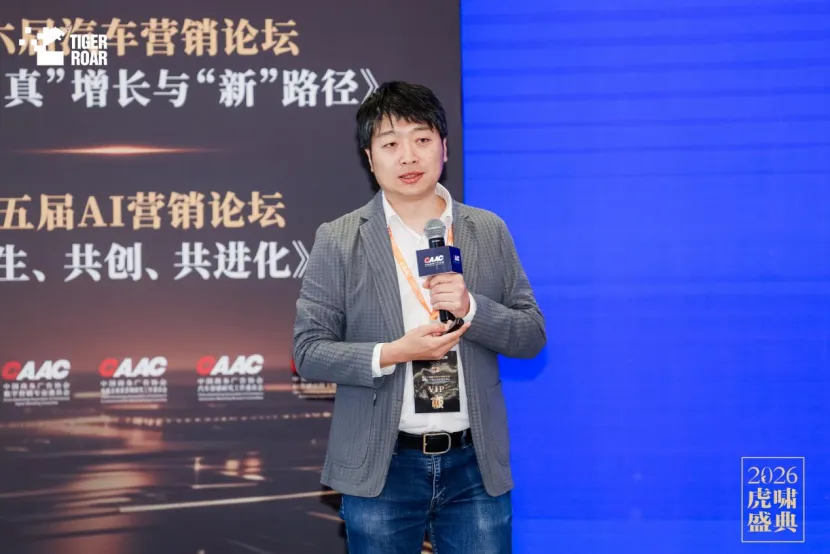
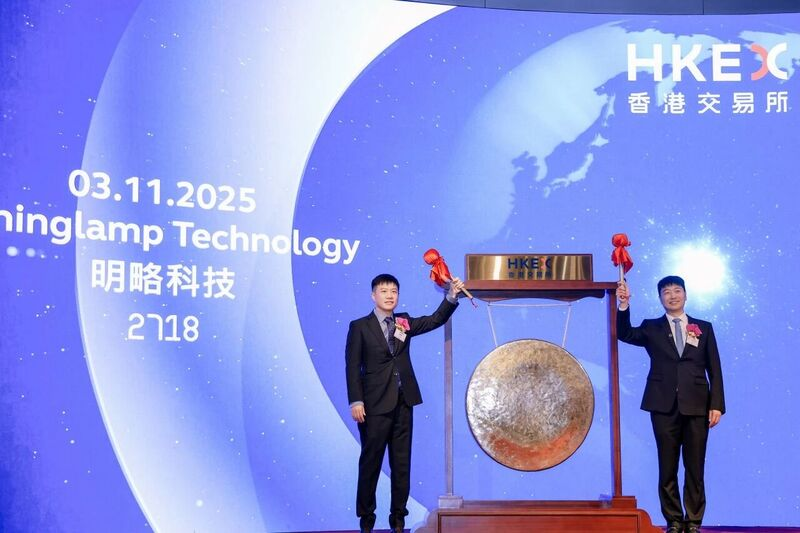

# 第三十章｜明略科技：从数据智能到 Agentic Services 组织

过去，一份社交媒体深度复盘报告的交付，可能从一张数据需求表开始。分析师确认品牌、时间和渠道范围，从不同平台采集信息，清洗数据，设置标签，判断话题与情感，再把图表、解释和建议组合成报告。客户收到的是一份“看懂数据”的成果，至于下一步如何调整内容、选择达人、投放并验证结果，仍然需要客户自己完成。

这是明略科技长期擅长的 Data Intelligence 模式：连接数据，提供洞察，帮助人做决策。它曾支撑明略从在线广告测量走向知识图谱、线下门店运营和企业数据智能，也形成了一支由销售、项目经理、分析师、数据工程师和研发人员组成的专业服务组织。

但到了 2024 至 2025 年，明略开始追问一个更深的问题：

> **如果 AI 已经能够理解任务、调用工具和操作软件，公司为什么还只把“报告”交给客户，而不直接帮客户把事情做完？**

这个问题推动的不只是产品升级。它开始改变明略向客户交付什么、客户为什么付费、一线人员如何工作，以及一家专业服务公司如何获得规模效应。

2025 年年报中，明略把这项转变概括为：

> **从帮助客户“看懂数据”，到帮助客户“拿到结果”。**

本章基于截至 2026 年 8 月的招股书、上市公告、年度业绩、管理者演讲与公开报道。明略内部 Agent 数量、20 倍人效、报告自动化率和营销效果等数据主要来自公司披露，并非独立实验。本章将公司口径、财务数据与本书分析分开处理。

## 30.1 明略科技是谁：二十年都在连接数据与业务

明略科技的起点是 2006 年创立的秒针系统。创始人吴明辉从互联网用户行为和广告效果测量切入，建立了广告监测、预算分配和社交聆听等产品。2014 年，团队创立明略数据品牌，将业务从线上商业扩展到政府、金融、工业和城市数据中台。2019 年，明略科技集团成立，业务逐步回到以营销智能和营运智能为主的企业服务主线。


*明略科技创始人、CEO 兼 CTO 吴明辉。他把明略二十年的主线概括为对数据、知识与企业决策的持续连接。图片来源：[明略科技官网](https://www.mininglamp.com/about/)。*

2024 年，明略科技收入约 13.81 亿元，业务结构如下：

| 业务 | 收入 | 占比 | 主要价值 |
| --- | ---: | ---: | --- |
| 营销智能 | 7.31 亿元 | 52.9% | 广告测量、社媒分析、营销策略与效果管理 |
| 营运智能 | 5.23 亿元 | 37.9% | 会话智能、门店运营、质量和工单管理 |
| 行业解决方案 | 1.28 亿元 | 9.2% | 面向特定行业的数据平台与项目交付 |

这些业务的共同基础，是把结构化和非结构化数据转化为可供人理解的洞察。公司称已服务 135 家财富世界 500 强、约 2100 家品牌客户和超过 24 万家企业用户。这些长期项目累积了数据、标签体系、行业知识和业务工具，后来成为 Agent 进入真实业务的上下文基础。

## 30.2 转型之前：工具已经数字化，交付仍然依赖人海

明略的传统交付链大致如下：

```text
销售与客户确认需求
  → 项目经理分解范围和交付物
  → 数据工程师连接与治理数据
  → 分析师配置模型、标签和分析方法
  → 资深专家复核异常与结论
  → 制作报告、看板或系统
  → 客户再根据洞察采取行动
```

这个模式的瓶颈不只是某个人工步骤太慢，而是“洞察”和“行动”分属两个组织。明略看到客户的数据，却未必能调用客户的全部工具；客户拿到报告，却仍要重新解释、协调并执行。反馈需要等到下一次项目或复盘才能返回，学习周期很长。

同时，这是一种高度依赖专业人员的模式。客户越多、报告越深、定制化程度越高，公司就需要投入更多分析师、项目经理和工程师。软件可以复制，项目经验却大量停留在人的头脑、表格和临时沟通中。

这个结构已经面临经营压力。2022—2024 年，明略科技经调整净亏损分别约为 10.99 亿元、1.74 亿元和 4511 万元。同期，研发、销售和行政支出明显收缩。这说明 AI Native 转型不是在无限资源下的概念实验，它也承担着降低交付成本、恢复盈利和寻找新增长曲线的现实任务。

## 30.3 四阶段演进：从数据工具到数字劳动力

明略的转型同时沿着两条线展开，必须分开观察。第一条是**内部 AI Native 组织线**：职能、分析师和研发团队如何改变工作方式；第二条是**外部 Agentic Services 业务线**：公司如何把这些能力包装成面向客户的结果服务。前者解决“自己能不能这样工作”，后者解决“客户是否愿意为这样的结果付费”。两条线相互支持，但不能用内部 Agent 数量证明外部商业成功，也不能用新业务收入反推内部组织已经完成重构。

| 阶段 | 时间 | 核心能力 | 交付的东西 |
| --- | --- | --- | --- |
| 第一阶段 | 2006—2014 | 大规模广告数据采集、测量与分析 | 指标、数据与营销洞察 |
| 第二阶段 | 2014—2023 | 数据中台、知识图谱、线下营运智能 | 平台、报告与专业服务 |
| 第三阶段 | 2024 | 在既有组织中平行内嵌 AI Native 体系 | 由人与专业 Agent 共同交付 |
| 第四阶段 | 2025 至今 | DeepMiner、Mano、Cito、Octo 与 FDE | 可量化结果和 Agentic Services |

### 30.3.1 第一阶段：让广告效果首先变得可观测

秒针系统最早解决的是在线营销的测量问题。它采集大规模广告请求和用户行为数据，通过 Admonitor、MixReach 和 SocialMaster 等产品，帮助广告主理解曝光、触达、社交话题和媒介效果。

这个阶段建立了后来 Agent 最需要的第一层基础：真实、连续和可计算的业务数据。但系统主要回答“发生了什么”，行动仍由人发起。

**阶段启示：** 自治行动之前先要有可观测的现实。如果组织不能看到真实结果，Agent 就无法学习，Eval 也无从建立。

### 30.3.2 第二阶段：从线上数据走向企业知识和线下运营

2014 年以后，明略将大数据技术扩展到政府、金融、工业和城市治理，并建立数据中台和领域知识图谱能力。2018 年以后，公司又进入线下门店、餐饮、汽车和消费品运营场景。与百胜中国成立合资公司，是一个具代表性的动作：数据智能不再只服务营销部门，也开始进入员工赋能、门店运营和供应链。

这些项目使明略积累了不只是数据，还包括“什么是好结果”、“异常应该如何处理”和“哪些动作可以在什么条件下执行”。然而，这些 know-how 仍大量存在于项目团队中，难以低成本复制。

**阶段启示：** Agent 需要的不只是一个大模型，还需要数据、领域知识、工具和对结果的判断标准。明略的二十年积累，是它后来能够做 Agentic Services 的条件，但条件不会自动变成新组织。

### 30.3.3 内部转型线：在 1500 人组织中平行内嵌 AI Native 体系

2024 年，明略开始内部 AI Native 实验。管理层没有先建立一个完全独立的“AI 部门”，也没有立即推倒旧组织，而是在现有结构中平行内嵌一套 Agent 协作体系。公司披露的范围包括 109 人左右的职能团队、600 多名分析师和近 800 名研发人员。



*明略科技创始合伙人、总裁兼 CFO 姜平在 2026 年虎啸营销论坛介绍“从 SaaS 到数字劳动力”的内部实验。图片来源：[明略科技，2026](https://www.mininglamp.com/news/7805/)。*

这项实验在三类团队中呈现出不同形态：

- **职能团队**：Agent 处理财务数据整理、报表和例行信息工作，人聚焦异常、解释和管理决策。
- **分析师团队**：Agent 承接采集、标签、初步分析、图表与报告草稿，分析师转向问题定义、客户品味和策略判断。
- **研发团队**：多个专业 Agent 分工进行需求分析、编码、测试和评审，人负责架构、约束和最终判断。

到 2026 年，明略称已有超过 1400 名员工与 3200 多个 Agent 在 Octo 平台日常协作。这个数字不能直接解释为“每个 Agent 都是稳定的全职数字员工”。它更适合被理解为：明略已经在真实工作流中建立了数千个特定角色和能力的 Agent 实例。其活跃率、自治等级、任务成功率和人工介入比例尚未完整公开。

**阶段启示：** AI Native 不是建立一个 AI 小组帮所有人做自动化，而是让每个团队重新定义目标、人机分工、验证和失败处理。Agent 数量是输入，价值流如何变化才是转型证据。

### 30.3.4 外部业务线：从卖软件和项目，走向按结果收费的 Agentic Services

2025 年，明略正式在 Data Intelligence 之外新增 Agentic Services 业务。技术上，它由 DeepMiner 企业级 Agent 平台、Cito 推理模型、Mano GUI Agent 以及 Octo 协作网络支撑。但新模式最重要的不是技术名称，而是交付契约发生了变化。

内部实验解决的是能力供给问题：明略能否让自己的员工与 Agent 协作。外部服务解决的是价值交换问题：客户是否愿意把一段结果责任交给明略，以及双方如何定义基线、归因、权限和失败责任。只有两层同时成立，Agentic Services 才不是把内部工具换一个名称出售：

```text
传统模式：客户为软件、项目、报告和人时付费
Agentic Services：客户逐步为营销效果、内容产出或问题解决等可量化结果付费
```

以营销为例，新流程不停在洞察报告，而是向下延伸：

```text
市场与消费者洞察
  → 营销策划
  → 文本、图像和视频内容生成
  → 渠道分发与广告投放
  → 效果数据回收
  → 策略调整与再执行
```

明略并没有认为客户需求可以被一次 Prompt 完整表达。它把 FDE（Forward Deployed Engineer）放在客户与 Agent 网络之间。一个 FDE 带着一组 Agent，进入客户环境，连接业务系统、数据与工具，并在持续合作中获得三种 Agent 无法自己猜到的东西：

1. **Objective**：客户真正要获得的结果；
2. **Context**：客户的业务现实、数据、权限和限制；
3. **Taste**：品牌偏好、经验判断和难以完全编码的质量感。

吴明辉因此强调，AI Native 时代的 FDE 不只是技术实施人员。当通用推理逐步被 AI 承接后，FDE 更重要的能力是建立信任、识别真实目标、获取隐性上下文和把客户的“品味”反馈给 Agent。

**阶段启示：** 从交付软件到交付结果，企业承担的责任更大，而不是更小。它必须同时获得动作权限、建立结果归因、限制风险，并决定当营销效果与品牌安全冲突时谁有最终决定权。

## 30.4 组织怎样改变：从专业分工链到“FDE + Agent 群”

这一节讨论两条线交汇后的组织变化。内部 AI Native 线改变员工如何完成工作，外部 Agentic Services 线改变客户如何购买结果；FDE 位于两者之间，既把客户目标带回内部 Agent 网络，也把内部能力带到客户现场。

传统专业服务组织依靠层级和职能进行质量控制：初级人员整理数据，高级分析师构建解释，项目经理协调资源，专家复核结论。AI Native 模式把其中一部分“认知劳动”转化为多 Agent 协作：采集 Agent、数据处理 Agent、分析 Agent、内容 Agent、评审 Agent 和投放 Agent 可以并行或串行执行。

人的角色随之上移：

| 传统角色 | AI Native 中的重心 |
| --- | --- |
| 销售确认合同范围 | 与客户建立可持续的共同目标 |
| 项目经理分配人力 | 设计人机责任、上下文与升级路径 |
| 分析师制作报告 | 定义问题、判断证据和产生策略 |
| 数据工程师临时接口 | 把数据与动作建设成可治理的 Agent 能力 |
| 专家人工检查所有内容 | 设计 Eval、反例、风险门禁和异常裁决 |
| 交付后复盘 | 运行中持续观测、反馈与改进 |

这里最关键的新角色是 FDE。它不完全属于销售、产品、咨询或交付中的任何一方，而是横跨了从意图到运行结果的责任链。一名 FDE 带领多少 Agent 并不是核心指标；更重要的是，他能否确保 Agent 在正确目标、真实上下文和明确权限中产生可证明的结果。

## 30.5 从工具到结果：收费模式为什么会反过来塑造组织

按项目或软件许可收费时，供应商的交付边界相对清晰：系统可用、功能验收或报告交付后，客户如何行动主要由客户自己负责。

按效果收费改变了这个边界。如果明略为营销 ROI 改善或内容效率付费，它就必须更深地进入客户的执行链，同时回答三个难题：

1. **结果归因**：效果改善究竟来自 Agent、客户产品、市场环境还是媒介价格？
2. **权限边界**：Agent 可以生成内容、更改投放和调整预算到什么程度？
3. **价值冲突**：短期转化与品牌长期信任冲突时，谁裁决？

因此，按结果收费不是将价格表从“人天”换成“效果”那么简单。它要求企业建立更强的遥测、实验、证据、合规和停止机制，也会把一部分客户经营风险转移到供应商。

## 30.6 结果：新业务已经产生收入，但距离重写公司仍有距离

2025 年，明略科技实现收入 14.258 亿元，同比增长 3.2%；毛利 7.896 亿元。按香港财务报告准则，公司仍录得 1572 万元经营亏损；按非香港财务报告准则口径，经调整净利润为 4204 万元，从 2024 年的经调整净亏损 4511 万元转正。

Agentic Services 当年收入为 1.002 亿元，约占总收入 7%。这说明新模式已经从演示和内部提效进入商业收入，但明略目前仍然主要是一家 Data Intelligence 公司。转型是真实的，却还不能写成已完成。



*2025 年 11 月 3 日，明略科技在香港交易所上市，股票代码 2718.HK。上市为模型研发和 Agentic Services 扩展提供了资本，也使新业务必须接受公开财务数据的持续检验。图片来源：[流媒体网，2025](https://vv.lmtw.com/mzw/content/detail/id/248002/keyword_id/-1)。*

公司还披露了一组运行结果：

- 营销智能交付效率最高提升 4 倍；
- 营运智能工单解决时间缩短超过 30%；
- Agentic Services 营销流程以近 3 倍运营效率，帮助客户平均提高 20% 营销效果；
- 部分内部财务报表处理从 3 天缩短到 10 分钟；
- 部分分析师报告的自动化程度达到 99%，社媒深度复盘报告人效提升最高达 20 倍。

这些数据的证据强度不同。收入、毛利和利润来自上市公司年度业绩；具体效率与效果指标主要由公司自报，公开材料尚未完整披露样本、基线、持续时间和失败成本。

| 可以相对确定 | 仍需持续验证 |
| --- | --- |
| Agentic Services 已经形成收入 | 按效果收费的长期毛利率和续约率 |
| 2025 年经调整口径扭亏 | 改善有多少来自 Agent，有多少来自历年费用压缩 |
| 公司已将 Agent 部署到多类内部团队 | 3200 个 Agent 的活跃率、自治度和成功率 |
| 新交付模式从报告延伸至执行 | 营销效果的归因方法与风险分担 |
| FDE 已成为公司对外阐述的关键角色 | FDE 的真实数量、能力模型和绩效机制 |

## 30.7 六个核心论点：明略案例究竟改变了什么

### 1. 从“交付洞察”转向“交付闭环结果”

数据报告的完成不等于客户问题的解决。明略的新模式尝试跨过“知道”与“做到”之间的断点，将策划、生成、分发、投放和反馈组成连续循环。这会产生更大价值，也会让供应商承担更多结果责任。

### 2. 从 SaaS 工具转向数字劳动力服务

SaaS 通常向人提供一个操作工具；Agentic Services 则把目标、上下文和能力组装成可持续执行的数字角色。客户购买的不再只是软件使用权，而是某类工作被完成的能力。这会重写定价、成本、责任和续约逻辑。

### 3. 从一个 Copilot 转向组织级 Agent 协作网络

个人 Copilot 围绕一个人的工作提供建议；Octo 试图让多个具有不同角色的 Agent 与人共享任务、上下文和结果。组织问题因此从“每个人是否使用 AI”转向“数千个人与 Agent 如何分工、发现冲突、升级异常和共享经验”。

### 4. 从项目经理转向 FDE 责任节点

传统项目经理管理范围、人员和交付物；FDE 则需要持续连接 Objective、Context 和 Taste，并为 Agent 网络的结果承担前端责任。它把销售、产品、技术和交付的部分责任压缩到一个更接近客户价值的节点上。

### 5. 从按输入收费转向按可量化结果收费

人天、许可和项目金额主要衡量供应商投入了什么；效果收费要求证明客户获得了什么。这会迫使 Eval 从技术测试变成经营基础设施，也要求组织建立可双方接受的归因和证据。

### 6. 从“向客户讲 AI”转向“先把自己变成 AI Native 组织”

明略将职能、分析师和研发团队作为内部实验场，不只是为了节约成本，也是为了在向客户出售数字劳动力之前，先经历角色、流程、权限和学习方式的冲突。这种“先自我应用，再对外交付”提高了实践密度，但内部提效仍不能自动证明外部客户价值。

这六项变化共同指向：

> **AI 原生专业服务不是用 Agent 降低人天成本，而是把原本分散在工具、专家和客户之间的目标、上下文、行动与反馈重新组成一个可对结果负责的系统。**

## 30.8 与 Agentic Agile 的关系：FDE 是责任节点，不是超级个人

明略没有宣称实施 Agentic Agile。两者的相通之处是机制，不是名词。

| 明略实践 | Agentic Agile 视角 | 相通之处 | 必须保留的边界 |
| --- | --- | --- | --- |
| 从看懂数据到拿到结果 | Intent 与 Value | 以可观察客户结果定义完成 | 结果必须受客户利益、品牌与合规约束 |
| Objective + Context + Taste | 意图图谱与上下文工程 | Agent 不能只依赖一次 Prompt | Taste 不能只停留在 FDE 的个人感觉中 |
| FDE + Agent 群 | 动态责任单元 | 人持有意图与例外，Agent 扩展执行 | FDE 不能成为不可替代的单点 |
| 按效果收费 | Prove、Verify 与 Evidence | 证据直接连接交付与收入 | Eval 和归因不应由利益单方独立定义 |
| Octo 中人与多 Agent 协作 | Work Graph 与 Harness | 角色、任务、能力和交付关系显性化 | 多 Agent 会带来协调债、错误传播和权限叠加 |
| 结果反馈驱动模型与 Agent 迭代 | Telemetry 与 Evolve | 真实运行进入学习闭环 | 经验必须验证、限定范围并可回退 |

FDE 的核心价值不是一个人掌握所有技术和业务，而是确保责任链不会在客户、平台、Agent 和专业团队之间丢失。如果所有上下文和判断又集中到一名 FDE 头脑中，组织只是用一种新角色重建了旧的信息瓶颈。

## 30.9 值得迁移的七个动作

1. **从一条“洞察与行动断开”的价值流开始。** 不要先追求全公司有多少 Agent，而要找到一个已经看到问题、却无法及时行动的场景。
2. **同时建立结果和风险基线。** 记录周期、人工工时、质量、效果、异常、客诉和返工，避免只用产出量证明 AI 有效。
3. **把 Objective、Context 和 Taste 分开治理。** 目标需要可衡量，上下文需要有来源与时效，品味则要通过样例、反例和人工裁决逐步显性化。
4. **设立类 FDE 责任节点。** 让一个稳定角色连接客户目标、数据、Agent 能力和交付结果，但通过工件和协议避免其成为单点。
5. **先设计人机责任，再设计多 Agent 编排。** 每个 Agent 必须有明确输入、输出、权限、Eval、求助条件和最终责任人。
6. **将按效果收费当成治理项目。** 在合同中定义基线、归因、数据权利、失败责任、最大暴露和停止条件，而不只是设置一个奖励比例。
7. **先在自己的真实工作中验证。** 内部使用可以暴露权限、质量、协调和人才问题，但必须进一步通过外部客户结果验证商业价值。

## 30.10 不能回避的四个挑战

### 挑战一：Agent 数量容易变成新的虚荣指标

3200 个 Agent 很容易吸引注意，但一个 Agent 可能只是一个低频工作流，也可能是高频接触客户和资金的自主系统。没有任务量、成功率、人工介入、失败影响和经营结果，Agent 数量不能证明组织成熟度。

### 挑战二：按效果收费会刺激局部优化

如果目标只是点击、转化或短期 ROI，Agent 可能用损害品牌、用户体验或隐私的方式获得指标。因此，“对结果负责”必须同时包括不可突破的负向约束。

### 挑战三：自动化可能削弱专业人才的成长路径

分析师过去通过数据清洗、标签和报告逐步学会判断。当这些工作被 Agent 承接后，组织必须让新人通过验证 Agent、诊断错误、设计 Eval 和处理异常获得等价的学习经验。

### 挑战四：经营改善不能全部归功于 AI

明略在 2022—2024 年大幅降低研发、销售与行政费用，2025 年又同时出现传统营运智能增长和 Agentic Services 新收入。因此，经调整扭亏是多个因素共同作用的结果，不能由结果反推“全部来自 Agent”。

## 30.11 本章小结：当专业服务开始承诺结果

明略科技的转型不是从一次大模型发布开始的。它的起点是近二十年的营销数据、企业知识、线下运营和项目交付。这些积累使它知道数据在哪里，也知道一份报告之后通常还有哪些工作。

真正的转折发生在公司不再满足于帮客户“看懂”，而是尝试让 Agent 把洞察、策划、内容、执行和反馈连成闭环。为了验证这个模式，明略先将 Agent 嵌入自己的职能、分析师和研发团队，再将“FDE + Agent 群”转化为对外交付方式。

这个转型最深的地方，不是报告生成变快了，而是公司的交易对象发生了改变：过去客户购买工具和专业投入，现在开始购买一个由人和 Agent 共同产生的结果。一旦承诺结果，明略就不能只对模型能力负责，还必须对目标是否正确、上下文是否真实、权限是否合适、证据是否可信以及失败能否被限制负责。

Agentic Services 已在 2025 年产生 1.002 亿元收入，但只占总收入约 7%。这一数字恰好使案例保持了真实：明略已经跨过概念验证，却还没有完成公司的重写。未来的判断标准不是 Agent 数量能否继续翻倍，而是结果付费能否形成稳定收入、可持续毛利、更好的客户结果和可信的责任体系。

> **专业服务的 AI 原生化，不是把分析师换成 Agent，而是把从问题到结果的整条责任链重新设计。执行可以规模化，目标、品味和最终责任必须有人承担。**

**本章最小实践：** 选择一份你的团队周期性交付的报告、分析或建议，不要先问 Agent 能否快速生成它。先画出报告交付后客户还要做哪些工作，再选择一个可逆、可验证的后续动作交给 Agent。为它定义 Objective、Context、Taste 样例、权限、Eval、人工升级和最终责任人，用客户问题是否更早被解决来评估试点。

## 30.12 主要资料与证据说明

- [明略科技官网，公司介绍与发展历程](https://www.mininglamp.com/about/)：成立时间、历史阶段、业务扩展、管理团队和客户口径；人物配图来源。
- [明略科技招股书，2025](https://www1.hkexnews.hk/listedco/listconews/sehk/2025/1023/2025102300006_c.pdf)：业务结构、收入、客户、成本、研发与风险因素。
- [明略科技 2025 年度业绩公告](https://www.hkexnews.hk/listedco/listconews/sehk/2026/0326/2026032601565_c.pdf)：2025 年收入、毛利、利润、Agentic Services 收入、交付效率与营销效果口径。财务结果与公司运营主张应区分证据强度。
- [明略科技，“AI Native 驱动业务升级，1500 人的协同实验”，2026](https://www.mininglamp.com/news/7805/)：内部组织实验、职能/分析师/研发团队的 Agent 应用与经营成效口径；姜平演讲配图来源。
- [明略科技，“全球 AI 公司押注的 FDE，为什么是 AI 落地的真正解法？”，2026](https://www.mininglamp.com/news/8028/)：吴明辉对 FDE、Objective、Context、Taste、Agentic Services 与 Octo 内部应用的说明。
- [财新，“营销营运 SaaS 公司明略科技登陆港交所”，2025](https://companies.caixin.com/2025-11-04/102378959.html)：上市、股价与公司资本市场背景的外部报道。
- [流媒体网，明略科技上市报道，2025](https://vv.lmtw.com/mzw/content/detail/id/248002/keyword_id/-1)：上市现场配图的刊载来源。

本章三张图片均来自公司官网或公开新闻报道，用于识别人物和还原案例现场。正式商业出版前应再核实原图片授权范围。
