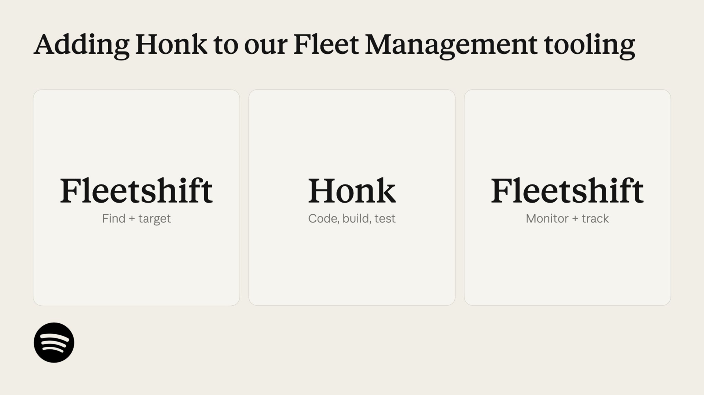
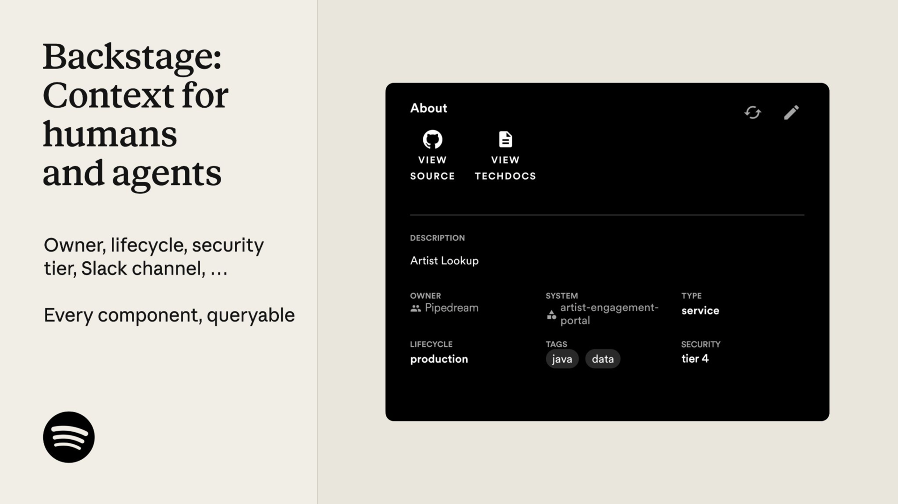

# 第三十一章｜Spotify：从敏捷研发到 Agentic Fleet Engineering

当一个软件产品的代码规模增长速度远远超过工程师人数，研发组织最先失去的往往不是写新功能的能力，而是维护旧系统的余力。Spotify 面临的正是这个问题：依赖升级、API 迁移、漏洞修复和组件改造不断占用工程师时间。

Spotify 成立于 2006 年，总部位于瑞典斯德哥尔摩，核心业务是数字音乐和播客服务。它长期采用小型、跨职能、相对自治的敏捷团队，并通过平台工程连接大量团队。随着规模扩大，团队越多，依赖越复杂；代码越多，统一升级越困难。

本章基于 Spotify Engineering 公开文章、工程负责人演讲摘要和公开技术材料。Spotify 披露的指标属于公司口径；本章将其作为案例证据，而不是未经检验的普遍规律。

## 31.1 敏捷团队很快，舰队维护很慢

Spotify 的产品价值流是：用户问题 → 产品实验 → 代码变更 → 测试 → 发布 → 用户反馈。

但工程维护流往往是：依赖升级或 API 迁移 → 找出受影响组件 → 设计脚本 → 各团队排期 → 分别修改与验证 → 逐个提交 PR。

这两条流遵循不同的经济规律。产品功能通常有明确的用户假设，可以用一次实验验证价值；维护任务的收益却常常表现为“没有发生什么”：没有服务中断，没有漏洞公开后的紧急返工，也没有某个周末突然爆发的技术债。收益延迟且不显眼，维护任务很容易输给产品路线图。

这里的“慢”不只是代码写得慢，而是五种速度同时受限：

1. **发现慢**：不知道哪些服务使用了旧 API，组件目录和依赖关系不完整。
2. **决策慢**：每个团队都要重新判断迁移方式，重复讨论同一类技术问题。
3. **执行慢**：同一种改动在不同仓库中反复手工完成。
4. **验证慢**：测试环境、技术栈和质量标准不一致，失败原因难以比较。
5. **收口慢**：PR 分散在不同团队，没人能快速判断哪些可以合并，哪些需要升级。

所以增加程序员并不能线性解决问题。工程师增加后，代码和服务也可能继续增加；如果依赖、标准、测试和发布机制没有一起改善，新增人员只会复制更多重复工作。

Spotify 公开称，几年前生产代码库增长速度约为工程师人数增长速度的七倍，维护工作逐渐挤压产品开发，迁移工作成为工程师主要的挫折来源之一。

这暴露了一个矛盾：**敏捷解决了团队如何快速学习和交付的问题，却没有自动解决全组织如何安全传播一次技术变更的问题。**

如果每个团队都自己处理同一种升级，组织得到局部自治，却付出重复劳动；如果中央团队统一处理，组织又会形成瓶颈。Spotify 的选择不是取消团队自治，而是在自治团队之上增加一个舰队级能力层：团队保留自己的服务和判断，平台负责识别范围、传播变更、汇总证据和暴露例外。

### 31.1.1 为什么原有敏捷机制没有自动解决这个问题

Squad 擅长围绕用户价值快速做出局部决策，但跨 Squad 的维护任务往往没有天然的产品 Owner。它不是单个团队的功能，也不是一次性项目；它穿过服务边界、团队边界和技术栈边界。

这会形成三种错位：

- **责任错位**：谁提出升级，谁通常只负责发起，并不负责所有下游组件完成。
- **收益错位**：投入由当前团队承担，收益却可能在未来由整个平台获得。
- **证据错位**：一个团队的测试全绿，只能证明自己的组件，不代表整条链路没有变化。

因此 Fleet Management 不是敏捷的反面，而是敏捷组织缺少的另一半。敏捷团队负责发现和交付价值；Fleet 层负责把共性工程意图变成可传播、可验证、可追踪的组织动作。

### 31.1.2 从“很多小任务”重新定义为“一次舰队变更”

没有 Fleet 视角时，一次 API 迁移看起来像几百个团队任务；有了 Fleet 视角，它首先是一个整体变更，再被分解为多个组件上的候选 PR。

旧对象：每个团队各自完成一个升级任务。  
新对象：组织发起一次 Fleet Change，系统追踪全量影响和完成证据。

前者容易产生“我的 PR 已经完成”；后者必须回答“目标范围内还有哪些组件没有完成、为什么没有完成、谁来处理”。这正是从局部敏捷走向系统敏捷的转折点。

### 31.1.3 Fleet Management 到底是什么

Fleet Management 不是传统意义上的“管理部门”，也不是给 Squad 分派任务的项目办公室。这里的 Fleet，指由大量软件组件、服务、仓库和依赖组成的整个软件舰队；Fleet Management 是管理这些组件如何被统一发现、批量变更、验证和持续维护的一套平台能力与工作方式。

它主要承担五项职责：

1. **建立组件视图**：知道组织有哪些服务、由谁负责、使用什么技术、依赖哪些库，以及哪些组件会受到一次变更影响。
2. **定义变更范围**：把“升级某个依赖”或“迁移某个 API”转换为可执行的目标集合。
3. **编排批量执行**：按组件、技术栈、风险或团队分批生成变更，避免一次错误修改扩散到全部系统。
4. **汇总验证证据**：统一收集构建、测试、静态分析、部署和 PR 状态，让组织看到全局完成度。
5. **处理例外和回流学习**：识别无法自动迁移的组件，把失败交给责任团队，或沉淀为新的规则、脚本和测试。

可以把它理解成研发组织的“全舰队变更控制面”：

Fleet Management 负责：发现范围 → 安排批次 → 调度执行 → 汇总证据 → 暴露例外。  
它不负责：替 Squad 决定用户价值，替团队承担产品责任，或绕过代码评审和发布门禁。

### 31.1.4 Fleet Management 与 Squad 的关系

二者解决的是不同层级的问题：

| 层级 | Squad 关注什么 | Fleet Management 关注什么 |
| --- | --- | --- |
| 价值 | 用户问题、产品目标和业务结果 | 共性工程变更为什么需要全局推进 |
| 范围 | 自己负责的产品、服务或组件 | 哪些仓库、服务和依赖会受到影响 |
| 执行 | 在自己的代码和运行环境中交付 | 跨团队编排变更，分批调度 Agent 或自动化任务 |
| 验证 | 本团队功能和服务是否正确 | 全舰队是否完成、哪些例外未完成 |
| 责任 | 对产品行为和服务质量负责 | 对传播机制、证据汇总和异常路由负责 |

Fleet Management 不是 Squad 的“老板”，而是 Squad 之上的横向能力层。它不夺走团队自治，而是处理单个 Squad 无法独立解决的系统性问题。

举例来说，一个基础库升级可能影响 800 个服务：

Squad 负责：判断自己的服务是否适用，检查业务例外，审查本服务变更，并接受本服务风险。  
Fleet Management 负责：识别 800 个服务，分组排序，生成候选 PR，运行统一验证，汇总完成情况，并将异常交回对应 Squad。

如果没有 Fleet Management，800 个 Squad 需要各自发现、判断、编写迁移方案；如果 Fleet Management 越权替 Squad 直接合并所有改动，又会破坏团队对服务的责任所有权。Spotify 的关键设计正在两者之间：

> **平台统一传播能力，Squad 保留局部判断和最终服务责任。**

这也是它与 Agentic Agile 中 OA 角色相近的地方。OA 不取代 IO 做价值取舍，也不代替 AS 完成所有操作，而是把意图编排成可执行任务，持续收集证据，识别异常，并把需要人判断的部分交回责任人。

## 31.2 四阶段演进

| 阶段 | 核心做法 | 组织变化 |
| --- | --- | --- |
| 第一阶段 | 小团队持续交付和内部工程平台 | 提升反馈速度与团队自治 |
| 第二阶段 | Fleet Management 与 Fleetshift | 让确定性维护变更跨组件传播 |
| 第三阶段 | 自动化 PR、大规模验证与合并 | 降低逐个处理的人工成本 |
| 第四阶段 | 后台 Coding Agent 与自然语言定义变更 | 让更多工程师发起复杂全舰队变更 |

### 31.2.1 从敏捷团队到平台化研发

小团队围绕用户价值持续实验，平台团队提供共同的交付基础设施。这个阶段的优势是反馈短、决策近、责任清晰；代价是组件、依赖和技术选择不断增加。

**阶段启示：** Agent 时代需要的不是消灭团队自治，而是为自治团队提供共同的上下文、约束和反馈基础设施。

### 31.2.2 Fleet Management 把维护变成组织能力

Spotify 建立 Fleet Management，并用 Fleetshift 执行跨大量软件组件的变更。依赖升级、API 迁移和安全修复，可以被描述为可重复的 Fleet Change，再由系统生成和验证 PR。

Spotify 公开称，Fleetshift 已合并超过 250 万个自动化维护 PR，其中大部分可以在没有人工介入的情况下自动合并。关键不在于自动合并，而在于自动化只覆盖目标明确、影响可预测、验证条件清晰的变更。

**阶段启示：** 高自治的第一步通常不是让模型自由行动，而是先把可确定的工程规则写进系统。

### 31.2.3 从脚本迁移到 Agent 迁移

复杂迁移需要理解上下文：不同组件使用不同 API，历史代码存在例外，测试覆盖也不均匀。Spotify 随后把后台 Coding Agent 接入 Fleet Management。工程师可以用自然语言描述代码转换，Agent 负责理解仓库上下文、修改代码、运行验证并提出 PR。

*Spotify 官方架构示意：Fleetshift 负责目标识别、调度和进度跟踪，Honk 负责实际代码修改，并通过 CI 验证。图片来源：[Spotify Engineering](https://engineering.atspotify.com/2026/6/code-with-claude-coding-is-no-longer-the-constraint)。*

Agent 降低的不是写一段代码的成本，而是把复杂迁移变成可重复 Fleet Change 的门槛。它通过 Slack、GitHub Enterprise 和 MCP 等入口连接日常协作与工程系统。

**阶段启示：** Agent 放大的不是单个开发者的手速，而是组织把一次判断传播到整个代码舰队的能力。

### 31.2.4 Agentic Fleet Engineering

Spotify 2026 年公开称，超过 99% 的工程师每周使用 AI 编码工具，94% 认为 AI 提高了生产力，PR 频率提高 76%。这些数据说明采用非常广泛，但不自动说明质量和业务价值同步提高。

更重要的是，Spotify 将 AI 放进已有 Fleet Management，而不是让每个工程师在本地孤立使用 Agent。变化分成三层：工程师定义一次跨组件变更的意图；Fleet Management 识别范围、安排批次、调用 Agent 并汇总结果；Squad 判断本服务的业务语义和例外。Agent 获得的是执行权，不是产品决策权，也不是不受约束的全局写入权。

这不是简单地把“写代码的人”换成“写代码的 Agent”，而是把研发任务拆成三层：工程师定义一次跨组件变更的意图；Fleet Management 识别范围、安排批次、调用 Agent 并汇总结果；Squad 判断本服务的业务语义和例外。Agent 获得的是执行权，不是产品决策权，也不是不受约束的全局写入权。

## 31.3 四维转型

这里的“四维”不是四种工具清单，而是同一个问题的四个观察面：谁承担工作、谁拥有能力、工作怎样流动、系统靠什么保证结果。只有四个面同时改变，Fleet Change 才不会退化成一个更快的脚本。

### 31.3.1 人员：从组件维护者到变更系统设计者

工程师从重复修改每个组件，转向定义变更意图、识别例外和风险、设计测试与回滚条件、处理 Agent 无法判断的异常，并把经验沉淀回系统。代码产出减少手工劳动，责任判断却更加集中。

### 31.3.2 组织：产品团队加平台控制面

产品团队仍围绕用户价值运行；Fleet Management、开发者平台和基础设施团队承担跨团队共性能力。产品团队决定为什么改、改什么；平台团队负责怎样跨舰队执行、验证和观测。

### 31.3.3 流程：从单仓库 PR 到全舰队闭环

变更意图先识别受影响组件，再由 Agent 生成候选变更，经过自动测试、静态检查和 PR 评审，最后自动合并或人工升级。运行结果与失败模式回流下一轮。

工作单元从函数或文件变成跨多个仓库的可验证变更。验证不再是最后一道门，而是编排过程的一部分。

### 31.3.4 工具：从脚本平台到 Agent Harness

Fleetshift 提供执行能力，组件目录提供上下文，CI 和测试提供约束，PR 提供审查和证据，MCP 提供 Agent 与工程系统的连接。可靠性不是模型单点属性，而是模型、代码库、测试、权限、反馈和回滚机制共同形成的系统属性。

*Spotify 将 Backstage Software Catalog 同时作为工程师和 Agent 的组件上下文入口。图片来源：[Spotify Engineering](https://engineering.atspotify.com/2026/6/code-with-claude-coding-is-no-longer-the-constraint)。*

## 31.4 与 3-4-3 的机制映射

| 3-4-3 | Spotify 对应机制 |
| --- | --- |
| IO | 产品团队或工程师定义 Fleet Change 的目标、范围和价值 |
| OA | Fleet Management、Fleetshift 和平台工程团队负责编排与验证 |
| AS | 后台 Coding Agent 执行转换、生成 PR 和处理重复任务 |
| 意图图谱 | 组件、依赖、仓库、PR、测试、团队和发布关系 |
| 意图契约 | 迁移目标、影响范围、排除条件、验收和回滚条件 |
| 约束矩阵 | 仓库规则、测试、CI、权限、自动合并和人工升级规则 |
| 证据包 | diff、测试结果、PR、合并状态、失败日志和运行反馈 |
| 意图注入 | 自然语言 Fleet Change、工程文档和仓库上下文 |
| 对抗自净化 | 测试失败、静态检查、跨组件验证和异常反馈 |
| 人类异常裁决 | 高风险组件、无法验证的迁移、例外规则和生产影响判断 |

## 31.5 用 SCOPE-V 重放一次 Fleet Change

假设 Spotify 需要将一个已弃用 API 迁移到新版本：

1. **Specify**：IO 说明为什么迁移、目标 API、必须保持的行为、排除服务和完成标准。
2. **Constrain**：OA 读取组件目录和仓库规则，设置批次、权限、测试门禁和自动合并条件。
3. **Orchestrate**：Fleet 平台识别范围，按技术栈和风险分批调度；AS 修改代码、生成 PR、运行 CI。
4. **Prove ⇄ Evolve**：测试失败返回 Agent；同类失败反复出现时暂停批次，先更新规则、测试或上下文。
5. **Verify**：Squad 检查本服务业务语义，平台责任人检查全局完成度、传播风险和回滚能力，再决定合并或停止。

批量不意味着一次性放大权限。更好的做法是分批执行、逐步扩大范围，让失败在传播前暴露。

## 31.6 真实声音与证据边界

Spotify 工程负责人曾指出，生产代码增长速度约为工程师人数增长速度的七倍，迁移工作成为开发者主要挫折来源。Fleetshift 的累计自动化维护 PR 超过 250 万个，说明 Spotify 在 Agent 之前已经拥有大规模自动化执行底座。

Spotify 2026 年又用一句话概括变化：

> **“Coding is no longer the constraint.”**
>
> 编码不再是约束。

约束发生转移：组织接下来必须回答哪些变更值得传播、哪些测试足以支持自动合并、哪些错误会同步扩散，以及如何让人类关注高风险例外。

99% 使用率、94% 生产力感知和 76% PR 增长属于采用与吞吐指标，不等于质量、客户体验或长期可维护性指标。

### 31.6.1 这些数字为什么不能直接证明研发提效

“PR 增长 76%”首先说明可提交的变更变多了，而不是有价值的交付变多了。它可能意味着 Agent 让有价值的工作更快完成，也可能意味着一个大变更被拆成更多小 PR，或者低成本生成了更多尚未产生价值的实验。

“99% 的工程师每周使用 AI”说明工具进入日常工作，却没有回答使用深度、任务类型、失败率和团队差异。94% 的生产力感知很重要，但它属于体验证据，不等同于质量证据。

Spotify 案例真正值得学习的不是三个漂亮百分比，而是指标背后的控制结构：代码规模压力推动 Fleetshift；Fleetshift 的自动化底座承接 Honk；Backstage 提供上下文和标准；PR 增长之后，人类决策又成为新的约束。只有把这些放在一起，才能看见转型的因果链。

### 31.6.2 关键转折：瓶颈从编码转移到判断

当 Agent 可以在几分钟内生成候选变更，研发组织会遇到一个反直觉结果：最稀缺的资源不再是写代码的时间，而是判断哪些代码值得合并的注意力。

组织因此必须重新设计评审：

1. 对低风险、规则明确、验证充分的变更，允许自动合并；
2. 对跨服务、权限、数据迁移和用户行为变化，提升人工评审等级；
3. 对证据不足或失败模式未知的变更，停止传播并进入异常处理；
4. 将评审发现的重复问题沉淀为规则、测试或组件标准。

如果只增加 Agent，而不改变风险分级和评审机制，组织会从“写不完代码”进入“看不完 PR”。Spotify 的公开材料已经承认这一点：编码速度提升后，人的决策能力成为新的约束。

### 31.6.3 Spotify 案例的适用边界

Fleet Engineering 最适合三类任务：影响范围可以识别、目标可以描述、结果可以自动验证。依赖升级、API 替换、漏洞修复和组件标准化通常符合这些条件。

它并不自动适合产品方向选择、用户体验取舍、核心架构重构和高风险数据迁移。这些任务的难点不是把同一种改动传播得更快，而是判断应该不应该改、牺牲什么、风险由谁承担。

因此，Spotify 不是“所有研发都交给 Agent”的案例，而是“把适合规模化的工程变更交给 Agent，同时把价值判断和异常裁决留给人”的案例。

## 31.7 六个核心启示

这六点是一条因果链，而不是并列口号：

1. **敏捷扩大了局部自治，也制造了跨组件协调债。** Squad 能快速交付自己的服务，却不能独立完成全舰队升级。
2. **协调债要求横向控制面。** Fleet Management 负责发现范围、安排批次、传播变更、汇总证据和暴露例外。
3. **控制面应先承接确定性自动化。** 目标明确、影响可预测、结果可验证的任务，才适合自动合并。
4. **复杂例外推动 Agent 进入执行环。** Agent 扩大可处理任务范围，也扩大错误传播风险。
5. **风险扩大后，人员角色必须升级。** 工程师从逐个修改文件，转向定义意图、设计验证、处理异常和维护 Harness。
6. **最终标准从吞吐转为系统结果。** PR 数量增加，只有在质量、维护成本、用户价值和风险没有恶化时才算提效。

## 31.8 案例总结

Spotify 的关键不是“用了 AI”，而是它先解决了 AI 最容易放大的三个问题：组件分散、上下文不足、规则无法跨团队执行。Fleetshift、Backstage 和工程标准化先形成底座，Honk 才有可能进入这条责任链。

- **人员**从逐个维护者转向变更系统设计者；
- **组织**形成产品团队与平台控制面的新分工；
- **流程**从单 PR 交付转向 Fleet Change 闭环；
- **工具**从确定性脚本平台演进为 Agent Harness。

它补充了 3-4-3 的一个重要场景：很多高价值任务并不围绕一个客户或一条产品需求，而是跨多个组件的基础设施演进。此时，意图图谱、约束矩阵、批量证据和异常裁决，比单次 Prompt 更重要。

这个案例也给出一个限制条件：Agent 不是敏捷的替代品。没有清晰的产品意图、稳定的组件目录、可执行的工程约束和可靠的验证机制，Agent 只会让更多错误更快进入更多仓库。

> **敏捷让团队更快学习和交付；Agentic Fleet Engineering 进一步让一次经过验证的工程意图，能够在边界内被整个软件舰队安全吸收。**

## 案例资料

- [Coding Is No Longer the Constraint: Scaling Developer Experience to Teams and Agents at Spotify](https://engineering.atspotify.com/2026/6/code-with-claude-coding-is-no-longer-the-constraint)
- [1,500+ PRs Later: Spotify’s Journey with Our Background Coding Agent](https://www.engineering.atspotify.com/2025/11/spotifys-background-coding-agent-part-1)
- [Let’s Talk Agentic Development: Spotify x Anthropic Live](https://engineering.atspotify.com/2026/4/anthropic-agentic-development)
