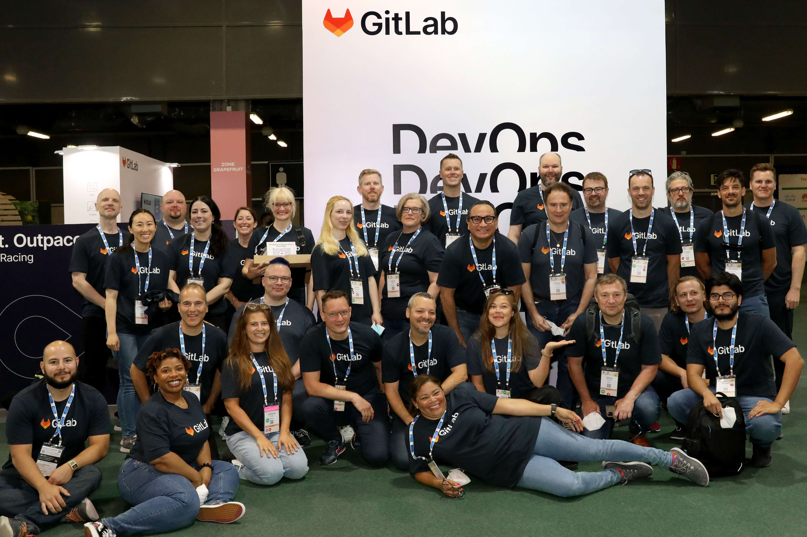
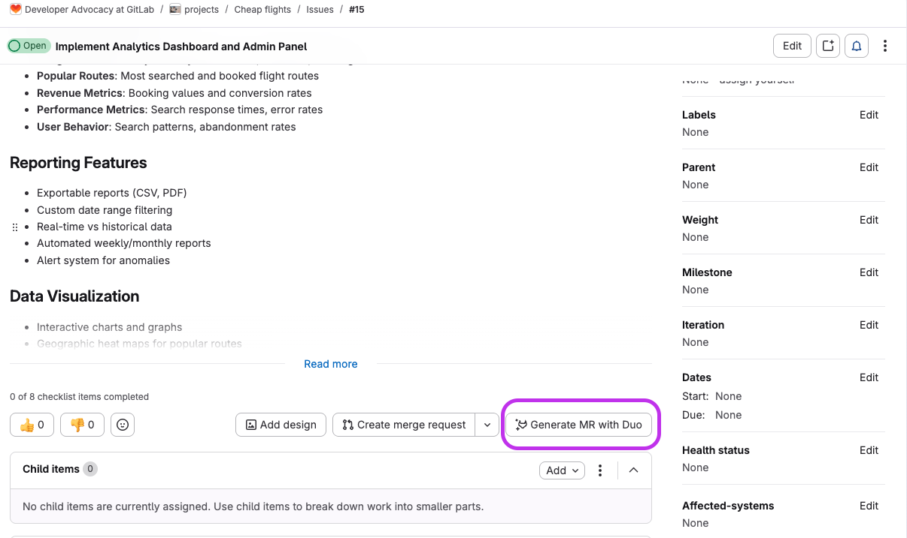
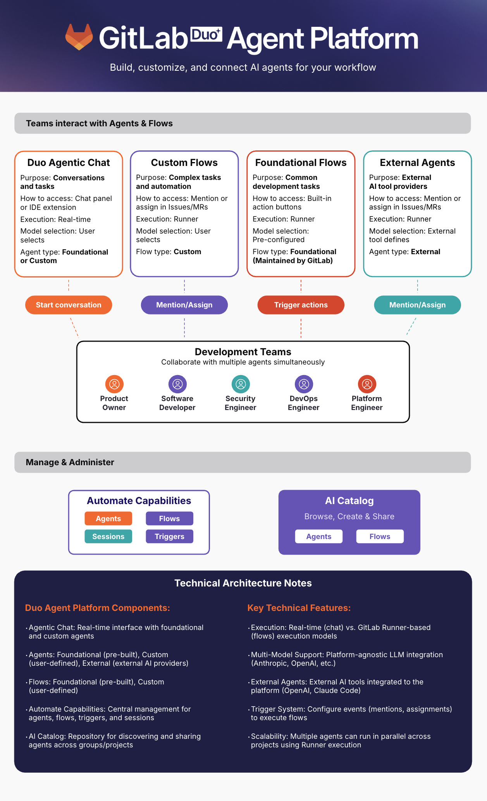

# 第三十二章｜GitLab：研发工具厂商如何把 Agent 纳入统一控制面

一个开发者打开 Issue，写下客户问题、验收标准和不可触碰的边界，然后将任务分配给 Agent。Agent 读取代码、历史 Issue、架构文档和 `AGENTS.md`，修改多个文件，运行测试，并创建 Merge Request。

流水线失败了。Agent 读取日志、修复问题、再次提交。CI 转绿后，另一个评审角色专门寻找反例，发现一条被忽略的权限路径，实现被退回。最后，人类 Maintainer 核对意图、风险和证据，决定是否合并。

这不是对未来研发的科幻描述，而是 GitLab 在 2026 年《AI-Assisted Development Playbook》中写出的基本循环：

```text
Issue 与需求
  → 共同制定计划
  → 技术规格
  → Agent 实现
  → CI 与测试验证 ⇄ 修复
  → 对抗评审 ⇄ 修复
  → Merge Request
  → 人类评审与合并
```

> **当人和 Agent 都能改变软件时，谁定义意图，谁执行，谁证明，谁批准，失败又由谁承担？**

本章基于截至 2026 年 8 月的 GitLab 官方网站、公开 Handbook 与产品文档。需要特别说明：GitLab 没有宣布采用 Agentic Agile 3-4-3。本章做的是机制对照，而不是品牌归属；产品能力、内部规范和规模化效果也将分开陈述。

本章的案例定位不同于上一章的 Spotify。Spotify 主要展示一个软件产品组织如何因规模压力重构研发价值流；GitLab 主要展示一个研发工具厂商如何把 Agent、上下文、权限、验证和审计纳入产品控制面，并用自己的研发团队进行 dogfooding。它适合说明“控制面如何形成”，不适合单独证明“四维组织转型已经完成”。

## 32.1 GitLab 是谁：把自己的研发方式做成产品

GitLab 起源于 2011 年的开源项目。Dmitriy Zaporozhets 和 Valeriy Sizov 最初想做一个能在本地自由使用的 Git 协作工具。2013 年，Sid Sijbrandij 与 Dmitriy 开始建立商业实体；2014 年公司正式注册；2015 年加入 Y Combinator，并将 GitLab Handbook 公开到网站仓库；2021 年在纳斯达克上市。

它的产品沿着自身研发痛点逐步长出来。最初只有代码管理；为了自动测试 GitLab，团队建立 GitLab CI；随后把计划、代码、安全、CI/CD、部署和观测逐步收进同一平台。这种开放核心模式既服务开源社区，也通过 SaaS 和企业订阅获得收入。



*分布在不同国家和地区的 GitLab 团队成员在线下活动相聚。GitLab 从成立之初就采用 all-remote 模式；截至 2026 年 6 月，公司称有 2500 多名团队成员、5500 多名代码贡献者和超过 5000 万注册用户。图片来源：[GitLab 公司网站](https://about.gitlab.com/company/)。*

全远程是理解 GitLab 的关键。当同事不在同一间办公室，依赖口头默契的管理很快就会失效。因此，工作原则、角色责任、开发流程和决策记录被持续写入 Handbook。这些文档原本为人类异步协作准备，后来却成为 Agent 可读的组织上下文。GitLab 既是 Agentic 研发工具的制造者，也是使用自己产品的“客户零号”。

## 32.2 Agent 之前：组织已经共享一条数字交付链

GitLab 在 AI 转型前，已经将大部分研发活动放在同一个可见系统中：

```text
Epic / Issue 定义价值与范围
  → 设计与技术方案
  → 分支与代码变更
  → Merge Request 汇集讨论与批准
  → CI/CD 执行测试、安全检查和构建
  → 部署与运行数据
  → 新 Issue 与后续改进
```

人仍是主要执行者，但意图、变更、批准和运行证据已有可追溯关系。如果需求、代码、测试和批准散落在互不相通的工具中，Agent 即使能写代码，也看不到完整责任链。

- **工作对象化**：Issue、MR、Pipeline、Deployment 和 Vulnerability 都是可引用对象。
- **规则代码化**：测试、静态分析、权限和批准规则进入 CI/CD 与仓库。
- **决策可追溯**：从 Issue 到 MR 再到部署，可以重建“为什么改、改了什么、谁批准”。

**核心启示：** Agent 不会自动消除工具断点和组织断点，它通常会放大这些断点。先让人类交付链可计算，才能让 Agent 可治理。

## 32.3 两条演进线：产品能力与内部实践

GitLab 的转型不能只写成一条产品发布时间线。产品能力回答“客户可以怎样使用 Agent”，内部实践回答“GitLab 自己怎样改变研发工作”。两条线相互促进，但证据性质不同。

| 阶段 | 产品能力线 | 内部实践线 | 证据性质 |
| --- | --- | --- | --- |
| 第一阶段 | 2011—2022：代码管理、CI/CD、DevSecOps 平台逐步统一 | all-remote、Handbook-first，先建立可见的异步协作系统 | 长期组织与产品事实 |
| 第二阶段 | 2023—2024：Duo 进入代码建议、解释、测试和评审 | 工程、技术写作和产品团队开始 dogfood | 产品能力与内部规范 |
| 第三阶段 | 2024—2025：Duo Workflow 可从需求生成 MR | Agent 从建议者变为异步执行者，但仍进入 MR 批准流程 | 产品演示与局部实践 |
| 第四阶段 | 2025 至今：Agent Platform、AI Catalog、Flows、Orbit | 内部 Playbook 规定自治等级、Harness 和 AI 贡献披露 | 产品路线与规范状态 |

### 32.3.1 第一阶段：先把工作变成机器可读的事实

GitLab 长期实行每月 22 日发布新版本的节奏。分布式远程团队要持续发布，不能依赖“找那个懂的人问一下”。任务状态、代码评审、运行手册和决策方法必须外化。

这个阶段没有 Agent，却在建设 Agent 最稀缺的东西：可定位的意图、版本化的知识、明确的责任人和自动化反馈。

**阶段启示：** AI Native 的前置工程，往往是让组织先停止依赖隐性知识。

### 32.3.2 第二阶段：Duo 进入人的工作环

GitLab Duo 最初主要提供代码建议、解释、测试生成、MR 摘要和漏洞解释。这一阶段仍是“人调用 AI”：人拥有任务，AI 缩短局部操作。

GitLab 同时在真实任务中 dogfood Duo，把摩擦变成 Issue。Developer Experience 团队后来要求 MR 作者使用 `devex-ai-assistance::1-5` 标签，披露 AI 参与程度。

**阶段启示：** 使用量不是转型结果，却是建立真实反馈的起点。只有 AI 贡献可见，组织才能比较不同自治等级下的质量、评审成本和失败率。

### 32.3.3 第三阶段：从建议代码到承接完整任务

2024 年，GitLab 公布 Duo Workflow，将其从反应式助手推向自主 Agent。Agent 可以理解需求、读取上下文、修改多个文件、运行命令并创建 MR；遇到不确定性时请求指导，产出仍进入原有 MR 批准流程。

人不再介入机器内环的每一步，却必须守住需求、异常和批准等责任节点。



*GitLab 官方示例：开发者从 Issue 启动 Developer Flow，Agent 在后台完成变更并创建待评审的 MR。这不等于自动获得合并权。图片来源：[GitLab Duo Agent Platform 指南](https://about.gitlab.com/blog/introduction-to-gitlab-duo-agent-platform/)。*

**阶段启示：** Agent 可以成为执行 Owner，却不能因此成为风险 Owner。执行权与最终责任必须分开设计。

### 32.3.4 第四阶段：把 Agent 收入组织控制面

Duo Agent Platform 把 Agent、Flow、模型、上下文、权限和运行记录收入统一平台。组织可以管理专业 Agent 和多步 Flow，规定其运行位置、模型和工具。每次执行形成 Session，记录触发条件、工具调用、输出和 CI/CD 日志。



*Duo Agent Platform 把 Chat、CLI、内置与外部 Agent、Flows、AI Catalog 和运行 Session 连接起来。图片来源：[GitLab，2026](https://about.gitlab.com/blog/introduction-to-gitlab-duo-agent-platform/)。*

GitLab Orbit 则将代码、Issue、MR、Pipeline 和 Deployment 组成持续更新的上下文图，并通过 MCP 向 Duo、Claude Code 和 Codex 提供基于索引事实的查询。它的目标不是让模型“猜”依赖，而是让依赖成为可遍历关系。

**阶段启示：** 当 Agent 可以异步、并行和跨工具执行时，组织需要的不是更好的聊天窗口，而是 Agent 控制面。

## 32.4 四维转型：改变的不只是工具

### 32.4.1 人员：从直接编码者到意图、架构与裁决者

GitLab 将 AI 自治分为五级：Baseline、Pair、Conductor、Orchestrator 和 Harness。到 Conductor，人引导单个 Agent；到 Orchestrator，人管理多个异步 Agent；到 Harness，人主要设定架构和质量标准，其余执行交给系统。

这不是“人离开回路”，而是人从操作回路上移到责任回路。GitLab 在招聘实验中也开始评估候选人表达意图、定义边界、验证输出和借助 AI 判断的能力。

### 32.4.2 组织：从 AI 小组到横跨产品和平台的能力网络

GitLab 的 AI Engineering 已分化出 Agent Foundations、AI Coding、AI Core Infrastructure、Model Services、Clients 和 Chat 等能力组。共享平台团队建设控制面，产品、安全和开发者体验团队则在自身价值流中使用并反馈。

### 32.4.3 流程：从“写完再审”到双重反馈环

1. **自动验证环**：CI 或测试失败，实现立即返回 Agent。
2. **对抗评审环**：即使测试全绿，仍主动寻找计划和实现的缺陷。

测试回答“已知性质是否成立”，对抗评审追问“我们遗漏了什么”。两者通过后，变更才进入 MR 和人类批准。

### 32.4.4 工具：从 AI 插件到研发控制面

`AGENTS.md` 和仓库文档提供局部上下文；Issue 和技术规格提供任务意图；CI/CD 把安全、测试和合规规则变成可执行约束；Orbit 连接跨生命周期事实；Session 记录 Agent 行为；MR 承载评审和最终批准。

## 32.5 为什么它与 3-4-3 高度同构

### 三个超级角色

| Agentic Agile 角色 | GitLab 中的对应机制 | 差异 |
| --- | --- | --- |
| **IO（意图责任人）** | Issue 发起人、Product Manager、DRI 或 Maintainer | 未统一使用 IO 概念，意图签署强度因团队而异 |
| **OA（编排与保证者）** | Conductor / Orchestrator、Flow、Pipeline、MR 批准规则 | 编排与独立保证未必由不同主体承担 |
| **AS（Agent 执行系统）** | Duo Agent、外部 Agent、Developer Flow、CI 与安全 Agent | 自治等级仍受仓库成熟度限制 |

### 四大动态工件

| 3-4-3 工件 | GitLab 中的近似形态 | 未完全覆盖的部分 |
| --- | --- | --- |
| **意图图谱** | Epic、Issue、代码、MR、Pipeline、Deployment 及 Orbit 图 | 价值因果与战略权重仍需补足 |
| **意图契约** | Issue、验收标准、技术规格和失败测试 | 尚非统一的可签署契约，非功能边界可能分散 |
| **约束矩阵** | `AGENTS.md`、CODEOWNERS、分支保护、CI 门禁、安全与评审指令 | 规则分散，冲突优先级不总是显式 |
| **证据包** | MR diff、Pipeline、测试、安全报告、批准和 Agent Session | 有证据元素，但不等于逐项契约化的 Evidence Bundle |

### 三大自治机制

| 3-4-3 机制 | GitLab 中的对应 | 成熟度判断 |
| --- | --- | --- |
| **意图注入** | Issue、Spec、仓库文档和 `AGENTS.md` 进入 Agent 上下文 | 较强，但取决于仓库知识质量 |
| **对抗自净化** | 失败测试、CI 返工环、对抗评审和专业审查 Agent | 已进入 Playbook，独立性仍需按项目检查 |
| **人类异常裁决** | Agent 求助、MR 人工评审、CODEOWNERS 与保护分支批准 | 节点存在，但要防止橡皮图章式审批 |

**GitLab 已有很多 3-4-3“部件”，但部件存在不等于每个任务都形成了完整闭环。**

## 32.6 用 SCOPE-V 重放一次 GitLab 式交付

假设团队要修复“特定权限用户无法查看流水线日志”的缺陷：

1. **Specify**：Issue 记录场景、期望结果、不得放大的权限和验收示例；失败测试把“完成”转为可执行预言。
2. **Constrain**：`AGENTS.md` 指明架构、命令和禁改区；CODEOWNERS 要求权限专家评审；分支保护阻止 Agent 直接写入主分支。
3. **Orchestrate**：Planner 完善方案，Developer Agent 修改实现，CI 执行测试与安全扫描，Reviewer 用反例检查权限泄漏。
4. **Prove ⇄ Evolve**：失败测试和评审意见返回实现环；通用缺口沉淀为新测试、静态规则或 MR 评审指令。
5. **Verify**：人类 Maintainer 不只看“Pipeline 全绿”，还核对客户问题、权限边界、变更影响和回滚能力，再决定是否合并。

GitLab 提供的平台不能自动保证每个组织都正确定义了意图、拥有独立证据，或真正完成风险裁决。

## 32.7 真实结果：有高强度样本，还没有全局答案

GitLab Handbook 披露了一个有冲击力的内部样本：Orbit 知识图谱项目由 4 名工程师在 2 周内完成 259 个 MR，约 13.5 万行 Rust 代码中 95% 由 AI 生成。GitLab 的解释不是“模型足够聪明”，而是项目从第一天就有 CI、`AGENTS.md` 和架构文档。

这个样本证明高自治研发在特定边界内可以产生极高吞吐，但它不能证明：

- 效果可迁移到历史包袱深、测试薄弱的老系统；
- 95% AI 代码等于 95% 价值或责任由 AI 承担；
- MR 数量和代码行数可以替代缺陷、安全、成本与客户结果；
- 局部实践已在 2500 多人的公司中达到同等成熟度。

更严谨的结论是：**GitLab 已提供一个强度很高的 Agentic 研发样本，但仍在把局部高自治经验转化为组织级稳定能力。**

## 32.8 内部声音：快不是唯一价值，责任也没有转移

GitLab 对人机分工的概括很直接：

> **“Software will be built by machines, directed by people.”**
>
> 软件将由机器构建，由人来定向。

这里的 `directed` 不应被简化为“写 Prompt”。GitLab 为人保留的责任包括架构、客户理解、品味和权衡。Developer Experience 团队还明确写道：

> **“AI-assisted review, not AI-replaced review.”**
>
> 用 AI 辅助评审，而不是用 AI 取代评审。

其 AI 开发手册的一条原则指向组织学习：

> **“Fix the environment, not the prompt.”**
>
> 出现系统性失败时，不要只改这一次 Prompt，而要把学习写进测试、Lint、文档或门禁。

这与 Evolve 非常接近：一次失败的价值，不只在于当次被修好，而在于它是否改变了下一次执行的环境。

## 32.9 六个核心论点

1. **Agentic 研发的起点不是 Agent，而是可计算的责任链。** 只有意图、代码、验证、批准和运行证据可以关联，Agent 才能看到完整任务。
2. **高自治由仓库和组织成熟度授予。** 没有 CI、测试、上下文和评审成熟度时，直接跳到 Orchestrator 或 Harness 只会放大技术债。
3. **约束应进入环境，而不只留在 Prompt。** 测试、分支保护和 CI 门禁比临时指令更稳定。
4. **对抗评审是高速生产的必要配对。** Agent 越快，系统越需要主动反驳方案、寻找遗漏和构造反例。
5. **人可退出操作内环，不能退出责任回路。** 人仍要守住意图、权限扩大、重大异常、不可逆动作和剩余风险。
6. **自我改进意味着失败改变下一次执行环境。** 人工介入只有转化为测试、规则、文档、工具或评估样本，才会成为组织能力。

## 32.10 对研发组织的行动指南

1. **先选一个仓库。** 选择责任人清晰、发布频繁、结果可验证的代码库。
2. **评估 Harness 成熟度。** 检查测试、CI、架构文档、分支保护、CODEOWNERS、回滚和观测，再决定自治级别。
3. **把任务改写为可验证契约。** 写明功能、Preserve、禁改区、验收证据和停止条件。
4. **建立精简的 `AGENTS.md`。** 放入项目结构、实际命令、关键约定和 off-limits 区，并由团队评审。
5. **先加一条确定性约束。** 从失败测试、Secret Detection、Lint 或测试数量保护中选择一项。
6. **分离执行与批准。** Agent 可创建 MR，但不能扩大权限、降低门禁或批准自己的变更。
7. **记录 AI 贡献与人工介入。** 除生成比例，还记录成功率、返工、评审时间、逃逸缺陷和求助原因。
8. **把重复失败修进系统。** 每次人工救火后追问：能否沉淀为测试、规则、上下文或新验证能力？

## 32.11 还没有解决的四个问题

### 第一，吞吐遥测不是价值遥测

AI 代码比例、MR 数量和节省时间容易计算，却可能鼓励生产更多变更。价值遥测还必须连接客户结果、缺陷逃逸、可维护性、运行成本与安全风险。

### 第二，人类评审可能成为新瓶颈和假门禁

Agent 能同时生成大量 MR，人的注意力却没有同比增长。没有风险分级、证据摘要和异常路由，“人在环上”容易退化为快速点击同意。

### 第三，生成、测试与评审的独立性仍需证明

同一模型、相同上下文和类似 Prompt 可能产生共同盲区。多 Agent 不自动等于多元证据。高风险变更仍需要确定性工具、独立上下文或不同责任主体的验证。

### 第四，上下文图展示事实关系，不是价值判断

Orbit 可以说明代码与 MR、Pipeline 和 Deployment 的关系，却不能替人回答：这项改动是否值得做？剩余风险由谁接受？知识图可以增强判断，不能替代判断。

## 32.12 案例总结：机器开始构建软件，组织必须重构责任

```text
人定义意图与不可牺牲的边界
  → 平台注入上下文与最小权限
  → Agent 承接持续执行
  → CI 和对抗评审持续反驳
  → MR 汇集变更与证据
  → 人对异常、风险与不可逆动作作出裁决
  → 失败进入测试、规则与下一次执行环境
```

> **AI 原生研发组织不是拥有最多编码 Agent 的组织，而是能够让意图、约束、人、Agent、证据和责任在同一条交付链上持续对齐的组织。**

机器可以构建软件，却不会因为 Pipeline 转绿就自动获得业务正当性。当执行被大规模交给 Agent，人的价值不会消失；它会集中到更少、更难，也更不可推卸的责任节点上。

---

## 案例资料与证据边界

### 主要资料

- [About GitLab](https://about.gitlab.com/company/)：公司历史、规模与时间线。
- [GitLab 上市时的创始人信](https://about.gitlab.com/blog/gitlab-inc-takes-the-devops-platform-public/)：项目起源、GitLab CI 与商业化过程。
- [GitLab Duo Agent Platform](https://about.gitlab.com/gitlab-duo-agent-platform/)：Agent、Flow、AI Catalog、政策和可追溯性。
- [Duo Agent Platform 指南](https://about.gitlab.com/blog/introduction-to-gitlab-duo-agent-platform/)：架构、Session 与从 Issue 生成 MR 的工作流。
- [AI-Assisted Development Playbook](https://handbook.gitlab.com/handbook/engineering/workflow/ai-assisted-development/)：五级自治、Harness、对抗评审与内部样本。
- [AI in Developer Experience](https://handbook.gitlab.com/handbook/engineering/infrastructure-platforms/developer-experience/ai/)：客户零号、AI 贡献标签、人工评审与仓库上下文。
- [GitLab Orbit](https://about.gitlab.com/gitlab-orbit/)：软件生命周期上下文图与 MCP 连接。
- [GitLab Mission](https://handbook.gitlab.com/handbook/company/mission/)：人与机器在软件建造中的定位。

### 证据边界

1. 公开 Handbook 中一些内容是规范与目标状态，不等于所有团队已一致执行。
2. Orbit 项目数据来自 GitLab 自报，是单项目样本，不是公司级对照实验。
3. 部分 Agent Platform 能力在 2025—2026 年才进入可用或规模化阶段，长期质量与人工批准负荷仍需观察。
4. 本章的 3-4-3 与 SCOPE-V 对照属于本书分析，不代表 GitLab 对该框架的认可或采用。
